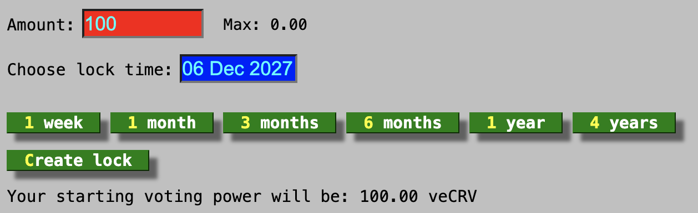

*Vote-locking* refers to the process of locking CRV for a specified period. This allows users to participate in the governance process of the protocol.

One of the primary incentives for vote-locking is the **boost mechanism**. Users who provide liquidity to a pool and have some vote-locked CRV receive boosted rewards. Additionally, starting on the 19th of September 2020, **50% of all trading fees are distributed to veCRV holders**. This distribution was implemented following a community-led proposal, aiming to align the incentives between liquidity providers and governance participants (veCRV holders).

Collected fees will be used to buy [**`3CRV`**](https://etherscan.io/address/0x6c3f90f043a72fa612cbac8115ee7e52bde6e490) (LP token for 3Pool) and distribute them to veCRV holders.  

In addition to receiving 3CRV as fees, users holding veCRV are also **eligible for [boosted CRV rewards](../reward-gauges/boosting-your-crv-rewards.md) on the liquidity they have provided** to pools, if applicable.  

!!!info
    veCRV stands for **vote-escrowed CRV**, which represents CRV tokens locked for voting in the Curve DAO.  
    More information about Vote-Locking can be found [here](../governance/vote-locking-boost.md).

:logos-youtube: **How to lock CRV**

<figure class="video_container">
  <video controls="true" allowfullscreen="true">
    <source src="https://storage.googleapis.com/curvedocs/staking-crv.mp4" type="video/mp4">
  </video>
</figure>

# :logos-lock: **Locking CRV**

!!! warning
    When a user locks their CRV tokens for voting, they will receive veCRV based on the lock duration and the amount locked. Locking is **not reversible** and veCRV tokens are **non-transferable**. If a user decides to vote-lock their CRV tokens, they will only be able to **reclaim the CRV tokens after the lock duration has ended**.

    Additionally, a user **cannot have multiple locks with different expiry dates**. However, a lock **can be extended**, or **additional CRV can be added** to it **at any time**.

Users must specify the amount of CRV they wish to lock and their preferred lock duration. The minimum lock period is **one week**, while the maximum is **four years**. The amount of veCRV **linearly decays over time**, reaching 0 when the lock duration ends.

*To lock some CRV token, visit either the [old](https://dao.curve.fi/locker) or [new](https://curve.fi/#/ethereum/locker/create)​ user-interface.*

<figure markdown>
  { width="500" }
  <figcaption>old UI</figcaption>
</figure>

<figure markdown>
  { width="300" }
  <figcaption>new UI</figcaption>
</figure>

!!!tip
    **The amount of veCRV received per CRV when locking depends on the duration of the lock.** To calculate the amount of veCRV you will receive, multiply the amount of CRV by (n/4), where **`n`** is the lock time denominated in years.