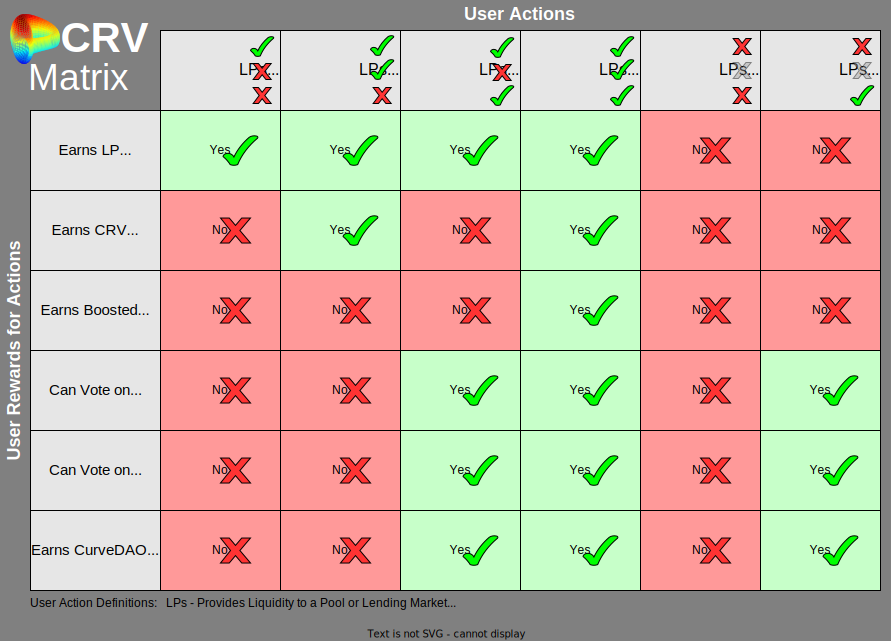

<h1>CRV Overview</h1>

The CRV token is the token for Curve DAO which governs the whole Curve Finance ecosystem.  CRV was launched on August 13, 2020.

## **Supply**

The total supply of 3.03 billion is distributed as such:

* 62% to community liquidity providers
* 30% to shareholders (team and investors) with 2-4 years vesting
* 5% to the community reserve
* 3% to employees with 2 years vesting

  <canvas id="crvAllocationChart"></canvas>

 

The initial supply of around 1.3b (~43%) was distributed as such:

* 5% to pre-CRV liquidity providers with 1 year vesting
* 30% to shareholders (team and investors) with 2-4 years vesting
* 3% to employees with 2 years vesting
* 5% to the community reserve

The circulating supply was 0 at launch and the initial release rate was around 2m CRV per day.

CRV inflation (community emissions for providing liquidity) started at 274 million tokens a year in 2020, and each year it decreases by roughly 16%.

See the [Supply & Distribution page](./supply-distribution.md) for more detailed information.

## **Utility**

There are 4 main use-cases for CRV, most require locked CRV (veCRV):

1. **Incentivizing liquidity providers** to provide liquidity to pools and lending markets through CRV rewards.  This is how CRV tokens are distributed to the community.
2. Allowing liquidity providers to **boost their CRV rewards** up to 2.5x by holding veCRV.
3. Allowing users to participate and **vote in governance proposals** including directing CRV emissions (gauge weight votes) through holding veCRV.
4. **Collecting a portion of the fees** from swaps and loans that occur on Curve through holding veCRV.

!!!info
    veCRV stands for **vote-escrowed CRV**, representing CRV tokens locked for voting in the Curve DAO.  Locked CRV, Vote-locked CRV and vote-escrowed CRV all mean veCRV, these terms are used interchangeably throughout the ecosystem.

    For information about how to lock see the [**locking guide**](../vecrv/locking-your-crv.md), or for more information about veCRV, see the [**veCRV page**](../vecrv/overview.md).

---

# **The CRV Matrix**

The table below can help you understand the value of CRV and veCRV in different situations:

