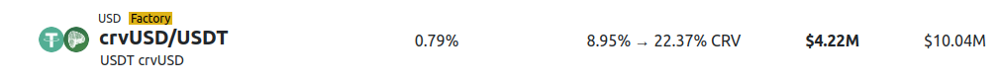

<h1>CRV Overview</h1>

The CRV token is the token for Curve DAO which governs the whole Curve Finance ecosystem.  

CRV was launched on August 13, 2020.  It was **launched with 1.3 billion minted tokens** and a **fixed supply of 3.03 billion**, the remaining 1.7 billion will be minted over the next 355 years.  The CRV tokens minted each year are distributed to the community, and each year the amount of CRV tokens minted and distributed decreases.  To see more information regarding the supply, distribution, emissions or launch details of CRV, please see the [**supply & distribution page**](crv-tokenomics.md).

This page gives a brief overview on the 4 main use-cases of CRV:

1. **Incentivizing liquidity providers** to provide liquidity to pools and lending markets through CRV rewards.  This is how CRV tokens are distributed to the community.
2. Allowing liquidity providers to **boost their CRV rewards** up to 2.5x by holding veCRV.
3. Allowing users to participate and **vote in governance proposals** including directing CRV emissions (gauge weight votes) through holding veCRV.
4. **Collecting a portion of the fees** from swaps and loans that occur on Curve through holding veCRV.

More information on each of these use-cases can be found below.

!!!info
    veCRV stands for **vote-escrowed CRV**, representing CRV tokens locked for voting in the Curve DAO.  Vote-locked CRV and vote-escrowed CRV both mean veCRV, these terms are used interchangeably throughout the ecosystem.

    

For information about how to lock see the [**locking guide**](./locking-your-crv.md), or for more information about veCRV, see the [**veCRV page**](./overview.md).

---

## **Incentivizing Liquidity Providers (LPs)**

Many pools and lending markets on CRV incentivize liquidity by rewarding the LPs with CRV tokens for supplying tokens/assets to a swap pool or lending market.  Normally this will be quoted as a range, for example the crvUSD/USDT swap pool on Ethereum:

{: .centered }

What this shows is that all users who LP into this pool and stake in the gauge will be rewarded with at least 8.95% APR paid in CRV.  If the user boosts their CRV rewards by owning veCRV, they could earn up to 22.37% APR in CRV rewards (2.5x the normal reward) depending on their personal boost.  Users can also receive CRV rewards for supplying to certain Curve lending markets and staking in their respective gauges.  CRV Rewards usually work in the same way in these lending markets, including the boost.

## **Boosting**

One of the main incentives to acquire CRV and lock CRV (veCRV) is the ability to boost rewards on provided liquidity. By acquiring enough veCRV, a user can boost their CRV rewards up to 2.5x, this is shown on the UI as the maximum figure of the CRV rewards range, e.g., in the crvUSD/USDT pool image above, it's 22.37%.

To learn more about how boosts work, including calculators to see how much veCRV is required to achieve a certain boost, see this section: [**Boosting your CRV Rewards**](../reward-gauges/boosting-your-crv-rewards.md)

# **Voting**

Once CRV holders vote-lock their CRV, they can start voting on various DAO proposals and pool parameters.  They can also participate in the weekly gauge vote which directs the CRV rewards to different swap pools and lending markets based on the proportion of veCRV voting for each reward gauge.

See [**Understanding Governance**](../governance/understanding-governance.md) for DAO and voting information, and see [**Gauge Weights**](../reward-gauges/gauge-weights.md) for information on the weekly gauge votes.

# **Rewards (Admin Fees)**

veCRV holders earn the admin fee on swap pools, and also all of the interest from crvUSD borrowing.  See the [**veCRV page**](./overview.md) for more information.

# **The CRV Matrix**

The table below can help you understand the value of CRV and veCRV in different situations

| | **Liquidity in Pool & no veCRV** | **Liquidity in Pool & veCRV** | **Liquidity in Pool & Staked in Gauge & no veCRV** | **Liquidity in Pool & Staked in Gauge & veCRV** | **No Liquidity & no veCRV** | **No Liquidity & veCRV** |
| :--: | :--: | :--: | :--: | :--: | :--: | :--: |
| **Earns lending & trading fees** | :material-check: Yes | :material-check: Yes | :material-check: Yes | :material-check: Yes | :material-close: No | :material-close: No |
| **Earns CRV Emissions** | :material-close: No | :material-close: No | :material-check: Yes | :material-check: Yes | :material-close: No | :material-close: No |
| **Earns boosted CRV Emissions** | :material-close: No | :material-close: No | :material-close: No | :material-check: Yes | :material-close: No | :material-close: No |
| **Can vote on DAO Proposals** | :material-close: No | :material-check: Yes | :material-close: No | :material-check: Yes | :material-close: No | :material-check: Yes |
| **Can vote on Gauge Weight** | :material-close: No | :material-check: Yes | :material-close: No | :material-check: Yes | :material-close: No | :material-check: Yes |
| **Earns Admin Fees** | :material-close: No | :material-check: Yes | :material-close: No | :material-check: Yes | :material-close: No | :material-check: Yes |