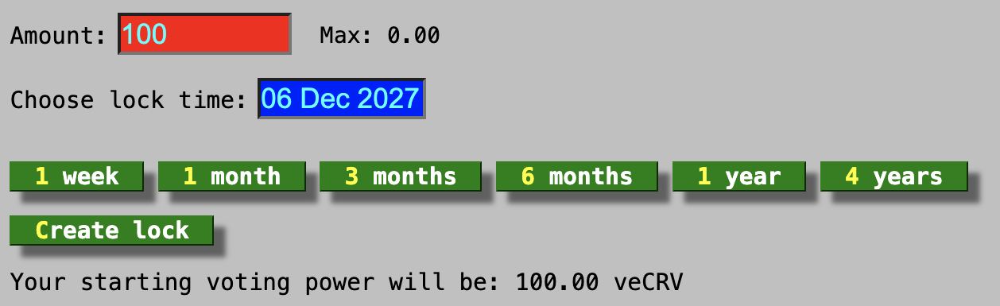
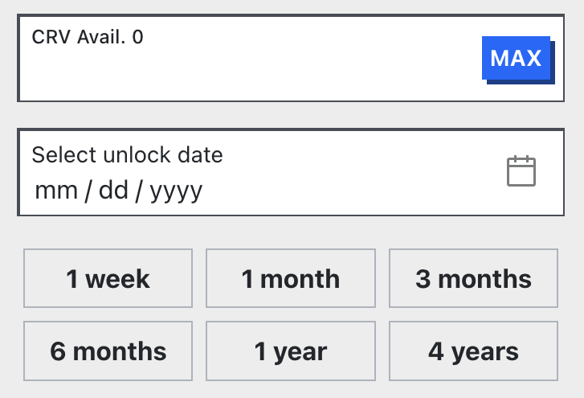

<h1>Locked CRV (veCRV)</h1>

veCRV is an acronym for **vote-escrowed CRV**.  Users can lock their CRV for a **minimum of 1 week**, **maximum of 4 years**, in return the user is given veCRV, **veCRV amount decays linearly over the chosen lock time**. **veCRV is not transferrable**. The longer you lock the more veCRV you receive, see the [locking formula section](#crv-to-vecrv-formula) for a detailed explanation but the simple explanation is:

- 1 CRV locked for 4 years = 1 veCRV
- 1 CRV locked for 3 years = 0.75 veCRV
- 1 CRV locked for 2 years = 0.5 veCRV
- 1 CRV locked for 1 year = 0.25 veCRV

**Locking was a concept created to align incentives for governance**.  Many coin voting systems have a problem where someone can buy tokens off the market to influence a governance vote, then sell the tokens after the vote passed/failed. These users can influence governance votes greatly and only take minimal risk by holding tokens for a few days. Locking stops this happening. Users must lock their tokens for a period of time to receive voting power, and users are rewarded with more voting power if they lock their tokens for a longer period of time.

!!!info
    The amount of veCRV shown as a statistic in various places is not a true reflection of the amount of locked CRV.  As 1 veCRV does not equal 1 CRV due to locking time and decay. Read the [locking information](./overview.md#locking-information) section of this page for more information

---

# **How to lock CRV**

  <iframe width="560" height="315" src="https://www.youtube.com/embed/8GAI1lopEdU" frameborder="0" allow="accelerometer; autoplay; clipboard-write; encrypted-media; gyroscope; picture-in-picture" allowfullscreen></iframe>

!!! warning
    When a user locks their CRV tokens for voting, they will receive veCRV based on the lock duration and the amount locked. Locking is **not reversible** and veCRV tokens are **non-transferable**. If a user decides to vote-lock their CRV tokens, they will only be able to **reclaim the CRV tokens after the lock duration has ended**.

    Additionally, a user **cannot have multiple locks with different expiry dates**. However, a lock **can be extended**, or **additional CRV can be added** to it **at any time**.

Users must specify the amount of CRV they wish to lock and their preferred lock duration. The minimum lock period is **one week**, while the maximum is **four years**. The amount of veCRV **linearly decays over time**, reaching 0 when the lock duration ends.

*To lock CRV tokens, visit either the old UI: [https://dao.curve.fi/locker](https://dao.curve.fi/locker) or new UI: [https://curve.fi/#/ethereum/locker/create](https://curve.fi/#/ethereum/locker/create)*​

<figure markdown>
  { width="500" }
  <figcaption>old UI</figcaption>
</figure>

<figure markdown>
  { width="300" }
  <figcaption>new UI</figcaption>
</figure>

---

# **veCRV Benefits**

Users with veCRV are given the following benefits:

## **Earning Fees**

After 2 community-led proposals and subsequent governance votes in September 2020 (Link to votes: [[1]](https://curvemonitor.com/#/dao/proposal/parameter/2), [[2]](https://curvemonitor.com/#/dao/proposal/parameter/3)), the admin fees of Curve pools were set to 50%, this means **50% of all trading fees are distributed to veCRV holders**, while the remaining 50% goes to the respective liquidity providers of the pools. This distribution was implemented to align the incentives between liquidity providers and governance participants (veCRV holders). Additionally, since the launch of Curve's own stablecoin (crvUSD), **100% of the accrued interest from crvUSD markets** also goes to veCRV holders.  veCRV holders don't receive any direct value from lending markets, but they do receive indirect value from increasing crvUSD supply.

All collected fees are converted to `crvUSD`  and distributed among veCRV holders. See [Claiming Trading Fees](./claiming-trading-fees.md) for how to claim, or [Fee Collection & Distribution](./fee-collection-distribution.md) for how they are collected.

## **Boosting CRV Rewards**

One of the primary incentives for vote-locking is the **boost mechanism**. Users who provide liquidity to a swap pool and/or lending market with a reward gauge and have some vote-locked CRV **receive boosted CRV rewards**.  See [Boosting your CRV rewards](../reward-gauges/boosting-your-crv-rewards.md) for more information.

## **Governance**

- The veCRV balance represents the voting power of a user in the Curve DAO, which allows them to **vote on on-chain proposals**. 

- Additionally, a crucial part of Curve governance are **gauge weight votes**. Curve token emissions are created in a way that allows **veCRV holders to choose how future emissions are allocated**. Liquidity pools on Curve can be added to the GaugeController via a successfully passed DAO vote, making them eligible to receive CRV token emissions. The gauge weights determine how much CRV each pool receives. Every **Thursday at 00:00 UTC**, the updated gauge weights are applied.  More info on [Voting](../governance/voting.md) and [Gauge Weights](../reward-gauges/gauge-weights.md)

---

# **External veCRV Incentives**

External marketplaces (out of Curve's purview) have been created to pay for users to vote for specific swap pools/lending markets and receive rewards in return.  Curve does not condone or condemn such marketplaces or behavior.  It is within the users' rights to use these marketplaces as they wish.

These incentives can be very lucrative and can be multiples of the platform fees earned by veCRV weekly.

These incentives work in the following way:

1. A project wants liquidity for their token in a swap pool on Curve
2. The project puts up a incentive for users to vote for the swap pool in the weekly gauge vote.  This incentive can be of any amount in any token, e.g., $100k in ETH.
3. If users vote for the pool, they receive a portion of the incentive based on how much veCRV they have, and how much voted for the pool total.  

    e.g., 2 users vote for the pool Alice and Bob.  Alice has 100k veCRV, Bob has 900k veCRV.  The total which voted for the pool was 1M.  The $100k ETH get split between Alice and Bob based on their veCRV, so Alice gets $10k in ETH, Bob gets $90k in ETH.

# **External CRV Liquid Lockers**

CRV liquid lockers are products outside of the Curve platform.  Some projects have created ways of locking 1 CRV for 1 veCRV forever and giving the user another token in return, e.g., tokenCRV (this token doesn't exist, it was just created for this example).  Most of these tokens like tokenCRV don't have all of the benefits of normal veCRV.  Also, as all the designs revolve around locking forever, there is no way of getting deposited CRV out of their systems.  The user must trade their tokenCRV back to normal CRV on the open market.  These tokens are always worth less than 1 CRV.  

These tokens are risky, the only way to guarantee being able to withdraw the same amount of CRV as is deposited is to lock through the [Official Curve Locker UI](https://dao.curve.fi/locker).

