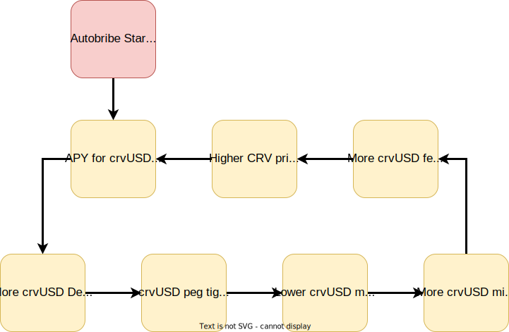

<h1>Autobribe System</h1>

The Autobribe system is a way to use a percentage of the fees generated from crvUSD to vote for pools and lending markets which include crvUSD as an asset.  This has a few interesting effects.  It means these pools should suck up crvUSD liquidity, which will tighten the peg, lowering rates, driving users to mint more and increasing the fees to veCRV holders.  

This makes crvUSD a desirable token for pairing on Curve, as it provides free emissions to pools containing it, proportional to the average amount in the pool.

This system has been developed, but is not currently enabled, yet could be if approved by DAO voters.

Currently all the crvUSD fees generated go to the veCRV holders:

{ width="400"}

This proposal **splits the crvUSD fees into a percentage for veCRV holders, and a percentage for Autobribes**:

{ width="400"}

The **percentage that is split between veCRV holders and Autobribes is chosen with a governance vote**.  

The fees sent to the autobribe system flow back to the veCRV holders in the form of bribes for gauge weight votes, so they are not lost, and there should be no noticable decrease in weekly veCRV APY when factoring in voting incentives.

---

## **Bribes**

Bribes are the colloquial name for incentives received for voting for a specific way in a governance vote.  

In the Curve ecosystem, for some years there have been 3rd party voting markets where projects (for example Frax) pay veCRV holders to [gauge vote](../reward-gauges/gauge-weights.md) for pools with FRAX the asset.  This directs a portion of the CRV inflation for the following week towards this pool.  Paying for votes in this way has historically been cheaper than incentivizing liquidity directly with FXS/FRAX rewards for the pool.

Currently, by paying for CRV rewards using bribes, projects can get $1.00 of CRV for every $0.97 they spend, a 3% discount.

## **Autobribes Overview**

Each week, the amount of crvUSD fees collected for Autobribes will be split proportionally between all Pools and Lending Supply Vaults which have crvUSD as an asset.  The more crvUSD the pool (vaults included) has, the more bribes the pool will receive.

$$\text{each bribe} = \text{total autobribe fees} \times \frac{\text{crvUSD in pool}}{\text{crvUSD total}}$$

In this first version of Autobribes, each of these bribes is proposed to be sent to [Stakedao's votemarket](https://votemarket.stakedao.org/).  Using this marketplace, any veCRV holder can vote for the crvUSD pools and receive bribes for doing so.  In turn the following week the pool will receive further CRV incentives, making all crvUSD pools and vaults more desirable for Liquidity Providers.

Interestingly, while at first glance it seems like veCRV holders would be losing revenue due to splitting their fees with the autobribe system, the value actually flows back to them through these bribes.

---

## **Potential Fee Flywheel**

Incentivizing in this way creates the likelihood that many new projects will create pools and lending markets on Curve and pair them with crvUSD, because they get free liquidity incentives for doing so.

This increases the demand for crvUSD, tightening the peg, which reduces interest rates and incentivizes minting of crvUSD.  More minting of crvUSD increases CRV fees.  If fees increase, price should follow (but obviously it's CRV so probably won't lol).  If CRV price increases, bribes control more emissions, which incentivizes more crvUSD liquidity to the pools.

!!!warning "This will reduce fees for crvUSD in the short term"
    As interest rates for minting crvUSD are currently very high (17%+), this proposal should reduce them, which in turn reduces revenue for veCRV holders in the short term.  In the long term this needs to happen.  crvUSD minting rates are currently among the highest in defi, and because of this the **crvUSD supply is slowly contracting** as users head to cheaper liquidity, creating a long term problem for fees.  
    
    **The only sustainable way to increase fees in the long term is to increase the supply of crvUSD**.  To do this supply sinks and demand need to be created, which in turn tightens the peg and reduces rates.  Autobribe should help this by incentivizing liquidity into Curve Pools and Vaults, which also makes Curve products more valuable.

---

## **How the system will work**

Each week the fees will be split and sent 