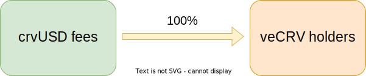
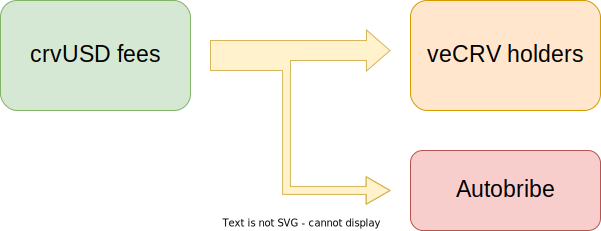

<h1>Autobribe System</h1>

The Autobribe system is a way to use a percentage of the fees generated from crvUSD to vote for pools and lending markets which include crvUSD as an asset.  This has a few interesting effects.  It means these pools should suck up crvUSD liquidity, which will tighten the peg, lowering rates, driving users to mint more and increasing the fees to veCRV holders.  

This makes crvUSD a desirable token for pairing on Curve, as it provides free emissions to pools containing it, proportional to the average amount in the pool.

This system has been developed, but is not currently enabled, yet could be if approved by DAO voters.

Currently all the crvUSD fees generated go to the veCRV holders:

{ width="400"}

This proposal **splits the crvUSD fees into a percentage for veCRV holders, and a percentage for Autobribes**:

{ width="400"}

The **percentage that is split between veCRV holders and Autobribes is chosen with a governance vote**.

---

## **How Autobribes Work**

Each week, the amount of crvUSD fees collected for Autobribes will be split proportionally between all Pools and Lending Supply Vaults which have crvUSD as an asset.  The more crvUSD the pool/vault has, the more bribes the pool/vault will receive.

$$\text{bribe} = \text{autobribe fees} \times \frac{\text{crvUSD in pool/vault}}{\text{crvUSD total}}$$

