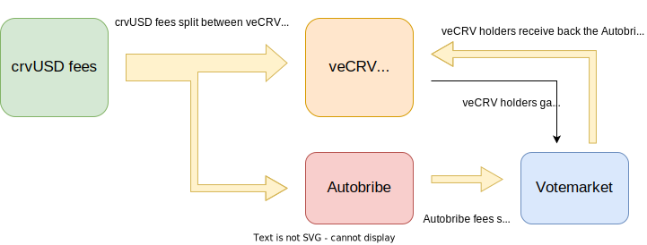

<h1>Autobribe System</h1>

The Autobribe system is a way to use a percentage of the fees generated from crvUSD to vote for pools and lending markets which include crvUSD as an asset.  This has a few interesting effects.  It means these pools should suck up crvUSD liquidity, which will tighten the peg, lowering rates, driving users to mint more and increasing the fees to veCRV holders.  

This makes crvUSD a desirable token for pairing on Curve, as it provides free emissions to pools containing it, proportional to the average amount in the pool.

This system has been developed, but is not currently enabled, yet could be if approved by DAO voters.

Currently all the crvUSD fees generated go to the veCRV holders:

{ width="400"}

This proposal **splits the crvUSD fees into a percentage for veCRV holders, and a percentage for Autobribes**:

{ width="400"}

The **percentage that is split between veCRV holders and Autobribes is chosen with a governance vote**.  

The fees sent to the autobribe system flow back to the veCRV holders in the form of bribes for gauge weight votes, so they are not lost, and there should be no noticable decrease in weekly veCRV APY when factoring in voting incentives.

---

## **Bribes**

Bribes are the colloquial name for incentives received for voting for a specific way in a governance vote.  

In the Curve ecosystem, for some years there have been 3rd party voting markets where projects pay veCRV holders to [gauge vote](../reward-gauges/gauge-weights.md) for pools with their asset, for example Frax pays each week to incentivize FRAX pools.  This directs a portion of the CRV inflation for the following week towards this pool.  Paying for votes in this way has historically been cheaper than incentivizing liquidity directly with FXS/FRAX rewards for the pool.

Currently, by paying for CRV rewards using bribes, projects can get $1.26 of CRV for every $1.00 they spend, which is a great deal.  The Autobribe system makes use of this discount to direct emissions towards crvUSD pools efficiently.

---

## **Autobribes Overview**

Each week, the amount of crvUSD fees collected for Autobribes will be split proportionally between all Pools and Lending Supply Vaults which have crvUSD as an asset.  The more crvUSD the pool (vaults included) have, the more bribes the pools will receive.

$$\text{each bribe} = \text{total autobribe fees} \times \frac{\text{crvUSD in pool}}{\text{crvUSD total}}$$

In this first version of Autobribes, each of these bribes is proposed to be sent to [Stakedao's votemarket](https://votemarket.stakedao.org/).  Using this marketplace, any veCRV holder can vote for the crvUSD pools and receive bribes for doing so.  In turn, the following week the pool will receive further CRV incentives, making all crvUSD pools and vaults more desirable for Liquidity Providers.

Interestingly, while at first glance it seems like veCRV holders would be losing revenue due to splitting their fees with the autobribe system, the value actually flows back to them through these bribes.  See below.

---

## **Potential Fee Flywheel**

Incentivizing in this way creates the likelihood that many new projects will create pools and lending markets on Curve and pair them with crvUSD, because they get free liquidity incentives for doing so.

This increases the demand for crvUSD, tightening the peg, which reduces interest rates and incentivizes minting of crvUSD.  More minting of crvUSD increases CRV fees.  If fees increase, price should follow.  If CRV price increases, bribes control more emissions, which incentivizes more crvUSD liquidity to the pools.

Interest rates for minting crvUSD have been very high recently (20%+), this proposal should suppress them in the long term.  By keeping minting rates low Curve will become a more desirable place to borrow from, increasing the supply and crvUSD fees in the long term.

---

## **How the system will work**

Each week a percentage of the crvUSD fees will be split and sent to the Autobribe system.  Bribes will be created on [Stakedao's Votemarket](https://votemarket.stakedao.org/), each bribe will be proportional to the percentage of crvUSD in each pool and supply lending vault as detailed in the equation above.  v1 is still in development, but currently it's proposed that a trusted third party suggests each bribe and users can then accept the bribe if is correct.  **The third party never takes control of any assets**, they can also never use their power to send themselves anything.  What they can propose and suggest is very limited, and must be accepted by the community.

Once the Votemarket bribes are created, holders with veCRV [gauge weight vote](../reward-gauges/gauge-weights.md) for those pools , and the total bribe is split on a per veCRV basis.  For example, a pool has a $600 bribe, Alice votes for the pool with 200 veCRV, and Bob votes using 100 veCRV.  The total is 300 veCRV, so each veCRV that voted gets $2, Alice's 200 veCRV = $400, Bob's 100 veCRV = $200.

Voters can then claim their incentives after the voting period for the bribe has concluded.  The gauge weights will then increase the proportion of CRV flowing to pools and lending vaults with crvUSD, increasing demand and spinning the flywheel.