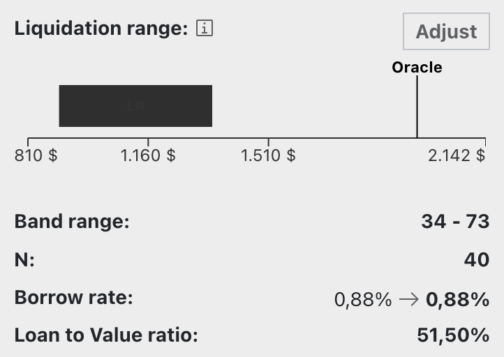

# **Loan Creation**

In standard mode, creating a loan using $crvUSD only requires setting how much of the collateral asset you would like to add, and how much $crvUSD you would like to borrow in return. After you have set your collateral amount, the UI will display the maximum amount you can borrow.

The UI includes a dropdown to see additional loan parameters like the current Oracle Price and [Borrow Rate](/crvusd/understanding-tokenomics#borrow-rate).

In the upper right-hand side of the screen, you can toggle advanced mode.

The advanced mode adds an additional display with more information about the current distribution across all the [bands](/crvusd/understanding-tokenomics#bands) within the entire [LLAMMA](/crvusd/understanding-tokenomics#llamma). It also enhances the loan creation interface by displaying the liquidation and band range, number of bands, borrow rate, and Loan to Value ratio (LTV). 

{ width="300" }

Additionally, users can manually select the number of bands for the loan by pressing the "adjust" button and using the slider to increase or decrease the number of bands.

{ width="300" }

# **Leveraging Loans**
The UI provides the option to leverage your loan. To do so, just navigate to the "Leverage" tab.

!!!info
    You can leverage your collateral up to 9x. This has the effect of repeat trading crvUSD to collateral and depositing to maximize your collateral position. Essentially, all borrowed crvUSD is utilized to purchase more collateral.  
    Be careful, if the collateral price dips, you would need to repay the entire amount to reclaim your initial position. 

[Here](https://curve.substack.com/p/august-15-2023-all-or-nothing) is a good explainer on how leveraging works. 

{ width="400" }

Toggling the advanced mode expands the display to show additional information about the loan, including the price impact, trade route and the actual leverage.

{ width="300" }

