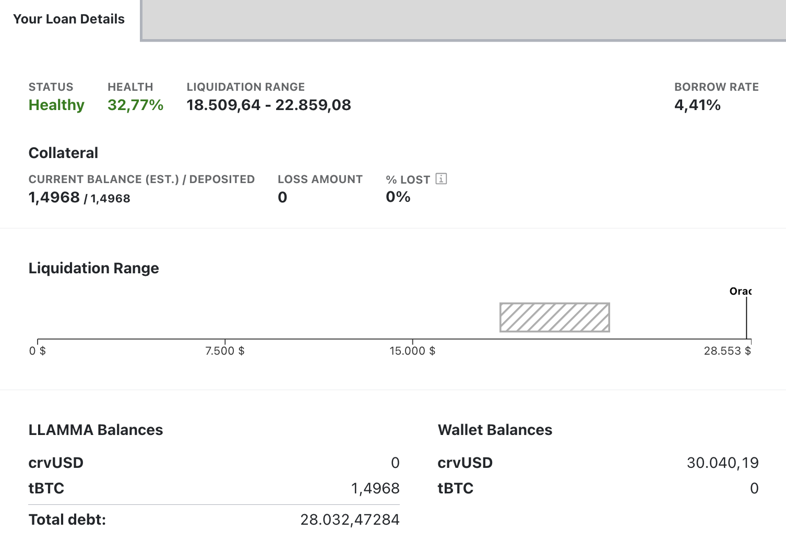
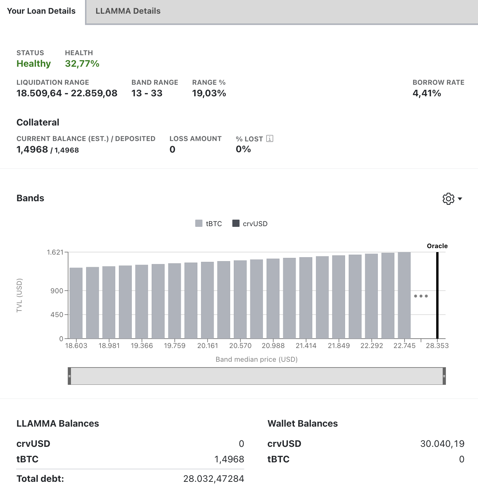

The Loan Details page displays information of an individual loan, along with features necessary for loan management.

<figure markdown>
  { width="700" }
  <figcaption></figcaption>
</figure>

# **Loan Details**

When a user creates a loan, their **collateral is allocated across a range of liquidation prices**. Should the asset price fall within this range, the loan will enter soft-liquidation mode. In this state, the user is not allowed to add additional collateral. The only recourse is to either repay with crvUSD or to self-liquidate the loan.

<figure markdown>
  { width="600" }
  <figcaption></figcaption>
</figure>

The section on the bottom of the page provides information about the entire [**LLAMMA**](#llamma) system, showing aspects such as the total amount of debt, along with individual wallet balances.

When a position was or is in soft-liquidation mode, losses occur. The UI displays the total ***LOSS AMOUNT*** as well as the ***% LOST***, which measures the loss in collateral value caused by the soft-liquidation process.

<figure markdown>
  { width="600" }
  <figcaption></figcaption>
</figure>

On the upper right-hand side of the screen, switching to advanced mode provides additional details about the loan.

<figure markdown>
  { width="350" }
  <figcaption></figcaption>
</figure>

In advanced mode the UI shows more information about the [**collateral bands**](#bands).

<figure markdown>
  { width="600" }
  <figcaption></figcaption>
</figure>

Advanced mode also adds a tab with more info about the entire [**LLAMMA**](#llamma).

<figure markdown>
  { width="600" }
  <figcaption></figcaption>
</figure>

## **Loan Parameters**

- **A:** The amplification parameter A defines the density of liquidity and band size.
- **Base Price:** The base price is the price of the band number 0.
- **Oracle Price:** The oracle price is the current price of the collateral as determined by the oracle. The oracle price is used to calculate the collateral's value and the loan's health.
- **Borrow Rate:** The borrow rate is the annual interest rate charged on the loan. This rate is variable and can change based on market conditions. The borrow rate is expressed as a percentage. For example, a borrow rate of 7.62% means that the user will be charged 7.62% interest on the loan's outstanding balance.

# **crvUSD Concepts**

## **Bands**

When loans are created, collateral is spread among several bands. Each band has a range of prices for the asset. If the [**price oracle**](../factory-pools/understanding-oracles.md) is inside this range of prices, that particular band of collateral is likely to be liquidated.

!!!info 
    The number of bands has a significant influence on the amount of losses when a loan is in self-liquidation. See [**here**](#loan-health).

In the example above, the collateral is distributed across 10 bands. The darker grey indicates collateral that has been converted into crvUSD, while the lighter grey represents the original collateral type. Hovering over any bar reveals details about that specific position within the band, including the corresponding asset prices. During soft-liquidation, a band may exhibit a mix of crvUSD and the original collateral.

## **Borrow Rate**

The borrow rate is variable based on conditions in the pool. For instance, when collateral price is down and some positions are in soft-liquidation, the rate can fall. A decreasing rate creates incentive to borrow and dump, while an increasing rate creates incentives to buy crvUSD and repay.

<figure markdown>
  { width="400" }
  <figcaption></figcaption>
</figure>

*with:*

- **`r`**:	rate
- **`rate0`**:	rate when pegkeepers have no debt and price of crvUSD is 1
- **`price_peg`**:	desired crvUSD price: 1.00
- **`price_crvusd`**:	actual crvUSD price
- **`DebtFraction`**:	ratio of the PegKeeper's debt to the total outstanding debt
- **`TargetFraction`**:	target fraction
- **`PegKeeperDebt`**:	sum of debt of all PegKeepers
- **`TotalDebt`**:	total crvUSD debt

A tool to experiment with the interest rate model is available [here](https://crvusd-rate.0xreviews.xyz/).

## **Liquidation**

In soft-liquidation, the collateral within a band is at risk of being converted into crvUSD. If the price goes back, it will be rehypothecated into collateral, although it will likely be lower than the initial amount.  While in soft-liquidation mode, users cannot modify their collateral. The only options available are to either partially or fully repay the debt or opt to self-liquidate the position.

If a borrower's health continues to decline, they may face a 'hard liquidation', functioning more like a standard liquidation process, resulting in the erasement of their position.

## **LLAMMA**

LLAMMA (Lending-Liquidating AMM Algorithm) is a fully functional AMM with all the functions a user would expect. For more detail [**please check the source code**](https://github.com/curvefi/curve-stablecoin/blob/master/contracts/AMM.vy).

## **Loan Health**

Based on a users collateral and borrow amount, the UI will display the health score and status. If the position is in self-liquidation mode, an additional warning will be displayed. Once a loan reaches 0% health, the loan is eligible to be hard-liquidated.

!!!warning "Losses in soft-liquidation mode"
    The **health of a loan decreases when the loan enters self-liquidation mode. These losses do not only occur when prices go down but also when the collateral price rises again, resulting in the de-liquidation of the user's loan.** This implies that the health of a loan can decrease even though the collateral value of the position increases. If a loan is not in self-liquidation mode, then no losses occur. Losses also heavily depend on the number of [**bands**](#bands) used; the more bands there are, the fewer the losses.

<figure markdown>
  { width="600" }
  <figcaption></figcaption>
</figure>
