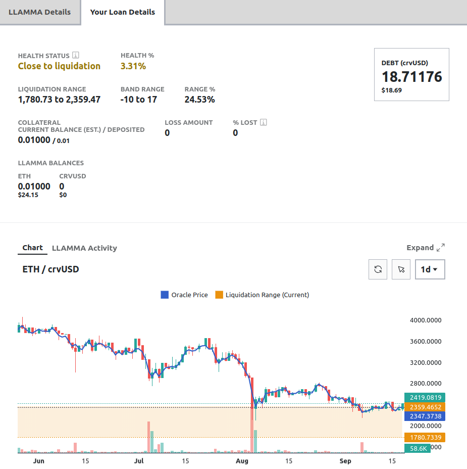

The Loan Details page displays information of an individual loan, along with features necessary for loan management.

<figure markdown>
  { width="700" }
  <figcaption></figcaption>
</figure>

# **Loan Details**

When a user creates a loan, their **collateral is allocated across a range of bands (liquidation prices)**. Should the asset price fall within this range, the loan will enter soft-liquidation mode. In this state, the user is not allowed to add additional collateral. The only recourse is to either repay with crvUSD or to self-liquidate the loan.

<figure markdown>
  { width="600" }
  <figcaption></figcaption>
</figure>

The section on the bottom of the page provides information about the entire [**LLAMMA**](#llamma-and-liquidations) system, showing aspects such as the total amount of debt, along with individual wallet balances.

When a position was or is in soft-liquidation mode, losses occur. The UI displays the total ***LOSS AMOUNT*** as well as the ***% LOST***, which measures the loss in collateral value caused by the soft-liquidation process.

<figure markdown>
  { width="600" }
  <figcaption></figcaption>
</figure>

On the upper right-hand side of the screen, switching to advanced mode provides additional details about the loan.

<figure markdown>
  { width="350" }
  <figcaption></figcaption>
</figure>

In advanced mode the UI shows more information about the [**collateral bands**](#bands).

<figure markdown>
  { width="600" }
  <figcaption></figcaption>
</figure>

Advanced mode also adds a tab with more info about the entire [**LLAMMA**](#llamma-and-liquidations).

<figure markdown>
  { width="600" }
  <figcaption></figcaption>
</figure>

---

# **crvUSD Concepts**

## **Market Parameters**

Each crvUSD market has the following parameters which affect all loans and change automatically due to market forces:

- **Base Price:** The base price is the upper price limit of band number 0.  Borrow rate increases the base price over time.
- **Oracle Price:** The oracle price is the current price of the collateral as determined by the oracle. The oracle price is used to calculate the collateral's value and the [loan's health](#loan-health).
- **Borrow Rate:** The borrow rate is the annual interest rate charged on the loan. This rate is variable and can change based on market conditions. The borrow rate is expressed as a percentage. For example, a borrow rate of 7.62% means that the user will be charged 7.62% interest on the loan's outstanding debt.  See [here](#borrow-rate) for how it's calculated.

Each market also has the following parameters which only change if the CurveDAO votes them to change:

- **A:** The amplification parameter A is used to calculate the density of liquidity and [band](#bands-n) width, as well as the [maximum LTV](#loan-discount) of a market.
- **Loan Discount:** The loan discount defines how much the collateral is discounted when taking a loan, it is directly related to the maximum LTV of each crvUSD market.  See [here](#loan-discount) for more information.
- **Liquidation Discount:** The liquidation discount is used to discount the collateral when calculating the health of the loan.  See the [health section](#loan-health) for more information.
- **Sigma:** Sigma changes how quickly rates increase and decrease when crvUSD depegs.  With a higher sigma interest rates will increase slower when crvUSD depegs.  See [here](#borrow-rate) for more information.

## **LLAMMA and Liquidations**

LLAMMA (**Lending-Liquidating AMM Algorithm**) is a fully functional two-token AMM containing the collateral token and crvUSD, which is **responsible for the liquidation mechanism**. For more detailed documentation, please refer to the [technical docs](https://docs.curve.fi/crvUSD/amm/).

When creating a new loan, the put-up **collateral will be deposited into a specified number of bands across the AMM**. Unlike regular liquidation, which has a single liquidation price, LLAMMA has multiple liquidation ranges (represented by the bands) and **continuously liquidates the collateral if needed**.   All bands have lower and upper price limits, each representing a "small liquidation range." The user's total liquidation range is represented by the upper price of the highest band to the lower price of the lowest band.

A loan only **enters soft-liquidation mode once the price of the collateral asset is within a band**. If the price is outside the bands, there is no need to partially liquidate and therefore not in soft-liquidation.

The AMM works in a way that the collateral price within the AMM and the "regular price" are treated a bit differently. If the price falls into a band, prices are adjusted in a way that external arbitrageurs are incentivized to sell the collateral token and buy crvUSD in the band. So, **if the price is within a band, the user's collateral will be sold for crvUSD**, meaning the user's collateral is now a combination of both tokens. This happens for each individual band the user has liquidity deposited into.

**This liquidation process does not only happen when prices fall but also when they rise again**. If the collateral in a band has been fully converted into crvUSD and the collateral price rises again, the earlier sold-off collateral will be bought up again.

*In short: External traders will soft-liquidate a users collateral when the collateral token's price is falling and de-liquidate it again when prices rise again.*

!!!warning "Losses in Soft-Liquidation"
    Positions in soft-liquidation / de-liquidation are suffering losses due to the selling and buying of collateral. If the position is not in soft-liquidation, no losses occur. These losses decrease the health of the loan. Once a user's health is at 0%, the user's position may face a hard-liquidation, which closes the loan.

---

## **Bands (N)**

When creating a loan, the added collateral is spread among the number of bands selected. Minimum amount is 4 bands, and the maximum amount is 50 bands.

**A band essentially is a price range, with an upper and lower price limit**. If the price of the collateral is within the limits of a band, that particular band is likely to be liquidated.

***Note that band price ranges drift higher over time as base price increases by the borrow rate***

<figure markdown>
  { width="700" }
  <figcaption></figcaption>
</figure>

In the illustration above, there are multiple bands with different price ranges. The light grey areas represent the collateral token, which in this example is ETH. As depicted, the bands below the collateral token's price are entirely in ETH since there is no need for liquidation, given the higher price. The dark grey areas represent crvUSD. Because the price of ETH fell within the band on the far right, the deposited collateral (ETH) is converted into crvUSD. In this instance, the band consists of both ETH and crvUSD. If the price continues to decline, all collateral in the band will be fully converted into crvUSD, and the band to the left will undergo soft-liquidation.

*Remember: When prices rise again, the opposite is happening. The ETH which was converted into crvUSD earlier will be converted back into ETH again.*

<figure markdown>
  { width="230" }
  <figcaption>A band which has fully been soft-liquidated. All collateral was converted into crvUSD because the price of the collateral is below the liquidation range.</figcaption>
</figure>

<figure markdown>
  { width="250" }
  <figcaption>A band which currently is in soft-liquidation. It contains both, the collateral token and crvUSD.</figcaption>
</figure>

<figure markdown>
  { width="250" }
  <figcaption>A band which has not been liquidated yet (composition is 100% collateral token). The price of the collateral is above the liquidation range.</figcaption>
</figure>

### Band Formulae:

`A` controls the density of the liquidity.  This is directly related to the width of the bands.  Band width at any price can be estimated to be:

$$\text{bandwidth} \approx \frac{\text{price}}{\text{A}}$$

To find the exact **upper price limit** and **lower price limits** of the bands the following formulae can be used:

$$\begin{aligned} \text{upperLimit} &= \text{basePrice} * \left( \frac{A-1}{A} \right)^{n} \\
\text{lowerLimit} &= \text{basePrice} * \left( \frac{A-1}{A} \right)^{n+1}\end{aligned}$$

Where:

* $\text{basePrice}$: The current base price of the desired market
* $A$: The amplification factor of the desired market (default is 100)
* $n$: The Band Number, e.g., $-$67.

### **Band Calculator**

Use the calculator below to simulate how bands are shaped and how liquidity density changes with different parameters.  By definition the liquidity density will be 100% at band 1.  Liquidity density increases as band width decreases as more collateral will be spread over a smaller price range.

<canvas id="ampChart"></canvas>
<h4>Inputs:</h4>

    <label for="ampInput" style="margin-right: 2%;">A : </label>
    <input type="number" id="ampInput" min="1" max="10000" step="1" value="30" style="font-size: 16px; width: 15%;">
    <label for="numBandsInput" style="margin-left: 3%; margin-right: 2%;">N : </label>
    <input type="number" id="numBandsInput" min="1" max="50" step="1" value="10" style="font-size: 16px; width: 15%;">
    <label for="basePriceInput" style="margin-left: 3%; margin-right: 2%;">Base Price ($):</label>
    <input type="number" id="basePriceInput" min="0.01" max="1000000" step="0.01" value="2000" style="font-size: 16px; width: 20%;">
    

---

## **Loan Health**

Based on a user's collateral and debt amount, the UI will display a health score and status. If the position is in soft-liquidation mode, an additional warning will be displayed. Once a loan reaches **0% health**, the loan is **eligible to be hard-liquidated**. In a hard-liquidation, someone else can pay off a user's debt and, in exchange, receive their collateral. The loan will then be closed.

The **health of a loan decreases when the loan is in soft-liquidation mode. These losses do not only occur when prices go down but also when the collateral price rises again, resulting in the de-liquidation of the user's loan.** This implies that the health of a loan can decrease even though the collateral value of the position increases. If a loan is not in soft-liquidation mode, then no losses occur.

Losses are hard to quantify. There is no general rule on how big the losses are as they are dependent on various external factors such as how fast the collateral price falls or rises or how efficient the arbitrage is. But what can be said is that the **losses heavily depend on the number of bands** used; the more bands used, the fewer the losses.  Daily losses based on current data are shown [here](./loan-management.md#soft-liquidation-losses).

The formula for health is below, this is visualized in the Health Calculator applet as well.

$$\begin{aligned} \text{health} &= \frac{s \times (1-\text{liqDiscount}) + p}{\text{debt}} - 1 \\ 
p &= \text{collateral} \times \text{priceAboveBands} \end{aligned}$$

Where:

- $\text{collateralValue}$ : the value of all collateral at the current LLAMMA prices
- $\text{liqDiscount}$ : the liquidation discount for the market (how much to discount the collateral value for safety during hard-liquidation).
- $\text{debt}$ : the debt of the user
- $s$ : an estimation of how much crvUSD a user would have after converting all collateral through their bands in soft-liquidation.  This can be very roughly estimated as: $\text{collateral} \times \left( \frac{\text{softLiqUpperLimit} - \text{softLiqLowerLimit}}{2} \right)$
- $p$ : The value above the soft-liquidation bands.  Found by multiplying the amount of collateral by how far above soft-liquidation the current price is.  If user is in or below soft-liquidation, this value is 0.
- $\text{collateral}$ - The amount of collateral a user has, e.g., if a user has 5 wBTC, this value is 5.
- $\text{priceAboveBands}$ - The price difference between the oracle price and the top of the user's soft-liquidation range (upper limit of top band).  This value is 0 if user is in soft-liquidation.  See applet below for a visual representation.
- $\text{collateralPrice}$ - The price of a single unit of the collateral asset, e.g., if the collateral asset is wBTC, this value is the price of 1 wBTC.

### **Health Calculator**

*Use the applet below to simulate how health works, soft-liquidation losses are given as numbers in a comma separated list, the first number is the starting band onwards.  The light blue shaded areas in the bands represent the value without using the soft-liquidation discounts, while the dark blue areas are the values after discounting.*

<h4>Inputs:</h4>

  

    

      

        <label for="ampInputLiq" style="margin-right: 10px;">A:</label>
        <input type="number" id="ampInputLiq" min="0" max="1000" step="1" value="10" style="font-size: 16px; width: 80px;">
      

      

        <label for="startingBandInputLiq" style="margin-right: 10px;">Starting Band:</label>
        <input type="number" id="startingBandInputLiq" min="-1000" max="1000" step="1" value="2" style="font-size: 16px; width: 80px;">
      

      

        <label for="oraclePriceLiq" style="margin-right: 10px;">Oracle Price ($):</label>
        <input type="number" id="oraclePriceLiq" min="0" max="100000" step="0.01" value="1100" style="font-size: 16px; width: 80px;">
      

      

        <label for="collateralLiq" style="margin-right: 10px;">Collateral Amount:</label>
        <input type="number" id="collateralLiq" min="0" max="1000000" step="0.01" value="10" style="font-size: 16px; width: 80px;">
      

      

        <label for="debtLiq" style="margin-right: 10px;">Debt ($):</label>
        <input type="number" id="debtLiq" min="0" max="1000000" step="0.01" value="5000" style="font-size: 16px; width: 80px;">
      

    

    

      

        <label for="basePriceInputLiq" style="margin-right: 10px;">Base Price ($):</label>
        <input type="number" id="basePriceInputLiq" min="0" max="100000" step="0.01" value="1000" style="font-size: 16px; width: 80px;">
      

      

        <label for="finishBandInputLiq" style="margin-right: 10px;">Finish Band:</label>
        <input type="number" id="finishBandInputLiq" min="-1000" max="1000" step="1" value="5" style="font-size: 16px; width: 80px;">
      

      

        <label for="liqDiscountLiq" style="margin-right: 10px;">Liquidation Discount %:</label>
        <input type="number" id="liqDiscountLiq" min="0" max="100" step="0.01" value="10" style="font-size: 16px; width: 80px;">
      

      

        <label for="slLossesLiq" style="margin-right: 10px;">Soft Liquidation Losses (%):</label>
        <input type="string" id="slLossesLiq" value="0,0,0,0" style="font-size: 16px; width: 80px;">
      

    

  

 
<canvas id="liqChart"></canvas>
 
<canvas id="healthChart"></canvas>

  

    
<strong>Health</strong> (including value above bands):

    
<strong>Health</strong> (not including value above bands):

  

  

    

      
    

    

      
    

  

*The Curve UI will either show health adding value above bands or without that value based on how close to liquidation a user is.  If the active band (Oracle price band) is 3 or less bands away from the user's soft liquidation bands, the UI will show the health not including value above bands.  Otherwise it will show the health including the value above bands.*

*The health values on the Curve UI and within smart contracts will always be slightly less than the values here.  Health is calculated by estimating the amount of crvUSD/debt tokens the collateral will be swapped for in each band.  This takes into account how much liquidity is in each band, the more liquidity in a band the less slippage Curve estimates will occur.  This slippage estimation slightly reduces a user's health.*

---

## **Loan Discount**

The `loan_discount` is used for finding the maximum LTV a user can have in a market.  At the time of writing in crvUSD markets this value is a constant 9%, in Curve Lending markets this value ranges from 7% for WETH to 33% for volatile assets like UwU.  Use the calculator below to see the maximum LTVs a user can have based on the `loan_discount`, amplification factor `A` and their number of bands `N`.  The formula is:

$$\text{maxLTV} = 1 - \text{loan_discount} - \frac{N}{2*A}$$

  <h3 style="margin-top: 0;">Maximum LTV Calculator</h3>
  <h4>Inputs:</h4>
  

    

        <label for="ampInput2" style="margin-right: 10px;">A:</label>
        <input type="number" id="ampInput2" min="1" max="10000" step="1" value="30" style="font-size: 16px; width: 80px;">
        <label for="numBandsInput2" style="margin-left: 20px; margin-right: 10px;">N:</label>
        <input type="number" id="numBandsInput2" min="4" max="50" step="1" value="10" style="font-size: 16px; width: 80px;">
        <label for="loanDiscountInput" style="margin-left: 20px; margin-right: 10px;">Loan Discount % :</label>
        <input type="number" id="loanDiscountInput" min="0" max="100" step="1" value="10" style="font-size: 16px; width: 80px;">
    

    

  <h4>Result</h4>

  
Maximum LTV: 

---

## **Borrow Rate**

The general idea is that **borrow rate increases when crvUSD goes down in value and decreases when crvUSD goes up in value**.  Also, contracts called [PegKeepers](https://docs.curve.fi/crvUSD/pegkeepers/overview/) can also affect the interest rate and crvUSD peg by minting and selling crvUSD or buying and burning crvUSD.

*The formula for the borrow rate is as follows:*

$$\begin{aligned}r &= \text{rate0} * e^{\text{power}} \\
\text{power} &= \frac{\text{price}_\text{peg} - {\text{price}_\text{crvUSD}}}{\text{sigma}} - \frac{\text{DebtFraction}}{\text{TargetFraction}} \\
\text{DebtFraction} &= \frac{\text{PegKeeperDebt}}{\text{TotalDebt}}\end{aligned}$$

*with:*

- $r$:	The interest rate.
- $\text{rate0}$:	The rate when PegKeepers have no debt and the price of crvUSD is exactly 1.00.
- $\text{price}_\text{peg}$:	Desired crvUSD price: 1.00
- $\text{price}_\text{crvUSD}$:	Current crvUSD price.
- $\text{sigma}$: variable which can be configured by the DAO, lower value makes the interest rates increase and decrease faster as crvUSD loses and gains value respectively.
- $\text{DebtFraction}$:	Ratio of the PegKeeper's debt to the total outstanding debt.
- $\text{TargetFraction}$:	Target fraction.
- $\text{PegKeeperDebt}$:	The sum of debt of all PegKeepers.
- $\text{TotalDebt}$:	Total crvUSD debt across all markets.

*A tool to experiment with the interest rate model is available [here](https://crvusd-rate.0xreviews.xyz/).*

---

## **PegKeeper**

A PegKeeper is a contract that helps stabilize the crvUSD price. PegKeepers are deployed for special Curve pools, a list of which can be found [here](https://docs.curve.fi/references/deployed-contracts/#curve-stablecoin).

PegKeepers take certain actions based on the price of crvUSD within the pools. All these actions are fully permissionless and callable by any user.

When the price of crvUSD in a pool is above 1.00, they are allowed to take on debt by minting un-collateralized crvUSD and depositing it into specific Curve pools. This increases the balance of crvUSD in the pool, which consequently decreases its price.

If a PegKeeper has taken on debt by depositing crvUSD into a pool, it is able to withdraw those deposited crvUSD from the pool again. This can be done when the price is below 1.00. By withdrawing crvUSD, its token balance will decrease and the price within the pool increases.

[:octicons-arrow-right-24: More on PegKeepers here](https://docs.curve.fi/crvUSD/pegkeepers/overview/)

