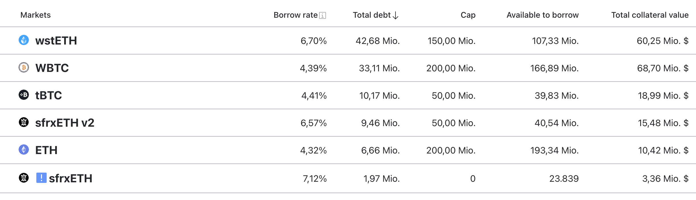

Curve Stablecoin infrastructure allows users to mint crvUSD using a variety of crypto-tokenized collaterals. Positions are managed passively: if the price of the collateral decreases, the system automatically initiates a 'soft-liquidation' process to sell off some of the collateral. Conversely, if the price of the collateral increases, the system recovers the collateral. However, this process may result in some losses due to the liquidations and de-liquidations.

Manage crvUSD positions at [https://crvusd.curve.fi/](https://crvusd.curve.fi/)

## **Markets**
On the 'Markets' tab, all available collateral types are displayed.

The page displays the current [borrow rate](../crvusd/loan-details.md#borrow-rate), total debt, debt cap, remaining amount available for borrowing, and the total value of collateral.

<figure markdown>
  { width="700" }
  <figcaption></figcaption>
</figure>

If no position exists, clicking on any market will lead to the [loan creation](../crvusd/loan-creation.md#loan-creation) page.

Should a position already exist, a dollar sign overlay will appear on the left. Selecting the market will lead to the [loan management](../crvusd/loan-creation.md#loan-management) interface.

## **Risks**

Please consider the following risk disclaimers when using the Curve Stablecoin infrastructure:

1. If your collateral enters soft-liquidation mode, you can't withdraw it or add more collateral to your position. Should the price of the collateral drop sharply over a short time interval, your position will get hard-liquidated, with no option of de-liquidation. Please choose your leverage wisely, as you would with any collateralized debt position.
    1. If your collateral enters soft-liquidation mode, you can't withdraw it or add more collateral to your position.
    2. Should the price of the collateral change drop sharply over a short time interval, it can result in large losses that may reduce your loan's health.
    3. If you are in soft-liquidation mode and the price of the collateral goes up sharply, this can result in de-liquidation losses on the way up. If your loan's health is low, value of collateral going up could potentially reduce your underwater loan's health.
    4. If the health of your loan drops to zero or below, your position will get hard-liquidated with no option of de-liquidation. Please choose your leverage wisely, as you would with any collateralized debt position.
2. The crvUSD stablecoin and its infrastructure are currently in beta testing. As a result, investing in crvUSD carries high risk and could lead to partial or complete loss of your investment due to its experimental nature. You are responsible for understanding the associated risks of buying, selling, and using crvUSD and its infrastructure.
3. The value of crvUSD can fluctuate due to stablecoin market volatility or rapid changes in the liquidity of the stablecoin.
4. crvUSD is exclusively issued by smart contracts, without an intermediary. However, the parameters that ensure the proper operation of the crvUSD infrastructure are subject to updates approved by Curve DAO. Users must stay informed about any parameter changes in the stablecoin infrastructure.

