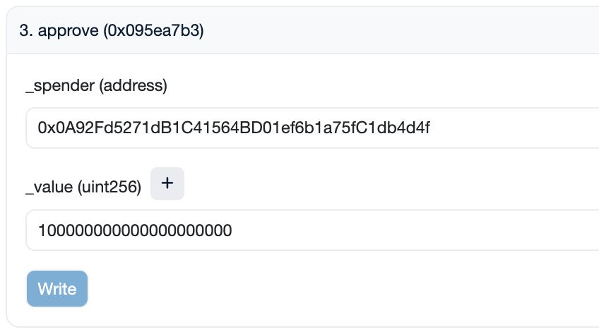
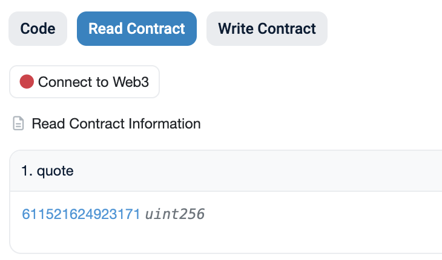
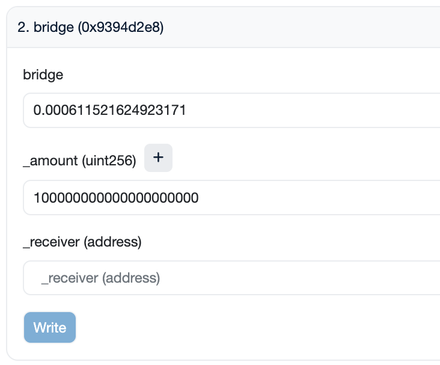

<h1>User Guide: Bridging Curve Ecosystem Tokens</h1>

Curve uses [LayerZero](https://layerzero.network/) to enable **cross-chain transfers of `CRV`, `crvUSD`, and `scrvUSD`** to other L1 blockchains such as `BinanceSmartChain`, `Avalanche`, and `Fantom`. This guide focuses on bridging using only blockchain explorers, reducing reliance on third-party interfaces and avoiding any additional fees they may charge.

This guide explains how to **bridge any of the three tokens from the Ethereum Mainnet to other L1 blockchains or vice versa**. The only requirements include having a wallet with the token to be bridged and ETH or the gas token of the L1, depending on the bridging direction, to cover transaction fees.

!!!info "Contract Addresses"
    This guide is applicable for bridging `CRV`, `crvUSD` and `scrvUSD` to other L1 blockchains. When following this guide, one needs to make sure to use the correct contract addresses depending on the token to be bridged.

    === ":logos-crv: CRV"

        The contract addresses for bridges are mirrored meaning the bridge contract on Ethereum is the same as the one on the L1 blockchain. But the CRV token address is different for each chain.

        - :logos-ethereum: Ethereum: [`0xD533a949740bb3306d119CC777fa900bA034cd52`](https://etherscan.io/address/0xD533a949740bb3306d119CC777fa900bA034cd52)
        - :logos-bsc: Binance Smart Chain: [`0x9996D0276612d23b35f90C51EE935520B3d7355B`](https://bscscan.com/address/0x9996D0276612d23b35f90C51EE935520B3d7355B)
        - :logos-avalanche: Avalanche: [`0xEEbC562d445F4bC13aC75c8caABb438DFae42A1B`](https://snowscan.xyz/address/0xEEbC562d445F4bC13aC75c8caABb438DFae42A1B)
        - :logos-fantom: Fantom: [`0xE6c259bc0FCE25b71fE95A00361D3878E16232C3`](https://ftmscout.com/address/0xE6c259bc0FCE25b71fE95A00361D3878E16232C3)
        - :logos-sonic: Sonic: [`0x5af79133999f7908953e94b7a5cf367740ebee35`](https://sonicscan.org/address/0x5af79133999f7908953e94b7a5cf367740ebee35)
        - :logos-etherlink: Etherlink: [`0x004A476B5B76738E34c86C7144554B9d34402F13`](https://explorer.etherlink.com/address/0x004A476B5B76738E34c86C7144554B9d34402F13)

        | Chain | Bridge Contract Address | Etherscan Link |
        | ------------------ | ---------------- | ---------------- |
        | :logos-bsc: BinanceSmartChain Bridge | `0xC91113B4Dd89dd20FDEECDAC82477Bc99A840355` | [Ethereum](https://etherscan.io/address/0xC91113B4Dd89dd20FDEECDAC82477Bc99A840355), [BSC](https://bscscan.com/address/0xC91113B4Dd89dd20FDEECDAC82477Bc99A840355) |
        | :logos-avalanche: Avalanche Bridge | `0x5cc0144A511807608eF644c9e99B486124D1cFd6` | [Ethereum](https://etherscan.io/address/0x5cc0144A511807608eF644c9e99B486124D1cFd6), [Avalanche](https://snowscan.xyz/address/0x5cc0144A511807608eF644c9e99B486124D1cFd6) |
        | :logos-fantom: Fantom Bridge | `0x7ce8aF75A9180B602445bE230860DDcb4cAc3E42` | [Ethereum](https://etherscan.io/address/0x7ce8aF75A9180B602445bE230860DDcb4cAc3E42), [Fantom](https://ftmscout.com/address/0x7ce8aF75A9180B602445bE230860DDcb4cAc3E42) |
        | :logos-sonic: Sonic Bridge | `0x5A537a46D780B1C70138aB98eDce69e7a53177ba` | [Ethereum](https://etherscan.io/address/0x5A537a46D780B1C70138aB98eDce69e7a53177ba), [Sonic](https://sonicscan.org/address/0x5A537a46D780B1C70138aB98eDce69e7a53177ba) |
        | :logos-etherlink: Etherlink Bridge (LayerZero) | `0xFF0871601158e506338967aB8C19fB59d8d5cAB2` | [Ethereum](https://etherscan.com/address/0xFF0871601158e506338967aB8C19fB59d8d5cAB2), [Etherlink](https://explorer.etherlink.com/address/0xFF0871601158e506338967aB8C19fB59d8d5cAB2) |

    === ":logos-crvusd: crvUSD"

        The contract addresses for bridges are mirrored meaning the bridge contract on Ethereum is the same as the one on the L1 blockchain. But the crvUSD token address is different for each chain.

        - :logos-ethereum: Ethereum: [`0xf939E0A03FB07F59A73314E73794Be0E57ac1b4E`](https://etherscan.io/address/0xf939E0A03FB07F59A73314E73794Be0E57ac1b4E)
        - :logos-bsc: Binance Smart Chain: [`0xe2fb3F127f5450DeE44afe054385d74C392BdeF4`](https://bscscan.com/address/0xe2fb3F127f5450DeE44afe054385d74C392BdeF4)
        - :logos-avalanche: Avalanche: [`0xCb7c161602d04C4e8aF1832046EE08AAF96d855D`](https://snowscan.xyz/address/0xCb7c161602d04C4e8aF1832046EE08AAF96d855D)
        - :logos-fantom: Fantom: [`0xD823D2a2B5AF77835e972A0D5B77f5F5A9a003A6`](https://ftmscout.com/address/0xD823D2a2B5AF77835e972A0D5B77f5F5A9a003A6)
        - :logos-etherlink: Etherlink: [`0x0094Ad026643994c8fB2136ec912D508B15fe0E5`](https://explorer.etherlink.com/address/0x0094Ad026643994c8fB2136ec912D508B15fe0E5)

        | Chain | Bridge Contract Address | Etherscan Link |
        | ------------------ | ---------------- | ---------------- |
        | :logos-bsc: BinanceSmartChain Bridge | `0x0A92Fd5271dB1C41564BD01ef6b1a75fC1db4d4f` | [Ethereum](https://etherscan.io/address/0x0A92Fd5271dB1C41564BD01ef6b1a75fC1db4d4f), [BSC](https://bscscan.com/address/0x0A92Fd5271dB1C41564BD01ef6b1a75fC1db4d4f) |
        | :logos-avalanche: Avalanche Bridge | `0x26D01ce989037befd7Ff63837A86e2da32E7D7e2` | [Ethereum](https://etherscan.io/address/0x26D01ce989037befd7Ff63837A86e2da32E7D7e2), [Avalanche](https://snowscan.xyz/address/0x26D01ce989037befd7Ff63837A86e2da32E7D7e2) |
        | :logos-fantom: Fantom Bridge | `0x76EAfda658C54548B460B3f190386699DE3827d8` | [Ethereum](https://etherscan.io/address/0x76EAfda658C54548B460B3f190386699DE3827d8), [Fantom](https://ftmscout.com/address/0x76EAfda658C54548B460B3f190386699DE3827d8) |
        | :logos-etherlink: Etherlink Bridge (LayerZero) | `0xE9670C9B8bd3e2824aECaAB346B1B4392e0c26b3` | [Ethereum](https://etherscan.com/address/0xE9670C9B8bd3e2824aECaAB346B1B4392e0c26b3), [Etherlink](https://explorer.etherlink.com/address/0xE9670C9B8bd3e2824aECaAB346B1B4392e0c26b3) |

    === ":logos-scrvusd: scrvUSD"

        The contract addresses for bridges are mirrored meaning the bridge contract on Ethereum is the same as the one on the L1 blockchain. But the crvUSD token address is different for each chain.

        - :logos-ethereum: Ethereum: [`0x0655977FEb2f289A4aB78af67BAB0d17aAb84367`](https://etherscan.io/address/0x0655977FEb2f289A4aB78af67BAB0d17aAb84367)
        - :logos-bsc: Binance Smart Chain: [`0x0094Ad026643994c8fB2136ec912D508B15fe0E5`](https://bscscan.com/address/0x0094Ad026643994c8fB2136ec912D508B15fe0E5)
        - :logos-avalanche: Avalanche: [`0xA3ea433509F7941df3e33857D9c9f212Ad4A4e64`](https://snowscan.xyz/address/0xA3ea433509F7941df3e33857D9c9f212Ad4A4e64)
        - :logos-fantom: Fantom: [`0x5191946500e75f0A74476F146dF7d386e52961d9`](https://ftmscout.com/address/0x5191946500e75f0A74476F146dF7d386e52961d9)
        - :logos-etherlink: Etherlink: [`0xe35A879E5EfB4F1Bb7F70dCF3250f2e19f096bd8`](https://explorer.etherlink.com/address/0xe35A879E5EfB4F1Bb7F70dCF3250f2e19f096bd8)

        | Chain | Bridge Contract Address | Etherscan Link |
        | ------------------ | ---------------- | ---------------- |
        | :logos-bsc: BinanceSmartChain Bridge | `0xAE0666C978500f2C05784242B79B08C478Dd999c` | [Ethereum](https://etherscan.io/address/0xAE0666C978500f2C05784242B79B08C478Dd999c), [BSC](https://bscscan.com/address/0xAE0666C978500f2C05784242B79B08C478Dd999c) |
        | :logos-avalanche: Avalanche Bridge | `0x26E91B1f142b9bF0bB37e82959bA79D2Aa6b99b8` | [Ethereum](https://etherscan.io/address/0x26E91B1f142b9bF0bB37e82959bA79D2Aa6b99b8), [Avalanche](https://snowscan.xyz/address/0x26E91B1f142b9bF0bB37e82959bA79D2Aa6b99b8) |
        | :logos-fantom: Fantom Bridge | `0x08132eA9b02750E118cF5F5C640B7c46A8E638E8` | [Ethereum](https://etherscan.io/address/0x08132eA9b02750E118cF5F5C640B7c46A8E638E8), [Fantom](https://ftmscout.com/address/0x08132eA9b02750E118cF5F5C640B7c46A8E638E8) |
        | :logos-etherlink: Etherlink Bridge (LayerZero) | `0x2E16150df237F938cc70730895dE33eb45594419` | [Ethereum](https://etherscan.com/address/0x2E16150df237F938cc70730895dE33eb45594419), [Etherlink](https://explorer.etherlink.com/address/0x2E16150df237F938cc70730895dE33eb45594419) |

---

## **Bridging tokens from Ethereum to an L1 blockchain**

### Step 1: Approve the Bridge Contract to Spend Your Tokens

1. Navigate to the contract of the token you want to bridge on [Etherscan](https://etherscan.io/).

2. Connect your wallet by navigating to **`Contract` > `Write Contract`** and clicking the **`Connect to Web3`** option.

    <figure markdown="span">
    { width="300" }
    <figcaption></figcaption>
    </figure>

3. Look for the **`approve`** method and approve the according bridge contract as a spender.

    <figure markdown="span">
        { width="350" }
        <figcaption></figcaption>
    </figure>

    - **`_spender`**: Enter `0x0A92Fd5271dB1C41564BD01ef6b1a75fC1db4d4f`, the bridge contract address. This address is the same for all tokens.
    - **`_value`**: Specify the amount in 1e18 format (for example, for 100 crvUSD, enter `100000000000000000000`).

    Again, to avoid manually entering the amount in 1e18 format, you can input the amount of tokens you wish to bridge and then append 18 zeros by using the **`+`** button.
    <figure markdown="span">
        { width="350" }
        <figcaption></figcaption>
    </figure>

4. Click **`Write`**. A transaction should pop up in your wallet which you need to sign to complete the approval.

---

### Step 2: Read Contract and Quote ETH Amount

1. Visit the bridge contract on Etherscan. This contract address is different depending on the token to be bridged and where it is being bridged to. This time, there is **no need to connect your wallet**.

2. Use function **`1. quote`** to determine the bridging cost.

    <figure markdown="span">
        { width="350" }
        <figcaption></figcaption>
    </figure>

    The `quote` amount represents the cost (in ETH) of calling the bridge method in the [next step](#step-3-bridge-the-token-to-the-l1-blockchain). This does not include gas costs, which need to be paid on top of the quoted amount.

---

### Step 3: Bridge the token to the L1 blockchain

1. Access the bridge contract on Etherscan. This contract address is different depending on the token to be bridged and where it is being bridged to.

2. Connect your wallet by navigating to **`Contract` > `Write Contract`** and clicking the **`Connect to Web3`** option.

    <figure markdown="span">
        { width="300" }
        <figcaption></figcaption>
    </figure>

3. Navigate to method **`2. bridge`** and input your values. On this contract, there might be multiple methods with the same name. Make sure to select the one which looks like the one in the image down below (it should have three input parameters: `bridge`, `_amount` and `_receiver`).

    <figure markdown="span">
        { width="400" }
        <figcaption></figcaption>
    </figure>

    - **`bridge`**: Enter the `ETH` amount quoted in [Step 2](#step-2-read-contract-and-quote-eth-amount). Ensure you enter the **amount denominated in Ether** (quoted amount / 1e18).
    - **`_amount`**: Specify the amount of tokens to bridge in 1e18 format.
    - **`_receiver`**: Enter the wallet you wish to receive the tokens to.

    Alternatively, to avoid manually entering the amount in 1e18 format, you can input the amount of tokens you wish to bridge and then append 18 zeros by using the **`+`** button.

    <figure markdown="span">
        { width="350" }
        <figcaption></figcaption>
    </figure>

4. Click **`Write`**. A transaction should pop up in your wallet which you need to sign to complete the bridging process.

!!!warning "Warning"
    The bridging transaction will not be settled immediately. After completing these steps, it may take a few minutes for your tokens to be successfully bridged to the L1.

---

## **Bridging tokens from an L1 blockchain to Ethereum**

### Step 1: Approve the Bridge Contract to Spend Your Tokens

1. Navigate to the token contract on the block explorer for the L1 network you want to bridge from. For example, to bridge crvUSD from BSC to Ethereum, you would need to navigate to the crvUSD token contract on BSCScan. All token addresses are listed in the table at the top of the page.

2. Connect your wallet by navigating to **`Contract` > `Write Contract`** and clicking the **`Connect to Web3`** option.

    <figure markdown="span">
        { width="300" }
        <figcaption></figcaption>
    </figure>

3. Look for the **`approve`** method and approve the according bridge contract as a spender.

    <figure markdown="span">
        { width="350" }
        <figcaption></figcaption>
    </figure>

    - **`_spender`**: Enter the contract address of the bridge on the L1 blockchain.
    - **`_value`**: Specify the amount in 1e18 format (for example, for 100 crvUSD, enter `100000000000000000000`).

    Alternatively, to avoid manually entering the amount in 1e18 format, you can input the amount of tokens you wish to bridge and then append 18 zeros by using the **`+`** button.

    <figure markdown="span">
        { width="350" }
        <figcaption></figcaption>
    </figure>

4. Click **`Write`**. A transaction should pop up in your wallet which you need to sign to complete the approval.

---

### Step 2: Read Contract and Quote the Fee Amount

1. Visit the bridge contract on the L1 blockchain you want to bridge from.

2. Use function **`1. quote`** to determine the bridging cost.

    <figure markdown="span">
        { width="350" }
        <figcaption></figcaption>
    </figure>

    The `quote` amount represents the cost (in the gas token of the L1 blockchain) of calling the bridge method in [Step 3](#step-3-bridge-tokens-to-ethereum). This does not include gas costs, which need to be paid additionally.

---

### Step 3: Bridge Tokens to Ethereum

1. Access the bridge contract on the L1 blockchain you want to bridge from.

2. Connect your wallet by navigating to **`Contract` > `Write Contract`** and clicking the **`Connect to Web3`** option.

    <figure markdown="span">
        { width="300" }
        <figcaption></figcaption>
    </figure>

3. Navigate to method **`2. bridge`** and input your values. On this contract, there might be multiple methods with the same name. Make sure to select the one which looks like the one in the image down below (it should have three input parameters: `bridge`, `_amount` and `_receiver`).

    <figure markdown="span">
        { width="400" }
        <figcaption></figcaption>
    </figure>

    - **`bridge`**: Enter the ETH amount quoted in [Step 2](#step-2-read-contract-and-quote-the-fee-amount). Ensure you enter the **amount denominated in Ether** (quoted amount / 1e18).
    - **`_amount`**: Specify the amount of tokens in 1e18 format.
    - **`_receiver`**: Enter the wallet you wish to receive the tokens to.

    Alternatively, to avoid manually entering the amount in 1e18 format, you can input the amount of tokens you wish to bridge and then append 18 zeros by using the **`+`** button.

    <figure markdown="span">
        { width="350" }
        <figcaption></figcaption>
    </figure>

4. Click **`Write`**. A transaction should pop up in your wallet which you need to sign to complete the bridging process.

!!!warning "Warning"
    The bridging transaction will not be settled immediately. After completing these steps, it may take a few minutes for your tokens to be successfully bridged to the L1.
