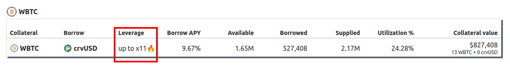

<h1>Leverage</h1>

# **What Is Leverage?**

Leverage allows you to **amplify your exposure** to an asset by borrowing against it — meaning you can increase your potential gains (and losses) without needing more upfront capital.

In the context of Curve loans, leverage works by borrowing crvUSD against your collateral, then using that crvUSD to buy more of the collateral asset and repeating the process. This creates a **looped position** with higher exposure to the asset than you originally deposited.

???info "Leverage Example"

    Let’s look at a basic example using WETH as collateral.

    If you deposit 1 WETH and borrow 1000 crvUSD, you can use that crvUSD to buy more WETH. If you do this multiple times, you end up with more WETH exposure — this is leverage.

    Here’s what that looks like with different levels of leverage:

    | ETH Starting Price | ETH Ending Price | Deposited ETH | Borrowed ETH | Total ETH Exposure | Leverage | Profit | ETH Profit |
    |--------------------|------------------|----------------|----------------|--------------------|----------|--------|-------------|
    | 1000 crvUSD        | 2000 crvUSD      | 1 ETH          | 0 ETH          | 1 ETH              | 1x       | 1000 crvUSD | 0 ETH       |
    | 1000 crvUSD        | 2000 crvUSD      | 1 ETH          | 1 ETH          | 2 ETH              | 2x       | 2000 crvUSD | 1 ETH       |
    | 1000 crvUSD        | 2000 crvUSD      | 1 ETH          | 2 ETH          | 3 ETH              | 3x       | 3000 crvUSD | 2 ETH       |

    !!!warning "Important"
        Leverage multiplies both **profits and losses**. If the price goes down instead of up, losses are amplified by the same factor.

---

# **Built-In vs. Manual Leverage**

There are generally two ways to create (and repay) leveraged loans on Curve: by using the one-click leverage option on the Curve UI, or by manually looping the position.

## **Built-in Leverage**

!!!warning "Differences in Leverage Support"  
    The Curve UI generally supports **one-click leverage** for loans. This means users can directly “loop” their positions with a single click, without manually repeating the borrowing and buying process.

    - **Newer markets** support leverage through **aggregators**, which can route through external liquidity sources for more efficient execution.  
    - **Older markets** (especially the early-deployed mint markets) rely solely on Curve’s internal liquidity, which can result in higher price impact—particularly when leveraging large amounts.

All crvUSD minting markets and some Curve lending markets offer this built-in leverage functionality, allowing users to achieve their desired leverage in a single transaction. Below is an image of the lending UI showing the WBTC lending market. This market allows built-in leverage of up to 11x.

{: .centered }

How built-in leverage works:

{: .centered }

### **Depositing Combined Assets (Curve Lending Only)**

Users can deposit both crvUSD and collateral assets (e.g., WETH) together. In this case, during the single transaction:

1. WETH collateral is used to borrow crvUSD
2. Borrowed crvUSD is added to the deposited crvUSD
3. The total amount is converted to WETH through 1inch
4. All assets are deposited into the lending market

{: .centered }

*Note: With combined deposits, the leverage calculation remains the same. For example, with 1,500 crvUSD + 0.5 WETH (total value 3,000 crvUSD) at 5x leverage, the borrowed amount is still 12,000 crvUSD (4x deposited collateral). Repayment process and profit calculation remain unchanged from single-asset deposits, and after repayment the user will receive profit in their borrowed asset.*

## **Manual Leverage Looping**

Users can create leverage in any crvUSD or lending market through manual looping:

{: .centered }
{: .centered }

Users, in this process:

1. Deposit WETH as collateral
2. Borrow crvUSD
3. Swap borrowed crvUSD back to WETH
4. Repeat the process

Each loop provides less additional leverage since loan LTV is always below 100%.  If a user uses 1 WETH worth 3,000 crvUSD, and borrows a total of 6,000 crvUSD, this is called 2x leverage.

---

# **Guides**

Check out a guide on how to open, close or deleverage [here](../crvusd/guides/intermediate/leveraged-loans.md)