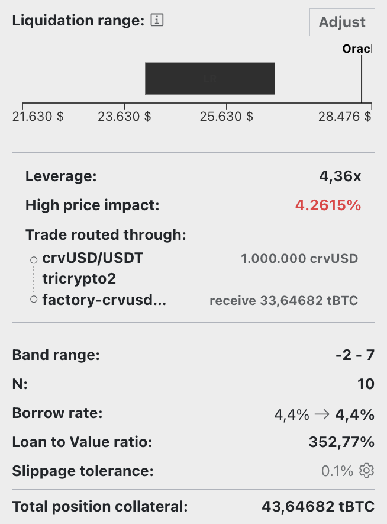

# **Loan Creation**

In standard mode, creating a loan with crvUSD involves specifying a certain amount of a collateral asset and determining the quantity of crvUSD to borrow. After the collateral amount is set, the interface displays the maximum amount of crvUSD that can be borrowed, along with the health and borrow rate of the loan.

<figure markdown>
  { width="300" }
  <figcaption></figcaption>
</figure>

The user interface (UI) features a dropdown menu for viewing additional loan parameters, such as the current Oracle Price and [**Borrow Rate**](./loan-concepts.md#borrow-rate).

<figure markdown>
  { width="300" }
  <figcaption></figcaption>
</figure>

---

# **Loan Management**

Everything needed to manage a loan is available in this interface. The features include:

<figure markdown>
  { width="300" }
  <figcaption></figcaption>
</figure>

**`Loan`**
This tab provides options to **`Borrow more`** crvUSD, **`Repay`** debt, or **`Self-liquidate`** a loan

**`Collateral`**
Options to **`add`** or **`remove`** collateral from a loan are available here.

**`Deleverage`**
This tab facilitates loan deleveraging. Find more details [here](#deleveraging-loans).

---

# **Loan Details**

The `Your Loan Details` tab shows all the information about your personal loan:

<figure markdown>
  { width="600" }
  <figcaption></figcaption>
</figure>

When a user creates a loan, their **collateral is allocated across a number of [bands](./advanced-liquidation.md#bands-n) (liquidation range)**. Should the asset price fall within this range, the loan will enter [soft-liquidation](./advanced-liquidation.md#soft-and-de-liquidation) mode. In this state, the user is not allowed to add additional collateral. The only recourse is to either repay with crvUSD or to self-liquidate the loan.

When a position was or is in soft-liquidation mode, losses occur. The UI displays these losses in 3 ways:

- `LOSS AMOUNT` is how much you've lost in soft-liquidation in collateral format, e.g. 0.001 ETH.
- `% LOST` is percentage of deposited collateral you've lost in soft liquidation.
- `COLLATERAL CURRENT BALANCE (EST.) / DEPOSITED` shows your current collateral minus any losses compared to the amount deposited.

The `LLAMMA BALANCES` section shows the breakdown of your current loan collateral.  For example, in the above picture there is 0.01 ETH and 0 crvUSD.  If the user was in soft-liquidation some of the collateral would be swapped to crvUSD to protect from further price decreases, and this would reduce the current ETH balance and increase the crvUSD balance.

!!!info "Soft-Liquidation Mode"
    **During [soft-liquidation](./advanced-liquidation.md#soft-and-de-liquidation), users are unable to add or withdraw collateral.** They can choose to **either partially or fully repay** their crvUSD debt to improve their [**health**](./loan-concepts.md#loan-health) **or** decide to [**self-liquidate**](../lending/how-to-borrow.md#self-liquidate) their loan if their collateral composition contains sufficient crvUSD to cover the outstanding debt. If they opt for self-liquidation, the user's debt is fully repaid and the loan will be closed. Any residual amounts are then returned to the user.

    If their health declines to 0, they are [**hard-liquidated**](./advanced-liquidation.md#hard-liquidation) and lose their collateral but keep their debt.

---

# **Advanced Loan Creation & Management**

In the upper right-hand side of the screen, there is a toggle button for advanced mode.

<figure markdown>
  {width="400"}
  <figcaption></figcaption>
</figure>

In advanced mode the UI shows more information about the [**Collateral Bands**](./advanced-liquidation.md#bands-n) for your personal loan:

<figure markdown>
  { width="600" }
  <figcaption></figcaption>
</figure>

Advanced mode also adds a tab with info about the [**LLAMMA Bands**](./advanced-liquidation.md#bands-n) for all loans together:

<figure markdown>
  { width="600" }
  <figcaption></figcaption>
</figure>

It also expands the loan creation interface by displaying the **liquidation and band range**, **number of bands**, **borrow rate**, and **Loan to Value ratio (LTV)**. Additionally, users can manually select the number of bands for the loan by pressing the **`adjust`** button and using the slider to increase or decrease the number of bands.

<figure markdown>
  { width="300" }
  <figcaption></figcaption>
</figure>

!!!tip
    A **higher number of bands generally results in fewer losses when the loan is in soft-liquidation** mode, see [**here**](./loan-concepts.md#loan-health). The maximum number of bands is 50, while the minimum is 4.

---

## **Leveraged Loans**

The UI offers a leveraging feature for loans, accessible by navigating to the **`Leverage`** tab.

More information on how to deleverage a loan [here](#deleveraging-loans).

!!!info "Leverage"
    Collateral can be leveraged **up to 9x**, depending on the number of bands chosen. If a user wants to use the maximum leverage (9x), they loan will have the minimum number of bands (4). Using the highest number of bands (50) only allows for a leverage of up to 3x. **For the consequences of using different numbers of bands, see [here](./loan-concepts.md#loan-health).**

The process of leveraging effectively involves **repeat trading of crvUSD for collateral and depositing it to maximize the collateral position**. Essentially, all borrowed crvUSD is utilized to acquire more collateral.

!!!warning
    **Caution is advised, as a dip in the collateral price would necessitate repaying the entire amount to reclaim the initial position.**

:fontawesome-solid-book: [A good explainer how leveraging works](https://curve.substack.com/p/august-15-2023-all-or-nothing)

<figure markdown>
{ width="400" }
<figcaption></figcaption>
</figure>

Toggling the advanced mode expands the display to show additional information about the loan, including the price impact, trade route and the actual leverage.

<figure markdown>
{ width="300" }
<figcaption></figcaption>
</figure>

---

## **Deleveraging Loans**

Deleveraging a loan — irrespective of it being [**leveraged**](../crvusd/loan-creation.md#leveraged-loans)  — is an option available through the UI. Users must navigate to the `Deleverage` tab and input the amount of collateral they intend to allocate for deleveraging. This particular collateral is then converted into crvUSD, which is used to facilitate debt repayment.

<figure markdown>
  { width="300" }
  <figcaption></figcaption>
</figure>

!!!info
    **When a user's loan is in soft-liquidation, deleveraging is only possible if the loan is fully repaid.** Apart from that, the loan can typically be self-liquidated. If the position is not in soft-liquidation, the user can deliberately deleverage by any chosen amount.

The UI will provide the user with their updated loan details, such as liquidation and band range, borrow rate, and health, as well as the LLAMMA changes of collateral and debt.

<figure markdown>
{ width="300" }
  <figcaption></figcaption>
</figure>
