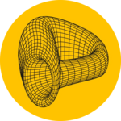

<h1>Savings crvUSD (scrvUSD)</h1>

{: .centered}

Savings crvUSD, abbreviated as scrvUSD, is an **interest-bearing stablecoin** that earns yield simply by holding the token. Users do not need to take any action whatsoever, as the yield is passively accrued.

---

## **Why scrvUSD?**

scrvUSD provides an additional interest-earning opportunity for crvUSD, diversifying the ways users can earn on their crvUSD holdings. It aims to:

- **Support true decentralization**: In a market dominated by centralized solutions, crvUSD stands out as a truly decentralized stablecoin, backed solely by ETH, safe ETH liquid staking tokens, and wrapped Bitcoin assets.
- **Increase crvUSD attractiveness**: By offering a low-risk[^1] way to earn stablecoin interest.
- **Improve crvUSD peg stability**: The low-risk[^1] yield increases demand for crvUSD, which helps solidify its peg.
- **Reduce and stabilize crvUSD borrow rates**: Borrow rates for crvUSD rise when its price falls below the peg. By increasing demand for crvUSD, the peg tightens, reducing borrow rates and aiming to stabilize them over the long term.
- **Increase crvUSD supply over time**: As borrow rates decrease and stabilize, borrowing becomes more predictable, making Curve a more attractive platform for loans.
- **Increase fee revenue over time**: With more crvUSD in circulation, fee revenue sustainably grows over time.

[^1]: **Low-risk** is subjective and depends on the user's risk tolerance. In this context, it means the deposited crvUSD is not used or rehypothecated; it simply remains in the Savings Vault, earning interest. However, smart contract risks remain. That said, scrvUSD is built upon Yearn v3 Vaults, which are widely used in DeFi and have undergone [extensive audits](https://github.com/yearn/yearn-vaults-v3/tree/master/audits).

---

## **How to Deposit and Withdraw crvUSD**

Users can obtain scrvUSD by simply depositing crvUSD into the Savings Vault[^2]. In exchange, they receive scrvUSD tokens. To earn interest, users don't need to do anything else—the interest accrues in the background. Therefore, the user's balance of scrvUSD doesn't increase. When redeeming scrvUSD, users receive their initial deposit plus the accrued interest.

[^2]: While depositing crvUSD into the Savings Vault is the most straightforward way to get scrvUSD, the token can technically also be bought on secondary markets such as liquidity pools on Curve.

*Guide for depositing coming soon after UI release.*

Let's look at an example:

{: .centered }
{: .centered }

---

## **How Does the Interest Accrue?**

Earning interest with scrvUSD is very simple. Simply holding scrvUSD in a wallet is enough to earn interest. There is no need to stake or lock scrvUSD to be eligible to earn rewards.

The interest accrues passively and constantly increases the underlying value of scrvUSD. For example, if a user deposits 100 crvUSD and receives 100 scrvUSD in exchange, and the interest accrued is 10% per year, the user will still have 100 scrvUSD, but the value of each scrvUSD token will have increased by 10% due to the accrued yield. The user can then withdraw 110 crvUSD from their 100 scrvUSD.

---

## **Where Does the Interest Come From?**

The yield paid to scrvUSD holders comes directly from the crvUSD interest rate fees paid by borrowers for taking out crvUSD loans.

*The amount of rewards allocated to scrvUSD varies and depends on two factors:*

1. The amount of crvUSD fees generated.
2. The percentage of the total crvUSD fees allocated to scrvUSD, as determined by the Curve DAO.  Currently there is a **5% minimum**, and **50% maximum** revenue share for scrvUSD.

{: .centered style="width: 75%;" }
{: .centered style="width: 75%;" }

The actual percentage of crvUSD fees going to scrvUSD is dynamic and based on the ratio of crvUSD staked in scrvUSD compared to the total circulating supply of crvUSD. The DAO sets both a minimum and maximum percentage of crvUSD fees allocated to scrvUSD, which serve as upper and lower bounds.  See below for an example:

!!!example "Example: How much crvUSD revenue will be allocated to scrvUSD?"

    Let's assume the DAO has allocated a **5% minimum** and a **50% maximum** threshold of crvUSD revenue to go to scrvUSD.  If the revenue from crvUSD is $100k in a week then:

    - If 2% of crvUSD is staked, 5% of the $100k will be allocated to scrvUSD.
    - If 32% of crvUSD is staked, 32% of the $100k will be allocated to scrvUSD.
    - If 60% of crvUSD is staked, 50% of the $100k will be allocated to scrvUSD.

---

## **How Does scrvUSD Help Grow crvUSD Supply and Fee Revenue?**

The current stagnation and contraction of crvUSD supply pose long-term challenges for veCRV holders and the DAO. Let's take a look at what is happening without scrvUSD:

{: .centered style="width: 85%;" }
{: .centered style="width: 85%;" }

Borrowers mint crvUSD to buy assets, which leads to selling crvUSD. This lowers the price of crvUSD, which in turn raises borrowing rates, making crvUSD less attractive to borrow.

**With scrvUSD in place, as borrowing rates rise, the yield (APR) for scrvUSD increases simultaneously.** Due to this mechanism, buying crvUSD to convert it to scrvUSD becomes attractive, increasing demand for crvUSD and tightening the peg (which leads to lower borrowing rates again):

{: .centered style="width: 90%;" }
{: .centered style="width: 90%;" }

Over time, with these dynamics, the peg should become tighter, and borrowing rates should stabilize. This **will allow the crvUSD supply to grow sustainably, increasing revenue for veCRV holders**.

---

## **How Much Interest Will I Earn with scrvUSD?**

The interest earned by holding scrvUSD is not fixed because it **depends on several dynamic factors**:

- The ratio of scrvUSD to the total circulating crvUSD supply
- The amount of crvUSD fees generated
- The minimum and maximum crvUSD fee share allocated to scrvUSD, as set by the DAO

In general, **if the ratio of scrvUSD to the total crvUSD supply stays within the minimum and maximum fee allocation limits set by the DAO, the yield for scrvUSD will roughly align with the average borrowing rate for crvUSD**. However, if the ratio exceeds the maximum limit, the yield will be capped because of the maximum revenue share.

??? example "Example: yield calculation"

    Parameters:

    - Timeframe: 1 year
    - Circulating supply of crvUSD: 100M
    - crvUSD yearly fees: 10M crvUSD
    - Average borrow rate: 10%
    - crvUSD revenue to scrvUSD: 5% min, 50% max

    Example yield calculation changing the ratio of crvUSD staked in scrvUSD vs crvUSD circulating supply:

    - 1M staked (1%): 5% of fees ($500k) → 50% yield
    - 32M staked (32%): 32% of fees ($3.2M) → 10% yield
    - 60M staked (60%): 50% of fees ($5M) → 8% yield (50% max rev/60% staked)
