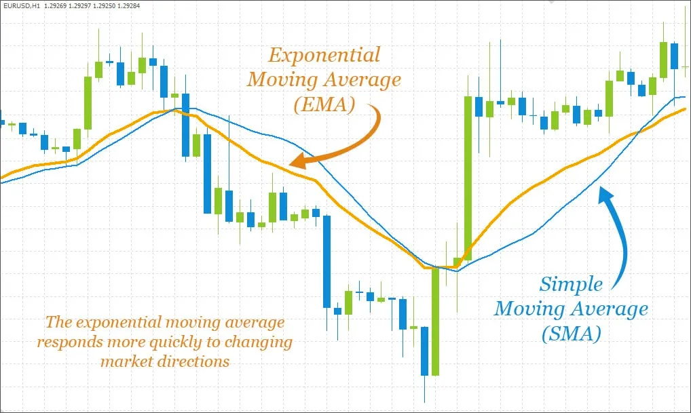

This article primarily covers the role of internal “price oracles” within Curve Finance v2 pools, with a brief note at the end of [**LLAMMA price oracles**](../factory-pools/understanding-oracles.md#llamma).

Please note that Curve v1 and v2 pools do not rely on external price oracles. **Misuse of external price oracles is a contributing factor to several major DeFi hacks.** If you are looking to use Curve’s “price oracle” functions, or any price oracle, to provide on-chain pricing data in a decentralized application you are building, we recommend extreme caution.

###  **Purpose**

​[**Curve v2 pools**](../base-features/understanding-crypto-pools.md), which consist of assets with volatile prices, require a means of tracking prices. Instead of relying on external oracles, the pool instead calculates the price of these assets internally based on the trading activity within the pool.

This is tracked by two similar but distinct parameters:

*   **Price Oracle:** The pool’s expectation of the asset’s price
*   **Price Scale:** The price based on the pool’s actual concentration of liquidity
    
Pools keep track of recent trades within the pool as a variable called **`last_prices`**. The **`price_oracle`** is calculated as an [**exponential moving average**](../factory-pools/understanding-oracles.md#exponential-moving-average) of recent trade prices. The **`price_oracle`** represents what the pool believes is the fair price of the asset .

In contrast, **`price_scale`** is a snapshot of how the liquidity in the pool is _actually_ distributed. For this reason, **`price_scale`** lags **`price_oracle`**. As users make trades, the pool calculates how to [profitably readjust liquidity](../factory-pools/understanding-oracles.md#profits-and-liquidity-balances), and the **`price_scale`** moves in the direction of the **`price_oracle`**.

Price Oracle and Price Scale shown in the Curve UI

### **Exponential Moving Average**

As discussed above, the **`price_oracle`** variable is calculated as an “exponential moving average” of **`last_prices`**.

For comparison, traders commonly rely on a “simple moving average” as a technical analysis indicator, which calculates the average of a certain number points (ie, a 200-day moving average computes the average of the trailing 200 days of data).

The “exponential moving average" is similar, except it applies a weighting to emphasize newer data over older data. This weighting falls off exponentially as it looks further back in time, so it can react quicker to recent trends.

### **Updates**

An internal function **`tweak_price`** is called every time prices might need to be updated by an operation which might adjust balances within a pool (hereafter referred to as a **liquidity operation**):

*   **`add_liquidity`**
*   **`remove_liquidity_one_coin`**
*   **`exchange`**
*   **`exchange_underlying`**
    
The **`tweak_price`** function is a gas expensive function which can execute several state changing operations to state variables_._

#### *Price Oracle*

The **`price_oracle`** is updated only once per block. If the current timestamp is greater than the timestamp of the last update, then **`price_oracle`** is updated using the previous **`price_oracle value`** and data from **`last_prices`**.

The updated **`price_oracle`** is then used to calculate the vector distance from the **`price_scale`**, which is used to determine the amount of adjustment required for the **`price_scale`**.

#### *Profits and Liquidity Balances*

Curve v2 pools operate on profits. That is, liquidity is rebalanced when the pool has earned sufficient profits to do so. Every time a **liquidity operation** occurs, the pool chooses whether it should spend profits on rebalancing. The pool’s actions may be considered as an attempt to rebalance liquidity close to market prices.

Pools perform all such operations strictly with profits, never with user funds. Profits are occasionally claimed by administrators, otherwise funds remain in the pool. In other words, profits can be calculated from the following function:

**`profits == erc20.balanceOf(i) - pool.balances(i)`**

Internally, every time the **`tweak_price`** function is called during a **liquidity operation**, the pool tracks profits. It then uses the updated profit values to consider if it should rebalance liquidity.

Specifically, pools carry a public parameter called **`allowed_extra_profit`** which works like a buffer. If the pool’s virtual price has grown by more than a function of profits and the **`allowed_extra_profit`** buffer value, then the pool is considered profitable enough to rebalance liquidity.

From here, the pool further checks that the **`price_scale`** is sufficiently different from **`price_oracle`**, to avoid rebalancing liquidity when prices are pegged. Finally, the pool computes the updates to the *+* and how this affects other pool parameters. If profits still allow, then the liquidity is rebalanced and prices are adjusted.

### **Manipulation**

We do not recommend using Curve pools by themselves as canonical price oracles. It is possible, particularly with low liquidity pools, for outside users to manipulate the price.

Curve pools nonetheless include protections against some forms of manipulation. The logic of the Curve **`price_oracle`** variable only updates once per block, which makes it more resistant to manipulation from malicious trading activity within a single block.

Due to the fact that changes to **`price_oracle`** are dampened by an [**exponential moving average**](../factory-pools/understanding-oracles.md#exponential-moving-average), attempts to manipulate the price may succeed but would require a prolonged attack over several blocks.

Actual $CVX price versus CVX-ETH Pool Price Oracle and Price Scale during rapid volatility

These safeguards all help to prevent various forms of manipulation. However, for pools with low liquidity, it is not difficult for whales to manipulate the price over the course of several transactions. When relying on oracles on-chain, it is safest to compare results among several oracles and revert if any is behaving unusually.

## **v1 Pools**

Newer v1 Pools also contain a price oracle function, which also displays a moving average of recent prices. If the moving average price was written to the contract in the same block it will return this value, otherwise it will calculate on the fly any changes to the moving average since it was last written.

Curve v1 pools do not have a concept of price scale, so no endpoint exists for retreiving this value. Older v1 pools will also not have a price oracle, so use caution if you are attempting to retrieve this value on-chain.

## **LLAMMA**

The LLAMMA use of oracles is quite different than Curve v2 pools in that it can utilize external price oracles. In LLAMMA, the **`price_oracle`** function refers to the collateral price (which can be thought of as the current market price) as determined by an external contract.

For example, LLAMMA uses **`price_oracle`** to convert $ETH to $crvUSD at a specific collateral price. When the external price is higher than the upper price (internally: **`P_UP`**), all assets in the band range are converted to $ETH. When the price is lower than the lower price (internally: **`P_DOWN`**), all assets are converted to $crvUSD. When the oracle price is in the middle, the current band is partially converted, with the exact proportion determined by price changes.

When the external price changes, an arbitrage opportunity exists. External arbitrageurs can deposit $ETH or $crvUSD to balance the pool, until the pool price reaches parity with the external price. LLAMMA applies an [**exponential moving average**](../factory-pools/understanding-oracles.md#exponential-moving-average) to the **`price_oracle`** to prevent users from absorbing losses due to drastic fluctuations.

More information on price oracles and other LLAMMA dynamics are [**available at this article**](https://mirror.xyz/0x07b05D3A1ed958944033060d058b8F0771ad1A6e/H0m3nyq65anotTWhTdWDIWEfMPOofNPy-0qyARYXNF4).
