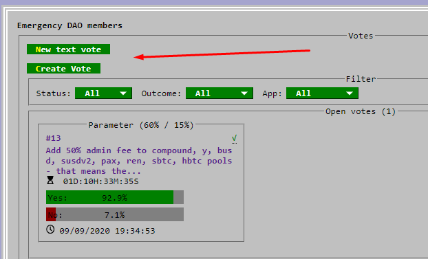
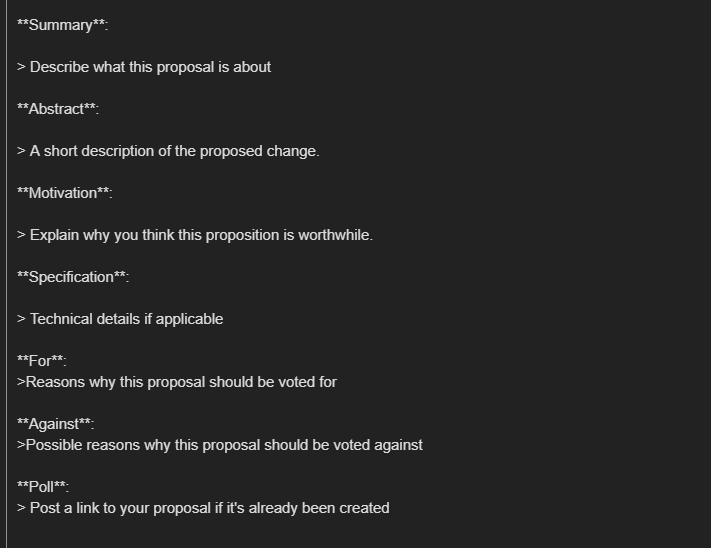

Official DAO proposals are the only way to create enforceable changes in the Curve protocol. There are currently two types of votes: parameter and text.

Parameter votes are automatically committed to the DAO three days after they are enacted at the end of the vote. Text proposals are different as they often necessitate development. For these, it is recommended to discuss with the Curve team to understand the feasibility and to create a signaling proposal.

Before creating an on-chain vote, it might make sense to do a temperature check on the [governance forum](https://gov.curve.fi/), especially if the subject is of an important matter.

To actually create an on-chain proposal, 2500 veCRV are required. (1)
{ .annotate }

1. But there's nothing to worry about, my friend. If you don't have 2500 veCRV, there are plenty of helpful community members who will surely help you create one.

## **Creating your vote** 

Visit the Curve DAO: [https://dao.curve.fi/dao](https://dao.curve.fi/dao), select your type of vote and submit it.

## **Creating your proposal**

Every DAO proposal must be accompanied with a proposal on the Curve governance forum. Visit the proposal section: [https://gov.curve.fi/c/proposals/8](https://gov.curve.fi/c/proposals/8) and click **"New Topic"**.

You will then be presented with a template to help you present your proposed choices to the community.

After that's done, be sure to engage with members of the community who have questions about your proposal.
