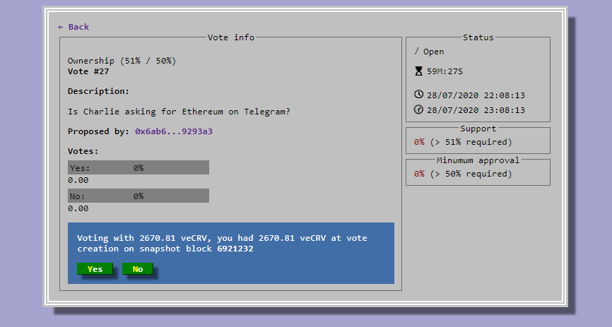

## **How to participate in governance?**

To participate in governance, Curve Finance users need to [lock](../vecrv/locking-your-crv.md) their CRV into a voting escrow.

You can do so at this address: [https://curve.fi/dao/ethereum/vecrv/create/](https://curve.fi/dao/ethereum/vecrv/create/)​

## **What are veCRV?**

veCRV stands for voting escrow CRV. They are your CRV locked for voting. The longer you lock your CRV for, the more voting power you have (and the bigger boost you can reach). You can vote lock 1,000 CRV for a year to have a 250 veCRV weight.

Your veCRV weight gradually decreases as your escrowed tokens approach their lock expiry. A graph illustrating the decrease can be found at this address: [https://curve.fi/dao/ethereum/vecrv/create/](https://curve.fi/dao/ethereum/vecrv/create/)​

Get more voting power by locking your CRV for a longer period of time.

## **Can I start voting right away?**

You can only vote using your voting weight at the block where a proposal was created.

## **How to vote?**

Simply visit the proposal of your choice, click your vote option and confirm your transaction. You can find DAO proposals at this address: [https://curve.fi/dao](https://curve.fi/dao)​

## **Where can I find out about governance?**

You can visit the Curve Finance governance forum at this address [http://gov.curve.fi/](http://gov.curve.fi/)​
