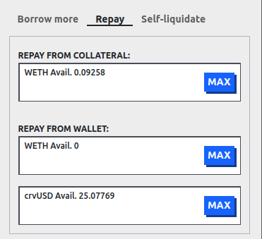
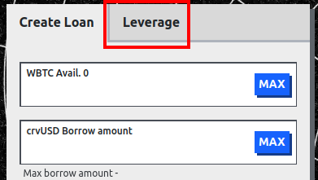
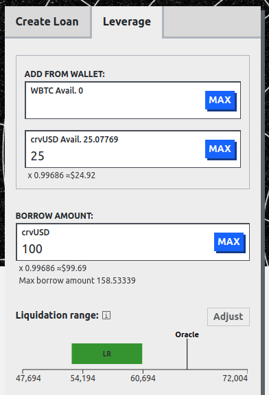
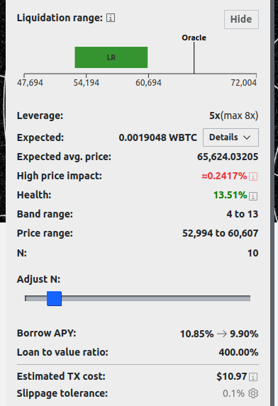
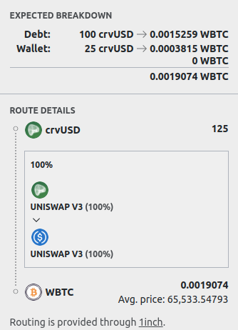
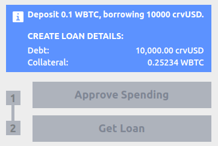

<h1>How to Borrow & Use Leverage</h1>

## **Borrowing UI**

When selecting the **`"BORROW"`** tab from the [main UI](https://lend.curve.fi/#/ethereum/markets), all relevant market information and values for borrowers are displayed:

<figure markdown="span">
  { width="800" }
  <figcaption></figcaption>
</figure>

`Collateral` displays the collateral token of the market, while `Borrow` shows the token which can be borrowed.  The `leverage` column shows whether or not built-in leverage is available in the market.

`Borrow APY` represents the current [borrow rate](./overview.md#borrow-rate).  The `Available` column shows the amount of assets left to borrow and `Borrowed` is the total amount currently borrowed.

`Supplied` shows the total amount of the borrowable token which has been supplied by users.  The `Utilization (%)` is the ratio of `Borrowed` to `Supplied` tokens, see [here](./overview.md#utilization-lend-apy-and-borrow-apy) for more information.

---

## **Creating A New Loan**

In order to create a loan and borrow tokens against collateral, a user first needs to choose a lending market. This can simply be done by clicking the desired market.

Having **`"Advanced Mode"`** activated when creating a loan allows the user to additionally select the number of bands for the loan and displays the corresponding liquidation range. If deactivated, the loan will be created with a default amount of 10 bands.

<figure markdown="span">
  { width="300" }
  <figcaption>Advanced Mode can be toggled on the top right of the page.</figcaption>
</figure>

!!!tip "Number of Bands (N)"
    A **higher number of bands results in fewer losses when the loan is in soft-liquidation** mode. The maximum number of bands is 50, while the minimum is 4.

<figure markdown="span">
  { width="300" }
  <figcaption></figcaption>
</figure>

Additionally, the UI shows the future borrow APY when the user's loan is created and the loan-to-value (LTV) ratio.

---

*Advanced mode also enables an overview of the entire LLAMMA including important values such as lend or borrow APY, available amount to borrow, etc.*

<figure markdown="span">
  { width="600" }
  <figcaption></figcaption>
</figure>

*Down below, a section containing relevant contracts and the current parameters for the lending market is displayed.*

<figure markdown="span">
  { width="600" }
  <figcaption></figcaption>
</figure>

- **`Fee`**: The current exchange fee for swapping tokens in the AMM.
- **`Admin Fee`**: The percentage of the total fee, which is awarded to veCRV holders. Currently, all fees go to liquidity providers in the AMM (which are the borrowers).
- **`A`**: The amplification parameter A defines the density of liquidity and band size.
- **`Loan Discount`**: The percentage used to discount the collateral for calculating the maximum borrowable amount when creating a loan.
- **`Liquidation Discount`**: The percentage used to discount the collateral for calculating the recoverable value upon liquidation at the current market price.
- **`Base Price`**: The base price is the price of the band number 0.
- **`Oracle Price`**: The oracle price is the current price of the collateral as determined by the oracle. The oracle price is used to calculate the collateral's value and the loan's health.

---

*Navigating to the `"Your Details"` tab displays all the user's loan details:[^1]*

[^1]: This tab will only show up if a user has a loan and their wallet is connected to the site.

<figure markdown="span">
  { width="600" }
  <figcaption></figcaption>
</figure>

---

## **Loan Management**

!!!info "Loan Management when in soft-liquidation mode"
    **During soft-liquidation, users are unable to add or withdraw collateral.** They can choose to **either partially or fully repay** their crvUSD debt to improve their health ratio **or** decide to **self-liquidate** their loan if their collateral composition contains sufficient crvUSD to cover the outstanding debt. If they opt for self-liquidation, the user's debt is fully repaid and the loan will be closed. Any residual amounts are then returned to the user.

Understanding how soft-liquidations, loan health and hard-liquidations work is essential for understanding how to manage loans on Curve.  Be sure to read and understand the following sections before taking out a loan:

- [**Understanding Soft-Liquidations**](./overview.md#soft-liquidation)
- [**Understanding Loan Health & Hard-Liquidations**](./overview.md#health-hard-liquidation)

The rest of this section talks about how to use the UI to manage loans and collateral.

### **Collateral Tab**

*The `"Collateral"` tab allows the adjustment of collateral:*

<figure markdown="span">
  { width="400" }
  <figcaption></figcaption>
</figure>

#### Add collateral

Add more collateral to the loan.  *This is not possible while in soft-liquidation.  If health is getting low, some debt must be repaid instead of adding more collateral*.

#### Remove collateral

Remove collateral from the loan.

### **Manage Loan Tab**

*The `"Manage Loan"` tab has the following options:*

<figure markdown="span">
  { width="400" }
  <figcaption></figcaption>
</figure>

#### **Borrow More**

Borrow more simply allows the user to borrow more debt and add more collateral at the same time.

#### **Repay**

Repay has the following options, and all options allow the user to **partially** or **fully repay** their loans.  If only a partial repayment is done then the liquidation range will change for the user.

{: .centered }

**Repay From Collateral** will remove the collateral (e.g., WETH or crvUSD) out of the lending market, convert them all to the debt asset if required (e.g., crvUSD), and send any leftover debt asset (e.g., crvUSD) back to the user if the loan is fully paid and closed.  *Note this is only available on new markets (markets which allow leverage allow this feature).  For older markets it's required to repay with the debt token.*

**Repay from wallet** has two boxes, one for the collateral asset, and one for the debt asset:

 * **Collateral asset, e.g., WETH**: this works the same way as **Repay From Collateral**, all sent WETH would be converted to crvUSD, debt would be repaid and any remaining crvUSD transferred back to the user if the loan is fully paid and closed.

* **Debt asset, e.g., crvUSD**: this repays the debt with the sent crvUSD.  If all debt is repaid the loan is closed and all collateral in the lending market is sent back to the user, in the above case the user would receive back their WETH.

#### **Self-liquidate**

Self-liquidation allows users to voluntarily close their position before reaching hard-liquidation, typically when they're already in soft-liquidation. This feature helps users recover their remaining collateral while avoiding the [`liquidation_discount`](../crvusd/loan-concepts.md#market-parameters) penalty.

See the [self-liquidation section](../crvusd/liquidations.md#self-liquidation) of the liquidation page for an example.

---

## **How to take out a leverage loan**

All new lending markets allow users to use leverage.  E.g., the WBTC market below allows up to 11x leverage when borrowing from this lending market.  11x leverage means 10x the deposited amount of WBTC is borrowed as crvUSD and swapped to WBTC using 1inch.

{: .centered }

!!!info "Info"
    If the market does not display a value in the leverage column, then leverage can still be built up manually by [looping](./leverage.md#manual-leverage-looping).

Click on the desired market with leverage, then navigate to the `leverage` tab next to the `create loan` tab shown here:

{: .centered }

After navigating to the `leverage` tab, the following options will be displayed:

{: .centered }

This shows all the information and options to open a leveraged loan.  Notice that the `ADD FROM WALLET` allows both assets to be added to the loan.  In this market a user could add WBTC, or crvUSD or both.  See the information about [depositing a combination of assets](./leverage.md#depositing-combined-assets-curve-lending-only) for how this works.

The **`BORROW AMOUNT`** lets the user specify how much they would like to borrow.

If [**`Advanced Mode` is enabled**](#creating-a-new-loan), then the user can click on the **`adjust`** button next to the liquidation range.  This allows a user to change the number of bands `N` for their liquidation range.  An example of this is shown below with the other loan details:

{: .centered }

**`Leverage`** is calculated using the following formula:

$$ \text{Leverage} = \frac{\text{value deposited} + \text{value borrowed}}{\text{value deposited}}$$

For example if \$10,000 crvUSD and \$10,000 of WBTC is deposited (\$20,000 value total deposited) and the user borrows \$80,000 crvUSD, then leverage is 5x.

**`Expected`** and **`Expected avg. price`** both relate in this case to how much WBTC is expected to be received after swapping the borrowed crvUSD, and what the expected average price for swapping is.  **`Expected`** has collapsible details which shows the route the assets will be swapped through.  These **swaps are always provided by 1inch**.  An example of these details are provided below and show that 125 crvUSD will be swapped to 0.0019074 WBTC.

{: .centered }

**`Price impact`** is the difference between the oracle price and the average swap price.

**`Band range`** is the starting and finishing bands of liquidity for the loan, e.g., "4 to 13" means the loan will begin soft-liquidation in band 4, and finish in band 13.  **`Price range`** shows the `Band range` but as a price range, e.g., band 4 to 13 could be a price range like 52,994 to 60,607. See [here](../crvusd/loan-concepts.md#bands-n) for more information about bands.

**`Health`** is how healthy the loan is, this value must be positive, if it is less than or equal to 0 then the loan can be hard liquidated.  See [here](../crvusd/loan-concepts.md#loan-health) for more information about health.

**`Borrow APY`** shows the interest rate before and after the loan is created.  **`Loan to Value Ratio`** shows the deposited collateral value compared to the borrowed collateral.

**`Estimated TX Cost`** shows the gas cost in USD.  **`Slippage tolerance`** is the maximum slippage allowed when swapping.

Before taking out a loan, a screen will appear showing the details of the loan, for example: 

{: .centered }

Then the tokens which will be used as collateral need to be approved and then the loan can be taken out by clicking the **`Get Loan`** and sending the transaction.

## **Closing a leveraged loan**

Closing a leveraged loan can be done in 2 ways, either through [repaying](#repay), or [self-liquidating](#self-liquidate).  The most efficient of these options is to [Repay with collateral](#repay).  This removes all collateral, swaps it to the same token as the debt, repays the debt and transfers the rest back to the user.  Otherwise the debt needs to be fully repaid to close the loan, and as this is a leveraged loan, the debt may be higher than the user's available assets, making this unviable.