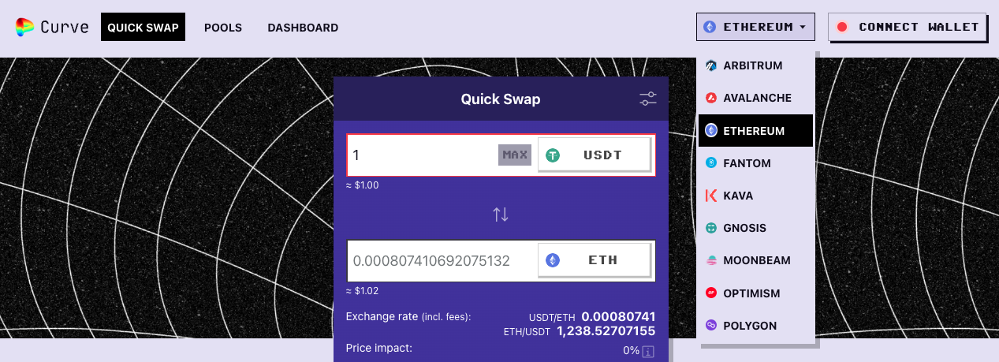
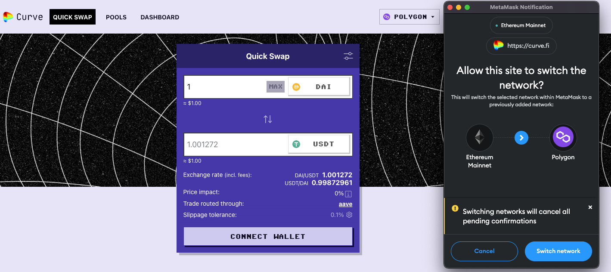

Curve exists across several chains, with several more planned. Curve's primary chain will always be Ethereum, but other sidechains have advantages including speed and cost. In order to use Curve on other chains, you must typically send your funds from Ethereum to the sidechain using the chain's bridge.

All of Curve's active chains can be found in the "Networks" menu on the Curve homepage.

> Supported Sidechains as of 11/14/2022

## **Connecting your Wallet**

When you move to new chains, you will need to connect your wallet with the chain's RPC and chain ID. Generally Curve sidechain pages have a button you can press to automatically switch networks and populate this information for you.

A common issue with sidechains is RPC networks that are temporarily or permanently unavailable. If you are having trouble connecting with RPC networks you may need to visit the chain's support networks to find a new RPC network.

## **Curve Forks**

!!!tip
    For Bridges and CRV contract addresses on other chains please see [*Important Bridges*](./understanding-multichain.md
    ).

Curve forks include the following:

###  *Avalanche*

Avalanche is a sidechain that bills itself as "blazingly fast, low-cost and eco-friendly." Curve's Avalanche site is hosted at [https://avax.curve.fi/](https://avax.curve.fi/)​

### *Arbitrum*
Arbitrum is an Optimistic Ethereum L2. Arbitrum validators _optimistically_ assume nodes will be operating in good faith, which allows for faster transactions. However, to retroactively allow opportunity to challenge malicious behavior, settlement time can be slower. In some cases this could mean it takes up to one week to bridge funds off-chain, so plan accordingly.  
Curve on Arbitrum: [https://curve.fi/#/arbitrum/pools](https://curve.fi/#/arbitrum/pools)
​
  
### *Binance Smart Chain*
Curve does not operate on Binance Smart Chain. The team at Ellipsis ([https://ellipsis.finance/](https://ellipsis.finance/)) launched a fork of Curve that provides similar functionality. The Curve team authorized this fork, but does not actively maintain this fund.

### *Fantom*
Fantom is a high-performance, scalable, and secure smart contract platform designed to overcome the limitations of traditional blockchain networks by utilizing a DAG-based consensus algorithm.  
Curve on Fantom: [https://curve.fi/#/fantom/pools](https://curve.fi/#/fantom/pools)

### *Harmony*
Harmony is a proof-of-stake sidechain promising two seconds of transaction speed and a hundred times lower gas fee. Curve's Harmony offerings are at [https://harmony.curve.fi/](https://harmony.curve.fi/)​.

### *Optimism*
Optimism is verified by a series of smart contracts on the Ethereum mainnet and thus not considered a real sidechain. Curve's Optimism branch is located at [https://curve.fi/#/optimism/pools](https://curve.fi/#/optimism/pools)​

### *Polygon*
Polygon (previously known as Matic Network) is a multi-chain scaling solution for Ethereum that aims to provide faster and cheaper transactions using Layer 2 sidechains.
Curve on Polygon: [https://curve.fi/#/polygon/pools](https://curve.fi/#/polygon/pools)

### *xDai/Gnosis*
The xDai chain is a stable payments EVM (Ethereum Virtual Machine) blockchain designed for fast and inexpensive transactions.
Curve on xDai/Gnosis: [https://curve.fi/#/xdai/pools](https://curve.fi/#/xdai/pools)
​
