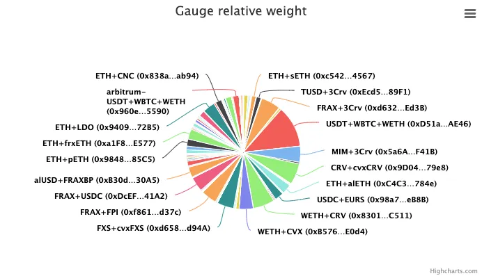
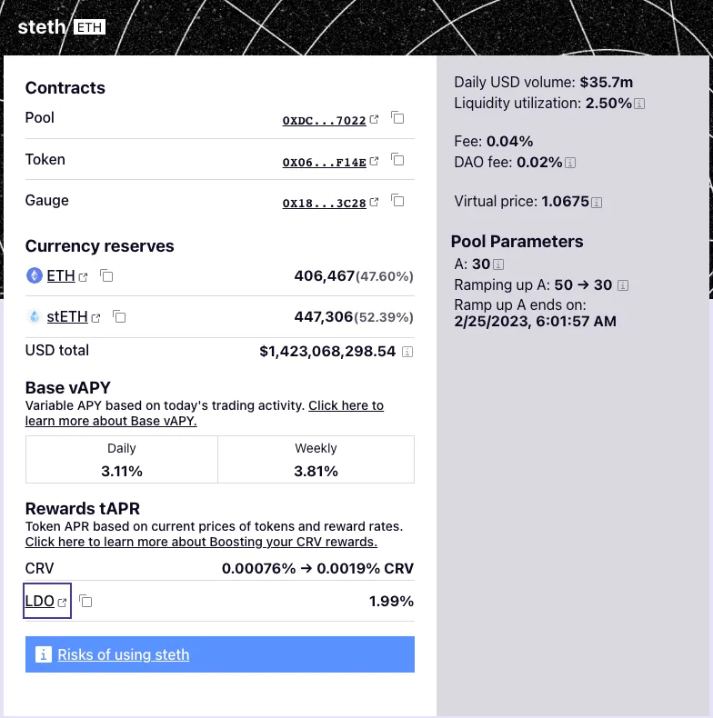

Explanation of how the Curve UI displays yield calculations

!!!warning "Warning"
    **This page is outdated and will be updated soon.**  Much of this information has changed.  If you need up to date information please check the [**new Technical Documentation**](https://docs.curve.finance/) or ask in the [**Curve Telegram**](https://t.me/curvefi).  There are some links here to the [**old Technical Documentation**](https://curve.readthedocs.io/), documentation there is also outdated.

Like all documentation within this guide, this article is intended to be detailed but non-technical, outside of a few light mathematical formulas. While we highlight specific smart contract function names that the Curve UI may reference for convenience, no knowledge of coding is otherwise necessary to understand this article.

# **Types of Yield**

Curve UI displaying different types of displayed Curve yield (tAPY and tAPR).

In the above screenshot you can see a Curve pool has the potential to offer many different types of yield. The documentation provides an overview of the different types of yield here:

[**Understanding CRV**](../crv-token/overview.md)

It’s important to remember that these numbers are a projections of historical pool performance. The user would get this rate if the pool performance stays exactly the same for one year.

These yield types are:

*   **Base vAPY:** Shown on the first line, this number represents the fees that accrue to holders of the LP token based on trading volume. [More Info](https://resources.curve.finance/pools/understanding-curve-pools)​
*   **$CRV Rewards tAPR:** Shown on the second line, the rewards tAPR represents the rate of $CRV token emissions one would have earned if the pool has a rewards gauge and the user stakes into this rewards gauge. The number is listed as a range of possible rewards, based on the user’s locked veCRV the size of this boost can vary. [More Info](https://resources.curve.finance/reward-gauges/understanding-gauges)​
*   **Incentives Rewards tAPR:** Some pools also choose to stream rewards in the form of a different token — this is represented on the third line if applicable.

**`vAPY`** stands for _“variable annual percentage yield”_, this value calculates an annualized estimate of the trading fee yield based on the past day’s trading activity, inclusive of any effect of compounding.

The rewards **`tAPR`** stands for _“token annual percentage rate”_ — token rewards must be claimed manually and therefore do not automatically compound, so “rate” is the more proper term.

## **Base vAPY**

When Curve pools are launched, they receive a value for both the **`fee`** (the overall fee applied to trades) and the **`admin_fee`** (the percentage of this fee that goes to the Curve DAO as opposed to pool LPs). These parameters are directly viewable on the smart contract through the corresponding function names.

These fees are displayed on the Curve UI pool page:

These parameters may also be updated in the future by the Curve DAO by calling the **`commit_new_fee`** method. If the fees are in the process of being changed, these are readable in the smart contract via the **`future_fee`** and **`future_admin_fee`** methods.

The fees are specifically earned or charged every time a user interacts with a pool contract through a transaction which may affect the pool balances. For example, directly calling the **`exchange`** function would rebalance the pool, so a fee clearly applies. If you add or remove liquidity in an imbalanced fashion, this would also adjust the ratios of tokens within the pool and thus be subject to fees. No fees are charged if a user adds coin in a balanced proportion or on removal.

When you call methods to preview how many tokens you might receive for interacting with a pool (ie **`get_dy`** or **`calc_token_amount`**) the values they return are usually but not always inclusive of any fees — the UI calculations are intended to make any corrections where appropriate, but be sure to ask the support team if you have questions.

Theoretically, one could calculate the base vAPY for any period by calculating the fees for every transaction and summing over the entire range. However, the Curve UI utilizes a simpler methodology to calculate the base vAPY, where **`t`** is the time in days:

$$\left( \frac{\text{virtual_price}(t=0)}{\text{virtual_price}(t=-1)} \right)^{365} - 1$$

In other words, the vAPY measures the change in the pool’s _**"virtual price"**_ between today and yesterday, then annualizes this rate. The _**"virtual price"**_ is a measure of the pool growth over time, and is viewable directly on the UI.

The UI receives this value directly by calling the **`get_virtual_price`** method on the pool contract.

Every time a transaction occurs that charges a fee, the virtual price is incremented accordingly. Thus, when a pool launches with a virtual price of exactly 1, if the pool’s virtual price is 1.01 at some future time, an LP holding a token has seen the token’s value increase by 1%.

$$\frac{1.01}{1.00} - 1 = 0.01 = 1\%$$

A virtual price of 1.01 means an LP will get 1% more value back on removing liquidity. Similarly, new users adding liquidity will receive 1% fewer LP tokens on deposit.

For pegged stablecoin pools, virtual price can easily be utilized to calculate vAPY of the pool since inception with no further calculations necessary. For v2 pools, one must also consider the fluctuating prices of underlying assets.

For developers, here are more details about trade fees from the technical documentation:

*   ​[**About Trade Fees**](https://curve.readthedocs.io/factory-deployer.html?highlight=fees#trade-fees)​
*   ​[**Claiming Admin Fees**](https://curve.readthedocs.io/factory-pools.html?highlight=fees#claiming-admin-fees)​
*   ​[**Fee Distribution**](https://curve.readthedocs.io/dao-fees.html?highlight=fees#fee-distribution)​

## **CRV Rewards tAPR**

The Curve DAO also authorizes some pools to receive bonus rewards from $CRV token emission, as described in the [**Understanding Gauges**](https://resources.curve.finance/reward-gauges/understanding-gauges) section of the documentation. If the pool has an eligible gauge, then the UI displays the range of possible tAPR values users are earning at present, subject to change in the future.

The formula used here to calculate rewards tAPR:

$$tAPR = \frac{\text{crv_price} \times \text{inflation_rate} \times \text{relative_weight} \times 12614400}{\text{working_supply} \times \text{asset_price} \times \text{virtual_price}}$$

These parameters are obtained from various data sources, mostly on-chain:

*   **`crv_price:`** The current price of the $CRV token in USD. This could be extrapolated from on-chain data, but the UI relies on the CoinGecko API to fetch this value.
*   **`inflation_rate:`** The inflation rate of the $CRV token, accessed from the `rate` function of the $CRV token.
*   **`relative_weight:`** Based on weekly voting, each Curve pool rewards gauge has a weighting relative to all other Curve gauges. This value can be calculated by calling the same function on the Curve [**gauge controller contract**](https://curve.readthedocs.io/dao-gauges.html#the-gauge-controller).

​[https://curve.finance/dao](https://curve.finance/dao)​

*   **`working_supply:`** Accessed by calling the same function on the specific Curve gauge contract for the pool.
*   **`asset_price:`** The price of the asset — that is, if the pool contains only bitcoin, you would use the current price of $BTC. For v2 pools, this must be calculated by averaging over the specific assets within the pool.
*   **`virtual_price:`** The measure of the pool growth over time, as described above.

The magic number `12614400` is number of seconds in a year `(60 * 60 * 24 * 365 = 31536000)` times 0.4. In this case the 0.4 is due to the effect of boosts (minimum boost of 1 / maximum boost of 2.5 = 0.4).

As shown in the UI, all tAPR values are displayed as a range, with the base rate on the left of the arrow representing the default rate one would receive if the user has no boost, and the value on the right of the arrow representing the maximum value a user could receive if the user has the maximum boost, which is 2.5 times higher than the minimum boost. Further details about calculating boosts [**are provided here**](../reward-gauges/boosting-your-crv-rewards.md).

For developers, here are relevant links to the technical documentation:

*   ​[**About Liquidity Gauges**](https://curve.readthedocs.io/dao-gauges.html?highlight=gauge)​
*   ​[**Gauge Controller**](https://curve.readthedocs.io/dao-gauges.html#the-gauge-controller)​
*   ​[**Gauges for EVM Sidechains**](https://curve.readthedocs.io/dao-gauges-sidechain.html)​
*   ​[**Gauge Proxy**](https://curve.readthedocs.io/dao-ownership.html?highlight=gauge#gaugeproxy)​

## **Incentives tAPR**

All pools may permissionlessly stream other token rewards without approval from the Curve DAO. The UI displays these bonus rewards only when applicable. In the example of stETH below, note how the pool is streaming $LDO tokens in addition to $CRV rewards.

​[**Pool Overview Page**](https://curve.finance/#/ethereum/pools)​

​[**stETH Pool Page**](https://curve.finance/#/ethereum/pools/steth/deposit)​

Further information on these extra incentives is available in the developer documentation.
