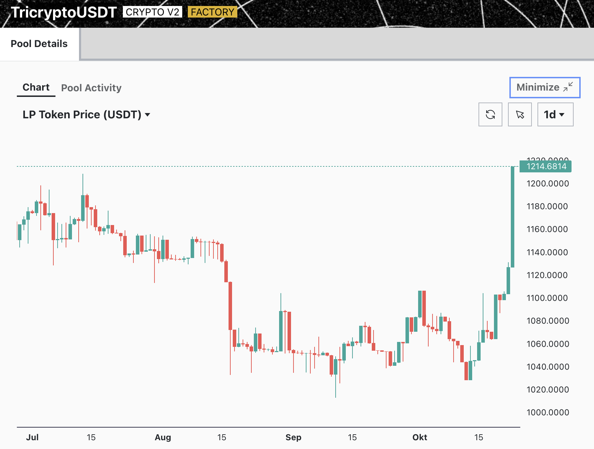
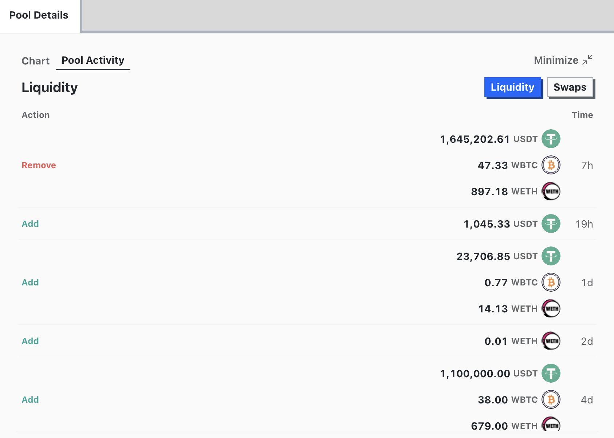

The [Curve UI](https://curve.finance/) offers a variety of charts related to **token prices**, as well as an **overview of exchanges and liquidity activities** (such as adding or removing liquidity) for each pool."

## **Charts**

LP tokens are tokens received upon depositing assets into a liquidity pool. These tokens represent the holder's share of the pool and can be redeemed for a portion of the funds, plus any fees accrued over time. Similar to other tokens, their value is contingent on the prices of the underlying assets in the liquidity pool.

Navigating to the **`Chart`** tab reveals a graphical interface of the LP Token price in relation to, for example, USDT. In the top right corner, options are available to expand/minimize or refresh the chart, as well as to adjust its timeframe.

<figure markdown>
  { width="600" }
  <figcaption></figcaption>
</figure>

Clicking on **`LP Token Price (USDT)`** reveals a drop-down menu with additional charts.

<figure markdown>
  { width="150" }
  <figcaption></figcaption>
</figure>

## **Pool Activity**

Besides a chart for prices, the UI also provides an overview of swaps and liquidity actions for the pool under the **`Pool Activity`** tab.

On the **`Swaps`** tab, the interface shows the tokens swapped and the time of each transaction, indicating how many hours or minutes ago it occurred. Clicking on a specific swap will redirect the user to the transaction on Etherscan.

<figure markdown>
  { width="600" }
  <figcaption></figcaption>
</figure>

Navigating to the **`Liquidity`** tab to display deposits and withdrawals in the pool.

<figure markdown>
  { width="600" }
  <figcaption></figcaption>
</figure>
