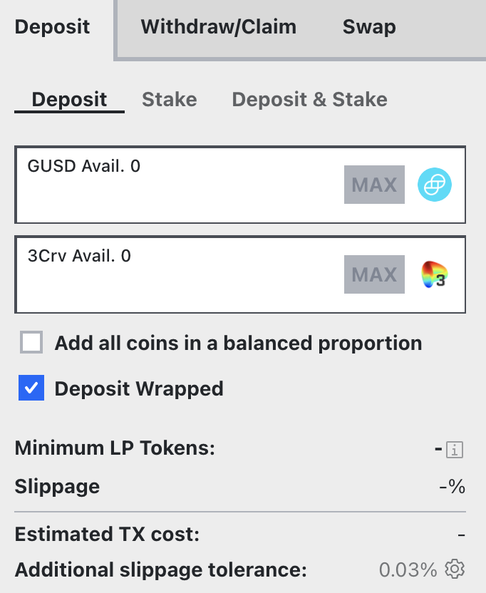

## **What is the “deposit wrapped” option?**

(This applies to metapools or pools with c-tokens or a-tokens). If you deposit a stablecoin to one of the pools with lending, Curve will automatically wrap your token to a cToken (for Compound) or aToken (for AAVE). The option is simply there if you have already previously lent them on Compound or AAVE. If your stablecoin is in its original form, you can ignore this option.
If you deposit into metapools and you have the corresponding basepool token (for example, 3Crv), you can also use the "deposit wrapped" option to deposit this token.

<figure markdown>
  { width="300" }
  <figcaption></figcaption>
</figure>

## **What happens when you provide liquidity on Curve?**

When you go to the deposit page and deposit one stablecoin, it then gets split between each token in the pool. That’s something you have to keep in mind because if you were to deposit 1000 DAI in the Pool, as per the screenshot below, your balance would be roughly equal to 390.7 GUSD, 120 DAI, 119.8 USDC and 362.6 USDT. Those values change constantly as people trade and arb the price of stable coins.

<figure markdown>
  { width="300" }
  <figcaption></figcaption>
</figure>

## **Does the coin I deposit matter?**

For most typical deposits, it doesn't matter which coin you use - your tokens will automatically get split into the pool proportions. However, there are two important considerations:

1. There's a deposit bonus explained below that can affect your choice.
2. If you're making a large deposit relative to the pool's size or if the pool has low liquidity, depositing a single token could result in unfavorable exchange rates due to slippage. In these cases, it's better to pre-swap your tokens to match the pool's proportions before depositing.

For normal-sized deposits into liquid pools, you can comfortably deposit one, some, or all the coins without worrying about it affecting your returns.

## **Understanding deposit bonuses**

On the screenshot above, you can see GUSD is quite low as it should make up 50% of the total pool because it's a metapool paired against 3crv. So if your plan was to join the gusd-pool, you would ideally deposit GUSD into it.
As you can see on the screenshot, you would get an instant 0.0082% bonus for depositing GUSD into the pool.

The main reason for this is that GUSD is currently slightly more expensive so if you went to a centralized exchange you might sell it for $1.007 instead of $1. The deposit bonus reflects that.

The other reason behind this is that the pools are always trying to balance themselves and go back to equal parts (in this case 50% GUSD) so depositing the coin with the lowest share will get you a deposit bonus.

<figure markdown>
  { width="300" }
  <figcaption></figcaption>
</figure>

## **But does that mean I can still withdraw in my favorite stable coin?**

When you withdraw, the same principle as in the question above applies- but reversed. If you withdraw the stable coin with the biggest share, you would get a bonus but you still choose what stable coin you want to withdraw.

## **How quickly does interest accrue/compound?**

Interests for pools using lending protocols compound every block or 15 seconds or immediately after fees are paid. It’s also compounded automatically.

## **What is arbitrage?**

Arbitrage is the simultaneous buying and selling of, in our case, a token to make a profit. Because cryptocurrency markets can often lack liquidity, there are often opportunities for traders to take advantage of price discrepancies to make a profit which can be helped by protocols like Curve.

An example transaction: ​[**Etherscan**](https://etherscan.io/tx/0x259b7ac1f50554fe5ddcfeea7b4fa90ad70356ddfbbd341289db0dfbf99447f9)​

In this transaction, someone used Curve and OasisDex and made around $200. This goes back to what was discussed earlier with liquidity pools. The idea is that is you incentivize traders to take advantage of price discrepancies which we all get rewarded for.

## **What are incentivized pools?**

Liquidity pools (particularly one without an opportunity cost) are a great way to help stable coins keep their pegs. It makes easy for traders to arb (see question above) when the price slips off the peg which is very important for all the companies and foundations developing stable coins as having a $0.98 stablecoin is never a good look.

As a result, some pools on Curve are “incentivized”. That means that on top of trading fees and lending fees, the companies will give rewards to people providing liquidity to the pools with their coins.

## **What makes the incentives APR move?**

The steth pool in this screenshot earns another 2.69% of LDO per year and there are three variables that can make this change:

*   The LDO distributed is based on the number of people staking their LP tokens, which means your share of rewards gets lower if more people start staking
*   The price of LDO (price of LDO going up would make the yearly bonus go up)
*   The size of weekly rewards (48,000 SNX as of today) could also be lowered as Lido reevaluates its partnership with Curve
