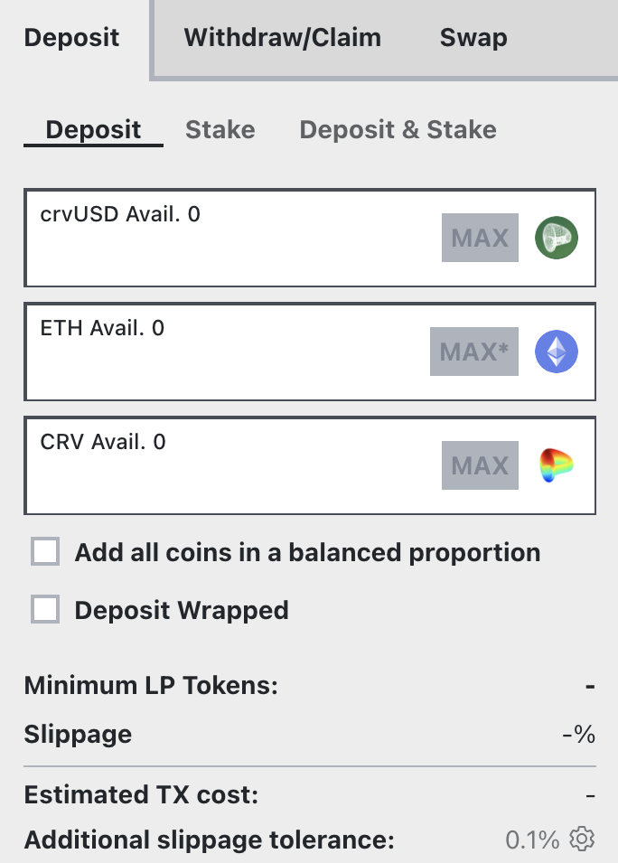

<h1>Depositing into a Cryptoswap Pool</h1>

Cryptoswap pools contain 2-3 volatile assets and provide deep liquidity for trading between them. These pools maintain an equal USD value split between assets - for example, a USDT/ETH/BTC pool with $3M TVL would contain approximately $1M worth of each asset. Before depositing, ensure you're comfortable holding all assets in the pool, as you will have equal exposure to each asset within the pool.

[Learn more about Cryptoswap pools](./overview.md)

*This guide demonstrates the deposit and staking process using the [TriCRV pool](https://curve.finance/#/ethereum/pools/factory-tricrypto-4/deposit), to show you how to deposit and start earning rewards.*

The process involves two steps:

1. [**`Depositing`**](#depositing): Add assets to receive LP tokens
2. [**`Staking`**](#staking): Place LP tokens in the [rewards gauge](../reward-gauges/overview.md) to earn CRV and other rewards

Both steps can be combined into a single [**`Deposit and Stake`**](#depositing-and-staking-together) transaction.

---

## **Depositing**

Visit the deposit page ([https://curve.finance/#/ethereum/pools/factory-tricrypto-4/deposit](https://curve.finance/#/ethereum/pools/factory-tricrypto-4/deposit)). You will need at least one of the three tokens in the pool to deposit. The TriCRV pool consists of CRV, crvUSD, and ETH.

<figure markdown>
  { width="300" }
  <figcaption></figcaption>
</figure>

First, it's important to understand that you don't have to deposit all coins, you can deposit one or several of the coins in the pool and it won't affect your returns. Cryptoswap pools have a re-balancing mechanism so as asset prices change, assets are swapped to maintain equal value of assets in the pool.  As such, if the pool is slightly off balance, depositing the coin with the smallest share in the pool will result in a small positive price impact, giving the depositor slightly more pool tokens.

Second, once you deposit one coin, **it gets split over the three different coins in the pool which means you now have exposure to all of them**. The first checkbox (Add all coins in a balanced proportion) allows you to deposit all three coins in the same proportion they currently are in the pool, resulting in no price impact.

The second checkbox (Deposit Wrapped) allows users to deposit wrapped ETH instead of plain ETH.

To deposit:

1. Choose your deposit amount
2. Click `Approve Spending` to authorize the Curve contract (first-time only)
3. Click `Deposit` to receive your LP tokens (consider gas fees for this transaction)

Your LP tokens represent your share of the pool and can be redeemed later to withdraw your assets. Note: You must unstake LP tokens before withdrawing.

You'll start earning trading fees immediately after depositing. To earn additional rewards like CRV tokens, you must `Stake` your LP tokens in the pool's [rewards gauge](../reward-gauges/overview.md).

---

## **Staking**

Curve uses separate smart contracts called [Reward Gauges](../reward-gauges/overview.md) to distribute CRV and other token rewards. Each pool has its own gauge, and you must stake your LP tokens in it to earn these rewards. This modular design enhances security and flexibility.

To stake your LP tokens:

1. Select the `Stake` tab at the top of the deposit page
2. Choose how many LP tokens to stake (typically the maximum amount)
3. If first time staking, click `Approve Spending` to authorize the Reward Gauge
4. Click the blue `Stake` button and confirm the transaction

Once the staking transaction is confirmed, you'll begin earning available token rewards like CRV.

---

## Depositing and Staking Together

You can combine depositing and staking into a single process:

1. Select the `Deposit & Stake` tab at the top of the deposit page
2. Input your deposit amounts
3. Click `Approve Spending` to authorize the Curve contract (first-time only)
4. Click `Deposit & Stake` to execute both actions

This will deposit your assets and automatically stake the LP tokens in the reward gauge, allowing you to start earning both trading fees and rewards immediately.

---

**Once you are deposited and staked, all that's left to do is wait for your trading fees and other rewards to accrue.**

*You can click the link below to learn how to boost your CRV rewards by locking CRV on the Curve DAO:*

- [Boosting your CRV Rewards](../reward-gauges/boosting-your-crv-rewards.md)
- [Locking your CRV](../vecrv/locking-your-crv.md)