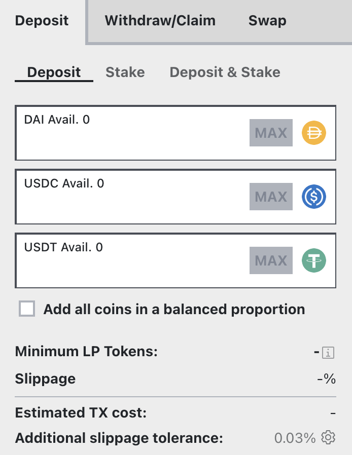

# Depositing into a Stableswap Pool

Stableswap pools hold 2-8 assets that maintain similar prices (e.g., USD stablecoins or wrapped BTC variants). Unlike Cryptoswap pools, Stableswap pools don't maintain equal value between assets. Instead, they optimize for minimal price impact when trading between assets.

For example: A USDT/crvUSD pool with $10M TVL might contain:
- $9M USDT
- $1M crvUSD
Yet trading 1 crvUSD would still yield approximately 1.001 USDT due to the pool's design.

**Important**: Before depositing, ensure you're comfortable holding all assets in the pool. Your deposit gives you exposure to all assets, and during a depeg event, the pool can become concentrated with the devalued asset through arbitrage.

[Learn more about Stableswap pools](./overview.md)

*This guide demonstrates the deposit process using the [3Pool](https://curve.finance/#/ethereum/pools/3pool/deposit)  (USDC/USDT/DAI), - one of Curve's most popular stablecoin pools. You can follow along with the written guide or watch the video below:*

<iframe width="560" height="315" src="https://www.youtube.com/embed/OsRrGij9Ou8?si=zglQ5gl1J9LkbLPY" title="YouTube video player" frameborder="0" allow="accelerometer; autoplay; clipboard-write; encrypted-media; gyroscope; picture-in-picture; web-share" referrerpolicy="strict-origin-when-cross-origin" allowfullscreen></iframe>

The process involves two steps:

1. [**`Depositing`**](#depositing): Add assets to receive LP tokens
2. [**`Staking`**](#staking): Place LP tokens in the [rewards gauge](../reward-gauges/overview.md) to earn CRV and other rewards

Both steps can be combined into a single [**`Deposit and Stake`**](#depositing-and-staking-together) transaction.

---

## **Depositing**

Visit the deposit page ([https://curve.finance/#/ethereum/pools/3pool/deposit](https://curve.finance/#/ethereum/pools/3pool/deposit)). You will need at least one of the three tokens in the pool to deposit. The 3Pool pool consists of USDT, USDC, and DAI.

<figure markdown>
  { width="300" }
  <figcaption></figcaption>
</figure>

You can deposit any single asset or combination of assets in the pool. When depositing, your assets are exchanged for LP tokens that represent your share of all assets in the pool. 

Deposits can provide additional value through the pool's pricing mechanism:

- If you deposit assets that help balance the pool (those with lower liquidity), you may receive a small bonus in LP tokens
- This bonus occurs because you're effectively selling into stronger demand and buying at a discount

**Important**: When you deposit any asset, it represents a share of all assets in the pool. You can avoid price impact by using the "Add all coins in a balanced proportion" checkbox, which deposits assets matching the pool's current ratio.

To deposit:

1. Choose your deposit amount
2. Click `Approve Spending` to authorize the Curve contract (first-time only)
3. Click `Deposit` to receive your LP tokens (consider gas fees for this transaction)

Your LP tokens represent your share of the pool and can be redeemed later to withdraw your assets. Note: You must unstake LP tokens before withdrawing.

You'll start earning trading fees immediately after depositing. To earn additional rewards like CRV tokens, you must `Stake` your LP tokens in the pool's [rewards gauge](../reward-gauges/overview.md).

---

## **Staking**

Curve uses separate smart contracts called [Reward Gauges](../reward-gauges/overview.md) to distribute CRV and other token rewards. Each pool has its own gauge, and you must stake your LP tokens in it to earn these rewards. This modular design enhances security and flexibility.

To stake your LP tokens:

1. Select the `Stake` tab at the top of the deposit page
2. Choose how many LP tokens to stake (typically the maximum amount)
3. If first time staking, click `Approve Spending` to authorize the Reward Gauge
4. Click the blue `Stake` button and confirm the transaction

Once the staking transaction is confirmed, you'll begin earning available token rewards like CRV.

---

## Depositing and Staking Together

You can combine depositing and staking into a single process:

1. Select the `Deposit & Stake` tab at the top of the deposit page
2. Input your deposit amounts
3. Click `Approve Spending` to authorize the Curve contract (first-time only)
4. Click `Deposit & Stake` to execute both actions

This will deposit your assets and automatically stake the LP tokens in the reward gauge, allowing you to start earning both trading fees and rewards immediately.

---

**Once you are deposited and staked, all that's left to do is wait for your trading fees and other rewards to accrue.**

*You can click the link below to learn how to boost your CRV rewards by locking CRV on the Curve DAO:*

- [Boosting your CRV Rewards](../reward-gauges/boosting-your-crv-rewards.md)
- [Locking your CRV](../vecrv/locking-your-crv.md)