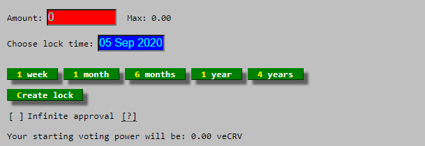
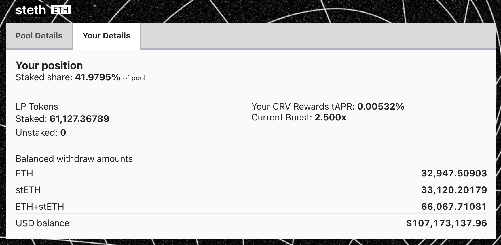

This guide assumes the reader has already provided liquidity and is currently staking LP tokens on the DAO gauge.

One of the main incentives for CRV is the ability to boost rewards on provided liquidity. Vote locking CRV enables the acquisition of voting power to participate in the DAO and earn a boost of up to 2.5x on the liquidity provided on Curve.

## **Figuring out the required boost**

The first step to getting rewards boosted is to determine the amount of CRV needed for lock. Each gauge has different requirements, meaning some pools are easier to boost than others. This depends on the amount others have locked and the liquidity gauge's capacity.

The calculator can be found at this address: [https://dao-old.curve.fi/minter/calc](https://dao-old.curve.fi/minter/calc)

## **Locking CRV**

After determining how much and for how long to lock, visit the following page: [https://curve.fi/dao/#/ethereum/vecrv/create](https://curve.fi/dao/#/ethereum/vecrv/create)

Enter the amount to lock and select the expiry. Remember, locking is not reversible. The amount of veCRV received will depend on the amount and duration of the vote lock.

A lock can be extended, and CRV can be added to it at any point, but having CRV with different expiry dates is not possible.

After creating a lock, the next step is to apply the boost.

## **Applying the boost**

Proceed to the minter page: [https://dao.curve.fi/minter/gauges](https://dao.curve.fi/minter/gauges)

If the new boost is visible after 'Current boost:', then no further action is required.

If the current boost hasn't updated, it may be necessary to claim CRV from each of the gauges where liquidity is provided to update the boost. After doing so, the boost should be visible.

!!!info  "Locking your Boost"
    Boosts are only updated when a withdrawal, deposit, or claim is made from a liquidity gauge

### **Boost Info**
The list of pools and boost/reward information has been relocated from the minter page. This information can now be found on each pool page on the classic.curve.fi site.

<figure markdown>
  { width="400" }
  <figcaption></figcaption>
</figure>

Alternatively, this information is also available in the new UI ([curve.fi](https://curve.fi/)) under the "Your Details" section on the pool page. Note: The new UI does not display future boost yet.

<figure markdown>
  { width="400" }
  <figcaption></figcaption>
</figure>

Visit the [**old**](https://classic.curve.fi/pools/?see=0x0000000000000000000000000000000000000000) or [**new**](https://curve.fi/#/ethereum/dashboard) dashboard to see all your pools!

## **Formula**

The boost mechanism calculates the **earning weight** of the liquidity you provide to pools and vaults.  If you have enough voting weight (veCRV) you will be able to boost the earning weight of the liquidity you provide by up to 2.5x.  This means if you have a boost of 2.5x and deposit \$10,000 of value to a pool your rewards are for \$25,000 of value in the pool.  The formula for calculating your boost ($B$) is given below.  $B$ has a maximum of 2.5 so if the formula gives a value greater than 2.5 then your boost is 2.5.

$$B = 1.5 \times \frac{D \times v}{V \times d} + 1$$

Where:

* $B$ is your rewards boost (if it's more than 2.5 it just equals 2.5).
* $d$ is the value you deposit, in USD.
* $D$ is the total value deposited to the pool's reward gauge, in USD.
* $v$ is the amount of veCRV you have (vote weight).
* $V$ is the total veCRV in the system (total vote weight) click [here](https://classic.curve.fi/usecrv) to find the current amount.