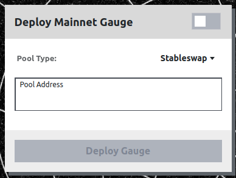
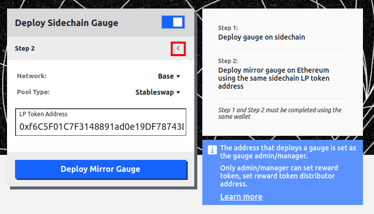
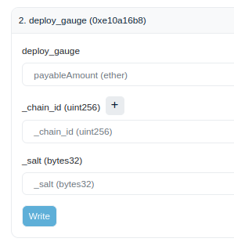

You can deploy the gauge directly **through the UI if the gauge is for a pool**.  To do so go to the following page: [https://curve.finance/#/ethereum/deploy-gauge](https://curve.finance/#/ethereum/deploy-gauge).  If you would like **to deploy a gauge for a lending market**, then follow the guide on the [Create Lending Market](../lending/create-lending-market.md#deploying-a-gauge) page.

---

# **Deploying a Pool Gauge with the UI**

Go to the Curve page to deploy a gauge here: [https://curve.finance/#/ethereum/deploy-gauge](https://curve.finance/#/ethereum/deploy-gauge).  This page has a switch with 2 options:

- [**Deploy Mainnet Gauge**](#deploy-mainnet-pool-gauge) - Deploy a gauge for a pool on Ethereum Mainnet
- [**Deploy Sidechain Gauge**](#deploy-sidechain-pool-gauge) - Deploy a gauge for a pool on any other chain Curve has deployed to.

These different options have slightly different processes for deploying the gauge, but both options require that you choose the correct pool type for the gauge that is being deployed.

### **Pool Types:**

- **Stableswap** - a pool with up to 8 pegged assets e.g., USDC and USDT
- **Two Coin Cryptoswap** - a pool with 2 volatile assets e.g., USDC and ETH
- **Three Coin Cryptoswap** - a pool with 3 volatile assets e.g., USDC, ETH and CRV
- **Stableswap (old)** - an old pool with pegged assets e.g., USDC and USDT.
- **Two Coin Cryptoswap (old)** - an old pool with 2 volatile assets e.g., USDC and ETH

A pool is classified as *old* if it is not a New Generation (NG) pool.  If the pool was deployed from 2024 onwards it should be a NG pool.  If you are not sure on the pool type then try all options when deploying the gauge, the UI will show an error if the wrong option is chosen or the pool already has a gauge deployed.

---

## **Deploy Mainnet Pool Gauge**

Go to the [Deploy Gauge](https://curve.finance/#/ethereum/deploy-gauge) page, and make sure the switch in the right hand corner is set to the left as shown below.  The  "Deploy Mainnet Gauge" screen should be visible as below.

{: .centered }

Simply **input the  pool address** (0x...) and **select the [pool type](#pool-types) from the drop down menu**.  *Note the pool type may be pre-selected for you, if this is the case, this does not need to be changed*.  

After the options have been inputted, click on deploy gauge and submit the transaction using your preferred wallet.  The UI will show an error if the incorrect pool type is selected, or a gauge already exists for the pool, so there is no harm in trying all options if you are unsure of the pool type.

After clicking on deploy and the transaction is confirmed the gauge is deployed.  A [vote can then be created to add it to the gauge controller](#submit-a-dao-vote).  Adding the gauge to the gauge controller allows the gauge to receive CRV rewards for stakers when the gauge is allocated [gauge weight](./gauge-weights.md).

---

## **Deploy Sidechain Pool Gauge**

Sidechain gauges (the same as L2 gauges) work differently to a mainnet gauge.  They have a gauge on the sidechain which distributes rewards, as well as a mirror gauge on Ethereum mainnet so that the gauge can receive [gauge weight](./gauge-weights.md) and CRV inflation rewards.  This parent-child relationship is required because all Curve governance currently happens on Ethereum Mainnet.

!!!warning "Warning"
    The same address **must** deploy the gauge both on mainnet and the sidechain for this process to work.

To deploy a sidechain gauge go to the [Deploy Gauge](https://curve.finance/#/ethereum/deploy-gauge) page. The click the  switch so it's on the right as shown below.  The "Deploy Sidechain Gauge" screen will then be shown.

{: .centered }

Then connect to the chain you would like to deploy the sidechain gauge to, which is the chain the pool resides on.  In this example we are choosing Base as shown below, after choosing and connecting to the network, Step 1 of deploying the sidechain gauge will be shown.

{: .centered }

For step 1 simply **input the LP Token Address** (same as pool address for newer pools, but can be different for older pools) and **select the [pool type](#pool-types) from the drop down menu** and click **deploy gauge**. The UI will show an error if the incorrect pool type is selected, or a gauge already exists for the pool, so there is no harm in trying all options if you are unsure of the pool type.

After the gauge has been deployed on the sidechain (called the child gauge), the mirror gauge must be deployed on Ethereum Mainnet (the parent gauge), this connects the Sidechain to Ethereum and Curve governance.  To go to step 2 click on the little arrow shown in the red rectangle in the picture below:

{: .centered }

Then choose the network the pool resides by clicking on the Network dropdown menu, in this example we have chosen base, as that's where the sidechain gauge was deployed.  The same pool type as in step 1 must be selected carefully in step 2, as the UI will not raise an error if the wrong option is selected.  Then we input the LP Token address (pool address) on the L2.  **The LP Token Address in step 2 is the same address as used for step 1**.  

After clicking on deploy and the transaction is confirmed, the gauge is deployed and a [vote can be created to add it to the gauge controller](#submit-a-dao-vote).  Adding the gauge to the gauge controller allows the gauge to receive CRV rewards for stakers when the gauge is allocated [gauge weight](./gauge-weights.md).

---

# **Deploy a Gauge for an Ethereum Mainnet Pool via Etherscan**

In addition to the UI, there is an option to deploy the gauge directly through Etherscan. If the pool was deployed recently, check the [Deployment Addresses](https://docs.curve.finance/references/deployed-contracts/) for the factory contracts, otherwise use the deployment transaction to find which contract deployed the pool/lending market, this will be the factory contract.

!!!warning
    Calling **`deploy_gauge`** on Etherscan will only work if the function is called on the Factory contract that also deployed the pool.

To navigate to this page, first search for the corresponding Factory contract on Etherscan. Then, go to **`Contract -> Write Contract -> deploy_gauge`**.  
Then insert the pool address you want to add a gauge for, press on **`Write`** and sign the transaction.  

Before deploying the gauge, ensure you connect your wallet by clicking the **`Connect to Web3`** button.

<figure markdown>
  { width="800" }
  <figcaption></figcaption>
</figure>

---

# **Deploy a Gauge for a Sidechain Pool via Etherscan**

To deploy a sidechain gauge we have to deploy 2 different gauges which link together:

- **Child Gauge** - This is the gauge on the sidechain, it is deployed first.
- **Root (Parent) Gauge** - This is the gauge on Ethereum Mainnet, it is deployed after the child and links the child gauge to mainnet.  The root gauge can be added to the gauge controller, allowing CRV inflation rewards to flow to the sidechain gauge.

!!!warning
    When deploying the Child Gauge and Root Gauge for a sidechain pool, they must be deployed using the **same address** and the **same salt** for **both gauges**.  This creates the same address for the gauge on the sidechain and ethereum.  If the addresses are not the same, the gauges cannot be linked.

## **Deploying the Sidechain (Child) Gauge**

To deploy the sidechain child gauge go to [Deployment Addresses for Sidechain Gauge Factories](https://docs.curve.finance/deployments/crosschain/).

Find the `ChildLiquidityGaugeFactory` address for your sidechain and click on it.  This will take you to the contract page on the sidechain's block explorer.  Then go to **`Contract -> Write Contract -> Connect to Web3`**.

{: .centered }

After your wallet is connected, find the `deploy_gauge` function.  There may be multiple `deploy_gauge` functions, this is because there is an optional parameter called `_manager`.  If the function doesn't have this option, the manager will be set to your address.  It is required that your address is the manager for this gauge, otherwise the root gauge will not be linked to this child gauge.

{: .centered }

To call the function first input the `_lp_token` address for the pool, this is the same as the pool address for newer pools, but can be different for older pools.  Then input your `_salt`, salt is used to create the address for your gauge, this can be anything, but **salt must be the same when deploying this gauge and later when deploying the root gauge**, read more about [salt here](https://en.wikipedia.org/wiki/Salt_(cryptography)).  Input your address as the `_manager` address if it is required, then click on `write` and submit the transaction.

After the transaction is confirmed the sidechain gauge is deployed.

## **Deploying the Ethereum Mainchain Root (Parent) Gauge**

After the sidechain child gauge has been successfully deployed, the Ethereum mainchain root gauge can be deployed.  To do so go back to the [Deployment Addresses for Sidechain Gauge Factories](https://docs.curve.finance/references/deployed-contracts/#evm-sidechain-gauges).  You should see the table below:

{: .centered }

The correct `RootLiquidityGaugeFactory` contract on Ethereum must be chosen.  Most root gauges for sidechains are deployed using the top contract boxed in blue, but some sidechains use their own special contracts, e.g., see the contract for Fractal boxed in red, or the BSC contract boxed in yellow.  If there isn't a specific `RootLiquidityGaugeFactory` for your sidechain, then use the first one.  Once the correct contract is found click on the address and you will be taken to the contract page on etherscan.

Once again go to **`Contract -> Write Contract -> Connect to Web3`** to connect your wallet as shown above.  **This must be the same wallet that deployed the sidechain child gauge**.  Then click on the `deploy_gauge` function.  

{: .centered }

In this function the `payableAmount` can be inputted as 0, the `_chain_id` must be the chain id of the sidechain your pool and gauge is on.  This can be easily found from [chainlist.org](https://chainlist.org/).  The `_salt` must be the same as the salt used to deploy the sidechain child gauge.

Click on `write`, and submit the transaction, after this is complete the gauge is root gauge is deployed and this process is complete.  You can now submit a gauge vote to get the root gauge added to the gauge controller, see the process below.

---

# **Submit a DAO Vote**

In order for a gauge to become eligible to receive CRV emissions, it has to be added to the GaugeController. This needs to be approved by the DAO.

Once you've created your gauge, you can submit it to the DAO for a vote: [https://classic.curve.finance/factory/create\_vote](https://classic.curve.finance/factory/create_vote)​.

If the gauge is for a pool on a sidechain, input the parent gauge address (Ethereum gauge address) here.

The address that submits must have 2500 veCRV in order to create a vote.

{: .centered }

Once the gauge has been submitted, politics take over. You may want to visit the governance forum and explain why your pool should be made eligible for rewards.

[Governance Forum](https://gov.curve.finance/)