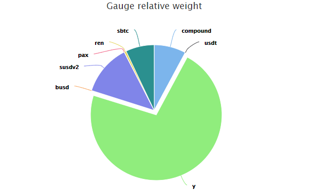

## **What are gauge weights?**

Simply put, a gauge weight translates into how much of the daily CRV inflation it receives.

For example on the below chart, the Y pool is currently receiving around 72% of the daily CRV inflation. This means that all liquidity providers in the Y pool share 72% of the daily CRV.

You can find each liquidity gauge relative weight on this page: [https://dao.curve.fi/minter/gauges](https://dao.curve.fi/minter/gauges)​

## **Why are gauge weights so important?**

Because those weights decide where the CRV inflation goes, it allows the DAO to control where most of the liquidity should go and balance liquidity. It's a powerful tool for voters that must be used responsibly.

The gauge weight is updated once a week on Thursdays.

## **Who can vote for gauge weights?**

Anybody who has vote [**locked CRV**](./../crv-token/overview.md) can vote to direct its voting power towards one or multiple Curve pools.

## **How can I vote?**

Visit this link: [https://dao.curve.fi/gaugeweight](https://dao.curve.fi/gaugeweight)​

Select the gauge you would like to put your voting weight towards, enter an amount in BPS (10,000 = 100% the maximum) and confirm your transaction.

## **How often can I move my voting weight?**

You can change your voting weight once every 10 days.

## **What happens when I add additional CRV to my existing lock or extend the locktime?**

Adding more $CRV to your lock or extending the locktime increases your veCRV balance. This increase is not automatically accounted for in your current gauge weight votes. If you want to allocate all of your newly acquired voting power, make sure to re-vote.

!!!warning
    Resetting your gauge weight before re-voting means you'll need to wait 10 days to vote for the gauges whose weight you've reset. So, please ensure you simply re-vote; there is no need to reset your gauge weight votes before voting again.