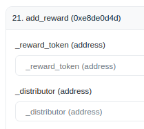
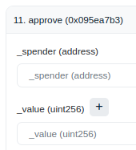
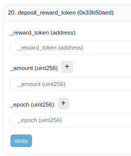

<h1>Permissionless Token Rewards </h1>

This section explains the process of setting any token reward using Etherscan. It's assumed that the user possesses some familiarity with Etherscan or are competent in executing the transaction through an alternative tool.  

These rewards are called **permissionless as the CurveDAO does not control them**.  They are not completely permissionless however, as **only the admin or manager of the gauge can approve and add these token rewards**.

!!!warning
    Note that Curve has employed various gauge versions over time. If your attempts are unsuccessful, it might be due to version differences. Please don't hesitate to reach out to the Curve team.

*Permissionless rewards are added in the following flow:*

1. Set reward token and distributor address.
2. Approve reward token.
3. Add rewards.

## **Setting the Reward Token and Distributor Address**

By calling the `add_reward` function on a specific gauge a token can be added to the gauge's list of approved reward tokens.  To call the function the **reward token** contract address and the **distributor address** must be specified. The distributor address is the source from which the reward token will be sent to the gauge.

!!!info
    Ensure you have the required `admin/manager` permissions for the gauge. The address that deployed the gauge is set as the `admin/manager`.
    If you are not admin/manager, the transaction will fail.

To identify the manager, check the `manager/admin` in the "Read Contract" section on Etherscan. Some versions of this contract may also allow the factory owner to execute this call.

The deployer of the gauge is usually the manager of the gauge if the gauge was deployed via the Factory Contracts.

This function should be called only once for a specific reward token. A repeated call to `add_reward` using a previously set reward token will fail. However, the distributor address for an already added reward token can be updated using the `set_reward_distributor` function. Over the lifetime of a gauge, a total of 8 different reward tokens can be set.

!!! description "`add_reward(_reward_token: address, _distributor: address):`"

    Function to add specify a reward token and distributor for the gauge. Once a reward tokens is added, it can not be removed anymore.

    { align=left, width="180" }

    | Parameter | Type | Description |
    | --------- | ---- | ----------- |
    | `_reward_token` | `address` | Reward Token Address |
    | `_distributor` | `address` | Distributor Address, who can add the Reward Token |

## **Approving the Reward Token for Deposit**

Visit the reward token's contract address (not the gauge contract address) on Etherscan and switch to the "Write Contract" tab. Use the `approve` function, setting the spender as the gauge contract address and specifying the desired amount.

!!! description "`approve(_spender : address, _value : uint256) -> bool:`"

    Function to approve `_spender` to transfer `_value` tokens.
    
    { align=left, width="150" }

    | Parameter | Type | Description |
    | --------- | ---- | ----------- |
    | **`_spender`** | `address` | Gauge Contract Address |
    | **`_value`** | `uint256` | Amount to approve |

## **Depositing the Reward Token**

When depositing the reward token to the contract a time period is chosen (`_epoche` seconds).  After depositing the reward epoch begins, lasting the defined number of seconds chosen by the depositor (`_epoch` seconds). Rewards are streamed at a constant rate per second to all gauge stakers over the epoch time period.  If no additional rewards of this token are deposited before the end of this time period, the rewards stop when the time period elapses.

Reward epochs are token specific.  Different reward tokens can have different epoch time periods.

If additional rewards for a currently streaming token are added mid epoch, both the newly added tokens and all the remaining tokens are combined (rewards = remaining + new), triggering a fresh epoch for the newly defined period of time.

For consistent reward distributions, it's advisable to deposit near the end of an epoch. If replenishing mid-epoch, ensure you compute the appropriate amount for a steady distribution rate.  

More information [here](https://docs.curve.finance/curve_dao/liquidity-gauge-and-minting-crv/gauges/LiquidityGaugeV6/#deposit_reward_token).

!!! description "`deposit_reward_token(_reward_token: address, _amount: uint256, _epoch: uint256 = WEEK)`"

    Function to deposit `_amount` of `_reward_token` into the gauge over the period of `_epoch` seconds.
    
    When depositing it is optional to use the `_epoch` parameter.  This is set to `WEEK` which means the rewards will be streamed to the gauge stakers over a 1 week period (604800 seconds).

    !!!info
        The `_epoch` parameter was added in newer versions of the gauge.  In older versions, rewards are all streamed over a 1 week period.

    { align=left, width="240" }

    | Parameter | Type | Description |
    | --------- | ---- | ----------- |
    | `_reward_token` | `address` | Reward Token Address |
    | `_amount` | `uint256` | Amount to be distributed over the week |
    | `_epoch` | `uint256` | Duration the rewards are distributed across, denominated in seconds. Defaults to a week (604800s). |