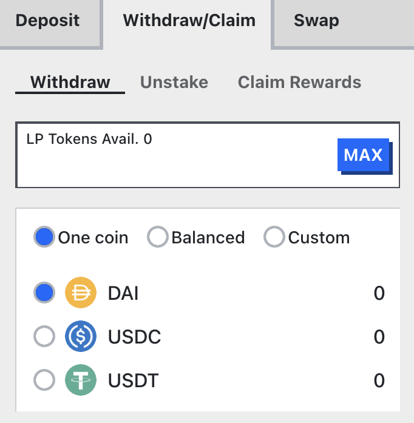

Every time a trade occurs on Curve Finance, **50% of the trading fee is collected by users who have vote-locked their CRV**. Furthermore, since the introduction of Curve's stablecoin, crvUSD, **veCRV holders earn a portion of the fees from crvUSD borrowing**.

As of 20th June, 2024, fees are now **distributed in crvUSD** instead of 3CRV pool tokens.

Fees are collected weekly from the pools, converted to crvUSD, and then distributed.  See the ["How does it all work?" section](#how-does-it-all-work) for how this process works.  Users who lock CRV can claim trading fees as often as they wish; however, fees will only be converted into crvUSD once a week.

!!!info
    There is a delay before the first claim of crvUSD can be made after locking. A wait of 8 days from the Thursday following the lock is required before a claim can be done.

---

## **New UI**

To claim trading fees, visit [https://curve.finance/#/ethereum/dashboard](https://curve.finance/#/ethereum/dashboard) and click the **`Claim LP Rewards`** button.

<figure markdown>
  { width="300" }
  <figcaption></figcaption>
</figure>

!!!info
    3CRV and crvUSD are both shown on this UI as some users may not have claimed their 3CRV fees yet.

---

## **Classic UI**

!!!warning
    The classic UI has not been updated to claim crvUSD fees.

when using the **classic UI** please visit: [https://classic.curve.finance/](https://classic.curve.fi) and look for the green **`Claim`** button in the box labeled **`veCRV 3pool LP claim`** at the bottom of the page.

<figure markdown>
  { width="700" }
  <figcaption></figcaption>
</figure>

---

# **Swapping 3CRV for a Stable Coin**

!!! note
    **No more 3CRV will be distributed as fees going forward**.  The last week of 3CRV fees was 13th June, 2024.  However, there may be users who haven't claimed their 3CRV yet, so this information is left for them.

3CRV is the liquidity provider (LP) token of the 3pool, which consists of USDC, USDT, and DAI. If the pool is perfectly balanced with 33% USDC, 33% USDT, and 33% DAI, then one 3CRV will represent 0.33 USDC, 0.33 USDT, and 0.33 DAI.

If a user wishes to withdraw 3CRV back into a stablecoin, they can do so at: [**https://curve.finance/#/ethereum/pools/3pool/withdraw**](https://curve.finance/#/ethereum/pools/3pool/withdraw). The user needs to select the stablecoin they would like to receive (withdrawing in a balanced or custom proportion is also an option) and click **`Withdraw`**. After the transaction is confirmed, they will receive the withdrawn stablecoin.

<figure markdown>
  { width="400" }
  <figcaption></figcaption>
</figure>

!!! note
    When withdrawing 3CRV into a stablecoin, it **might be beneficial to take a look at the balance ratios of the pool**. Withdrawing in a token with a higher balance than the other two could result in a small premium for that token. On the other hand, withdrawing a token with a lower balance relative to the other two coins may lead to receiving a slightly lesser amount. Further information can be found [here](../pools/deposit-faqs.md#but-does-that-mean-i-can-still-withdraw-in-my-favorite-stable-coin).

---

# **How does it all work?**

When the burn process is initiated, a contract collects fees, which come in dozens of different forms such as stablecoins, volatile assets, or LP tokens. These tokens are then burned through various contracts and pools, and converted into crvUSD through swapping in Cowswap.

Burning is a costly process due to the complexity and number of transactions involved. However, anyone can trigger this process at any time, provided they are willing to cover the associated costs.

Fees can only be claimed for the week that has already concluded, as the burner cannot determine each user's entitlement before the end of that period. Fees will be made available **weekly, within 24 hours after Thursday midnight UTC**, as long as someone — typically the Curve team — has initiated the burn process beforehand.

!!!info
    See the [Fee Collection & Distribution page](./fee-collection-distribution.md) for more information about this process.
