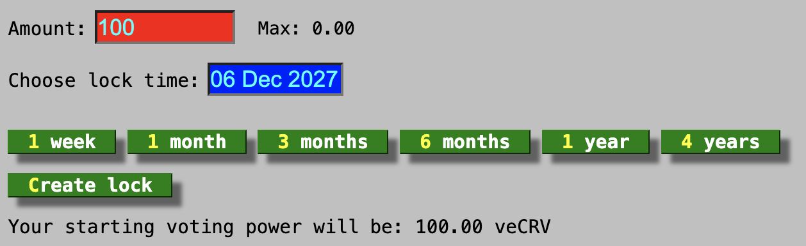
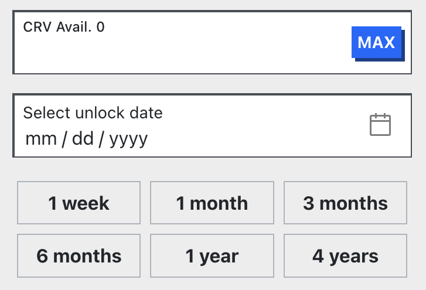

---
hide:
  - toc
---

:logos-youtube: **How to lock CRV**

  <iframe width="560" height="315" src="https://www.youtube.com/embed/8GAI1lopEdU" frameborder="0" allow="accelerometer; autoplay; clipboard-write; encrypted-media; gyroscope; picture-in-picture" allowfullscreen></iframe>

!!! warning
    When a user locks their CRV tokens for voting, they will receive veCRV based on the lock duration and the amount locked. Locking is **not reversible** and veCRV tokens are **non-transferable**. If a user decides to vote-lock their CRV tokens, they will only be able to **reclaim the CRV tokens after the lock duration has ended**.

    Additionally, a user **cannot have multiple locks with different expiry dates**. However, a lock **can be extended**, or **additional CRV can be added** to it **at any time**.

Users must specify the amount of CRV they wish to lock and their preferred lock duration. The minimum lock period is **one week**, while the maximum is **four years**. The amount of veCRV **linearly decays over time**, reaching 0 when the lock duration ends.

*To lock CRV tokens, visit either the old UI: [https://dao-old.curve.finance/locker](https://dao-old.curve.finance/locker) or new UI: [https://curve.finance/dao/ethereum/vecrv/create/](https://curve.finance/dao/ethereum/vecrv/create/)*​

<figure markdown>
  { width="500" }
  <figcaption>old UI</figcaption>
</figure>

<figure markdown>
  { width="300" }
  <figcaption>new UI</figcaption>
</figure>

!!!tip
    **The amount of veCRV received per CRV when locking depends on the duration of the lock.** See the [formula here](./overview.md#crv-to-vecrv-formula).
