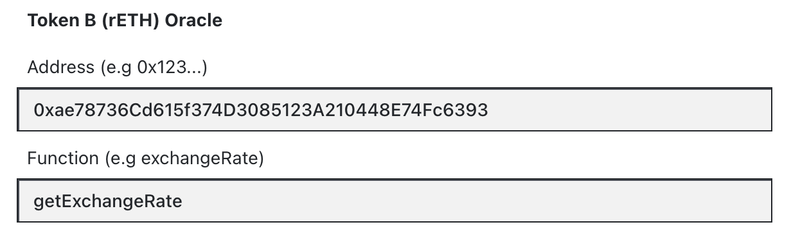

<h1>Deploying a Stableswap-NG pool</h1>

!!!info
    For a better understanding of what Stableswap-NG is and how it differs from regular Stableswap pools, check [this](../lp/pools.md#stableswap-new-generation).

To start the pool creation process, navigate to the **`POOL CREATION`** tab and choose the **`Stableswap`** option.

<figure markdown>
  { width="400" }
  <figcaption></figcaption>
</figure>

## **Token Selection**
The token selection tab can be used to select **between two and four tokens**.  
A token can be selected by searching for the symbol of any token that is already being used on Curve, or by pasting the pool's address.

*StableSwap-NG supports various asset types:*

- **Standard:** ERC20 tokens with no additional features.
- **Oracle:** tokens with rate oracles (e.g., rETH or wsETH).
- **Rebasing:** tokens that rebase (e.g., stETH).
- **ERC4626:** tokens with a `convertToAssets` method (e.g., sDAI).

<figure markdown>
  { width="500" }
  <figcaption></figcaption>
</figure>

An additional token can be added through the **`Add token`** button.

### **Tokens with Oracles**
Some tokens might require an oracle. In this case, when selecting a token that has an oracle, the corresponding box needs to be ticked, and an extra section for the contract address and oracle price method appears. Some tokens might retain their price oracle form a contract other than the token contract.

<figure markdown>
  { width="500" }
  <figcaption></figcaption>
</figure>

## **Parameters**
After selecting the tokens and possibly setting the oracles, parameters need to be set.

Stableswap-NG offers two different default **Pool Parameter Presets**:

<figure markdown>
  { width="400" }
  <figcaption></figcaption>
</figure>

Depending on the choice of the preset, some predefined parameters will be chosen. These are recommended parameters based on the chosen preset. Ultimately, parameter values can be freely selected within the supported ranges.

<figure markdown>
  { width="400" }
  <figcaption></figcaption>
</figure>

Stableswap-NG introduces **dynamic fees**. The use of the `Offpeg Fee Multiplier` allows the system to dynamically adjust fees based on the pool's state.

A tool to play around with the dynamic fee: [https://www.desmos.com/calculator/zhrwbvcipo?](https://www.desmos.com/calculator/zhrwbvcipo?).

- **`Swap Fee`**: The swap fee charged during transactions.
- **`A`**: The amplification coefficient, which defines the pool's density.
- **`Offpeg Fee Multiplier`**: A multiplier that adjusts the Swap Fee based on the pool's state.
- **`Moving Average Exp Time`**: The moving average time window for the built-in oracle.

## **Pool Info**

Finally, after setting all the parameters, **`name`** and **`symbol`** can be chosen:

<figure markdown>
  { width="500" }
  <figcaption></figcaption>
</figure>

## **Deploying the Pool**

On the right-hand side, there is a tab that summarizes all the tokens, parameters, and information. The pool can finally be deployed by pressing the blue **`Create Pool`** button at the bottom.

<figure markdown>
  { width="300" }
  <figcaption></figcaption>
</figure>
