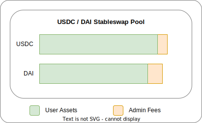
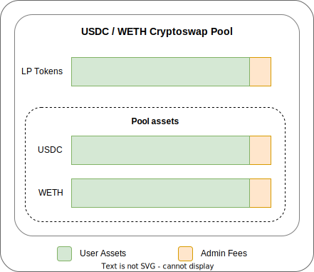

<h1>Fee Collection & Distribution</h1>

The Curve DAO earns revenue from pools and crvUSD minting markets within the ecosystem.  Each week this revenue is collected in different tokens and exchanged for a single token (currently crvUSD) which is then distributed to [veCRV](../crv-token/vecrv.md) holders.

# **Admin Fees**

The revenue comes in the form of admin fees.  There are three different ways these accrue and are collected:

## **Stableswap Fees**

Stableswap admin fees are 50% of the total fee charged using a Stableswap pool.  The fee is taken in the output token of the swap and calculated against the final amount received. For example, if swapping from USDC to DAI, the fee is taken in DAI.  Because of this every week each coin in the pool will have accrued fees that can be collected, e.g., for the pool below Admin Fees in USDC and DAI can both be collected.

{ : .centered }

## **Cryptoswap Fees**

Cryptoswap admin fees are 50% of the total fee charged from a Cryptoswap pool.  As Cryptoswap pools always maintain balance, these fees accrue in the LP token of a pool, which represents an equal share of all assets in the pool.  LP shares are collected each week for these pools.

{ : .centered }

## **crvUSD Minting Market Fees**

All accrued interest on debt in crvUSD minting markets is collected as crvUSD.  Also the AMM for crvUSD minting markets (LLAMMA) has the ability to collect admin fees on swaps, but currently all fees in these pools go to liquidity providers.

{ : .centered }

---

# **Fee Collection & Distribution Architecture**

Currently there are two ways fee collection, and distribution is being achieved.  The old way relies on hardcoding exchange routes for each coin collected, and the manual collection of these each week.  This is being phased out as a new architecture has been developed which incentivizes 3rd parties to do the collection of fees and uses [Cowswap's conditional orders](https://blog.cow.fi/introducing-the-programmatic-order-framework-from-cow-protocol-088a14cb0375) to flexibly sell any coin/token collected.

The distribution of each week's fees happens on Thursday at 00:00 UTC.  The fees are evenly split between all veCRV and streamed over the week until the following Thursday, at which time the next week begins.

## **The New Cowswap Architecture**

The new Cowswap Architecture is based around a 4 phases occurring on different days of the week.  These phases are: `collection` on Monday, `exchanging` on Tuesday, `forwarding` on Wednesday and `distribution` on Thursday.  See below for further details about each phase.

### **Collection** - Monday

The `collection` phase occurs on Monday, it makes sure any significant amounts of fees are collected and ready to be sold the following day.

Newer pools automatically claim admin fees throughout the week when users withdraw their liquidity from the pools.  

Otherwise, on Monday anyone can call functions which claim the fees from pools and then create conditional orders on Cowswap to sell the coins/tokens on Tuesday.  Doing this work is incentivized by giving the caller a reward.

{ : .centered}

### **Exchanging** - Tuesday

The `exchanging` phase happens on Tuesday.  In this phase the conditional sell orders which were created on Monday during the `collection` phase can be executed by Cowswap searchers.  Each coin/token is swapped separately, and by the end of the day all coins and tokens should be swapped into the target coin (currently crvUSD).

{ : .centered}

### **Forwarding** - Wednesday

The `forwarding` phase happens on Wednesday.  All the target coin (currently crvUSD) which was exchanged for on Tuesday is forwarded to the Fee Distributor on Ethereum Mainnet through an intermediary contract called a hooker.  The hooker contract is a future proofing contract which can implement any arbitrary functions that are approved by the DAO.  Calling the function to do this transfer is incentivized by giving the caller a reward.

### **Distribution** - Thursday

Fees are distributed to veCRV holders weekly, within 24 hours after Thursday 00:00 UTC. These fees are split evenly among all veCRV holders, who can claim their share once each week after distribution. Users can first claim trading fees 8 days after the first Thursday following their lock. For example, if you lock on a Tuesday, you can claim trading fees 10 days later on Thursday. See [How to Claim veCRV Trading Fees](../crv-token/claiming-trading-fees.md) for more information.

!!!info "Info"
    For more technical information regarding this new process please see the fee collection and distribution pages on the technical documentation: [https://docs.curve.fi/curve_dao/fee-collection-distribution/curve-burner/overview/](https://docs.curve.fi/curve_dao/fee-collection-distribution/curve-burner/overview/)

---

## **Old Architecture**

This is outdated and is currently being phased out.  

### **Collection**

Collection happened manually by calling withdraw functions on pools and crvUSD markets.

### **Exchanging (Burning)**

This happened manually by hardcoding in different exchange routes for each token, e.g., to transfer wstETH to 3CRV (the old target coin) the process was:

1. `wstETH` to `stETH` via unwrapping (wstETH Burner)
2. `stETH` to `ETH` via swap through stETH/ETH curve pool (SwapStableBurner)
3. `ETH` to `USDT` via swap through tricrypto pool (CryptoSwapBurner)
4. `USDT` to `3CRV` via depositing into 3pool (StableDepositBurner)

This process worked well, but became cumbersome when an exchange route was needed for every coin in every pool.  The exchanges also needed to be called manually.

### **Distribution**

After the exchanging process is completed distribution happens by forwarding the exchanged coins to the fee distributor on Ethereum Mainnet.  Fees are distributed to veCRV holders weekly, within 24 hours after Thursday 00:00 UTC. These fees are split evenly among all veCRV holders, who can claim their share once each week after distribution. Users can first claim trading fees 8 days after the first Thursday following their lock. For example, if you lock on a Tuesday, you can claim trading fees 10 days later on Thursday. See [How to Claim veCRV Trading Fees](../crv-token/claiming-trading-fees.md) for more information.

!!!info "Info"
    For more technical information regarding this old process please see the fee collection and distribution pages on the technical documentation: [https://docs.curve.fi/curve_dao/fee-collection-distribution/overview/](https://docs.curve.fi/curve_dao/fee-collection-distribution/overview/)