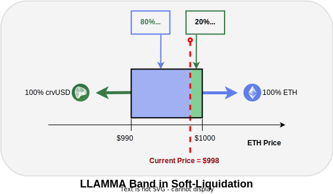

<h1>About Curve Lending</h1>

Curve Lending introduces an innovative approach to overcollateralized lending and borrowing with its unique [LLAMMA (Lending-Liquidating AMM Algorithm)](https://docs.curve.fi/crvUSD/amm/) system, designed to enhance risk management and user experience.  Let's look at how it works.

### Markets

There are many different Curve Lending Markets with hardworking llamas (LLAMMAs) in the background, they don't talk to each other, and all work for themselves (**every lending market is isolated**).  They all only take a single type of collateral, and make loans in a single asset (**all markets are one-way**).  Some of the markets available are pictured below, but there are many more available, and **new markets can be permissionlessly deployed** at anytime.

*Note that all markets have to be paired with crvUSD (i.e., crvUSD must be either the collateral, or the coin to be loaned)*

### How A Lending Market Works

Let's take a look at a single market to see how it works:

Let's breakdown the different entities and their roles in this market:

| Entity | | Role |
|:--:|:--|:--|
| {: style="height:50px"} | **The llama** | This llama (lending market) represents the smart contracts in the system.  It uses CRV as collateral, and lends out crvUSD.  The llama **charges interest on crvUSD users borrow**, and **pays interest to lenders who supply crvUSD**. |
| {: style="height:50px"} | **Bobo** | Bobo always thinks the market will crash, so he **supplies his crvUSD** and the llama **lends it out and pays Bobo interest**. |
| {: style="height:50px"} | **Pepe** | Pepe wants to go trade meme coins but doesn't want to sell his CRV, so he **deposits CRV and uses it as collateral to borrow crvUSD**.  He feels safe knowing he's better protected here with LLAMMA and soft-liquidations than other lending markets. |
| {: style="height:50px"} {: style="height:50px"} | **Wojak** & **Grug** | Wojak and Grug are just talking to the wrong llama (lending market).  All Curve Lending Markets are one-way, so they need to go and find the llama with a wizard hat pictured above.  That llama lends out CRV with crvUSD collateral. |

*Note:* ***Curve lending markets can't mint any crvUSD themselves, it is all supplied by users.***  *This allows the markets to use riskier assets as collateral, or any asset really!  If you are interested in minting crvUSD, check out crvUSD [here](https://crvusd.curve.fi/)*.

See the following sections for further details how supplying and borrowing work.

## **Supplying (Lending)**

### **Earning Interest for Supplying to Lending Markets**

Just like Bobo in the above example, you too could **earn interest for supplying assets** to Curve Lending.  Here's how it works:

{: style="height="200px"}

By Supplying assets on Curve Lending, the balance you deposited increases and compounds by **Lend APY**.  Also, any **Rewards APR** are streamed to you and can be **claimed at any time**.  *Note that APY is different to APR, the TL;DR is that APY compounds, APR doesn't.  See [here](./understanding-lending.md#interest-rates) for more info.*

The **Lend APY** is based on the **Utilization** of the market.  It is the ratio of assets supplied, to assets loaned.  In the image below the Utilization is 80% as 80% of the Supply is borrowed.  Higher Utilization means higher Lending APYs and Borrowing APR.  This incentivizes borrowers to close loans, and more suppliers to lend out their assets.

{: .centered }

**Rewards APR** is a combination of CRV rewards and any other incentives provided to suppliers.  As each lending market has a [gauge](https://resources.curve.fi/reward-gauges/understanding-gauges/) (a mechanism for distributing rewards), the rewards work the same as depositing to a Curve Pool. This number is a range as CRV rewards are variable based on the boost a user receives from their veCRV holdings, [more info here](https://resources.curve.fi/reward-gauges/boosting-your-crv-rewards/).  These rewards can be claimed at any time.

### **Depositing and Withdrawing from a Lending Market**

After depositing to a lending market your assets are added to the pool of available supply.

You can withdraw a supplied asset provided there are sufficient available (un-borrowed) assets in the market.

{: .centered }

If there are insufficient available assets for a full withdrawal, you can withdraw the maximum amount currently available. The high Utilization rate will cause Borrow APY and Lend APYs to increase, incentivizing borrowers to repay their loans, and more lenders to supply. As available supply increases you can withdraw your remaining balance over time.

## **Borrowing**

When borrowing on Curve Lending, you are taking an overcollateralized loan against deposited assets (e.g., borrowing crvUSD with CRV collateral).  You are **charged the Borrow APY on the borrowed assets** (e.g., Borrowing APY increases crvUSD debt).

Collateral is deposited into each lending market's [LLAMMA](https://docs.curve.fi/crvUSD/amm/) system and split evenly across the chosen number of **Bands**.  Each band represents a small liquidation range.  Reducing the number of bands allows for a higher **Loan-to-Value** (LTV) ratio.  Your loan is safe while the oracle price is higher than any of your bands.  See the image below for a breakdown of how it all works together.

{: .centered }

By **minimizing the number of bands** (N=4) you can **maximize the amount you borrow** (LTV) just like Pepe.  Wojak is more risk conscious so he chooses 10 bands (N=10) and doesn't max borrow.  This is why Wojak's loan is split into bands 3-12 and Pepe's is split into bands 1-4.  When you borrow you can choose the number of Bands from 4-50.

### **Soft-liquidation**

**Soft-liquidation** begins if the oracle price of your collateral drops into one of your bands. Here, the platform will begin trading your collateral for your borrowed asset linearly as the price declines through each band (e.g., with a CRV-backed loan spread across 10 bands 10% of total CRV is swapped for crvUSD in each band).  

Let's have a look what soft liquidation looks like in a simplified example with a single band for an **ETH/crvUSD LLAMMA market**.  This example shows that if the price has declines 20% through the band, 20% of the ETH has been converted to crvUSD to protect it from further price declines.  At the lower bound of the band all the collateral is converted to crvUSD, and at the higher bound the collateral is 100% ETH, 0% crvUSD.

{: .centered style="height:250px" }

We can also look what it looks like for many bands at the same time.  Note the higher bands than the current price are fully converted to crvUSD and the lower bands are still ETH.

{: .centered style="height:250px" }

There is something **magical** here in that **LLAMMA converts your collateral to the higher worth asset as price increases or decreases**.  This seems impossible when compared to other liquidity range AMMs, which always convert to the lower priced asset no matter the price direction.

The value of traded assets remain loan collateral throughout soft-liquidation (e.g., if ETH is swapped for crvUSD the value of that crvUSD is added to the collateral backing the loan).  If prices increase through your bands, any swapped collateral will be traded back for your initial collateral (e.g., ETH swapped to crvUSD as price decreased is swapped back to ETH as price increases).

Rebalancing collateral through soft-liquidation must be incentivized through paying trading fees.  These fees are taken from your collateral, as such your **health factor erodes over time in soft-liquidation**.  With higher volatility, equating to more losses.  Also note that **collateral cannot be deposited while in soft-liquidation, debt can only be repaid**.

### **Health Factor & Hard-Liquidation**

The **Health Factor** is a measure of debt value to collateral value with a small buffer added for safety.  As long as the health factor is positive, the position remains open.  It's possible to be below your bands with all collateral converted to the borrowed asset (e.g., all CRV converted to crvUSD), while maintaining a positive health factor.  If this happens, further price declines do not affect the position (e.g., all CRV traded for crvUSD, and crvUSD collateral covers debt and safety buffer).   **Hard-liquidation only occurs if your health factor reduces to 0**.

In contrast, most other lending platforms will hard-liquidate your collateral and terminate your loan if your loan falls below a minimum collateral ratio (LTV), even if only by a small amount for a brief time. This can be highly stressful for borrowers and lead to significant losses. Curve Lending offers a safer space and more peace of mind for borrowers.

## **More Information**

For more information on basic concepts and borrowing and supplying please see [Curve Lending section within the Curve Resources](./understanding-lending.md).

For more technical information especially relating to the underlying smart contracts please see the [Lending section within the Curve Docs](https://docs.curve.fi/lending/overview)