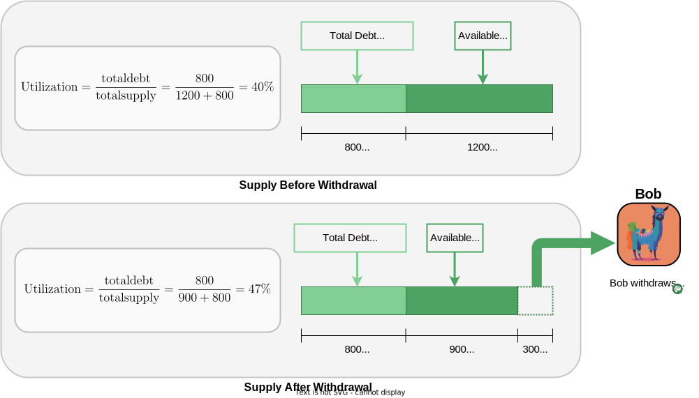
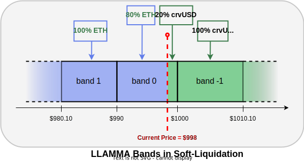

<h1>Curve Lending Overview</h1>

Curve Lending introduces an innovative approach to overcollateralized lending and borrowing with its unique [LLAMMA (Lending-Liquidating AMM Algorithm)](https://docs.curve.fi/crvUSD/amm/) system, designed to enhance risk management and user experience.

**Curve Lending differs from the crvUSD borrowing system as it does not mint any crvUSD, all crvUSD is supplied by users.**  This allows the lending markets to **use any asset as collateral**.  If you are interested in minting crvUSD, check out crvUSD [here](https://crvusd.curve.fi/).  Curve Lending uses the same system for creating loans and depositing collateral as crvUSD, but it also allows users to **generate interest through supplying their assets** to be borrowed by others.

# **Markets**

There are many different Curve Lending Markets.  Each market uses a single type of collateral, and make loans in a single asset (**all markets are one-way, and all markets are isolated**).  Some of the markets available are pictured below (we've used llamas to illustrate different markets), but there are many more available, and **new markets can be permissionlessly deployed** by anyone, at anytime (as long as the asset has a [price oracle](https://docs.curve.fi/stableswap-exchange/stableswap-ng/pools/oracles/)).

*Note that all markets have to be paired with crvUSD (i.e., crvUSD must be either the collateral, or the coin to be borrowed)*

## **Basic Lending Market Architecture**

Let's take a look at a single market to see the basics of how it works:

Let's breakdown the different entities and their roles in this market:

| Entity | | Role |
|:--:|:--|:--|
| {: style="height:50px"} | **The llama** | This llama (lending market) represents the smart contracts in the system.  It uses CRV as collateral, and lends out crvUSD.  The llama **charges interest on crvUSD users borrow**, and **pays interest to lenders who supply crvUSD**. |
| {: style="height:50px"} | **Bobo** | Bobo always thinks the market will crash, so he **supplies his crvUSD** and the llama **lends it out and pays Bobo interest**. |
| {: style="height:50px"} | **Pepe** | Pepe wants to go trade meme coins but doesn't want to sell his CRV, so he **deposits CRV and uses it as collateral to borrow crvUSD**.  He feels safe knowing he's better protected here with LLAMMA and soft-liquidations than other lending markets. |
| {: style="height:50px"} {: style="height:50px"} | **Wojak** & **Grug** | Wojak and Grug are just talking to the wrong llama (lending market).  All Curve Lending Markets are one-way, so they need to go and find the llama with a wizard hat pictured above.  That llama lends out CRV with crvUSD collateral. |

See the following sections for further details how supplying and borrowing work.

---

# **Supplying (Lending)**

## **Earning Interest for Supplying to Lending Markets**

Just like Bobo in the above example, you too could **earn interest for supplying assets** to Curve Lending.  Let's have a look at an example where Bobo lends his crvUSD for a year and how much he earns:

So at the end of a year **Bobo earned 22.1 crvUSD and $20 worth of CRV**, this equates to an **APR of 42.1%** over that year.

### **Supply Share Tokens**
By Supplying assets on Curve Lending, you are given a **Supply Share Token** ([more info here](https://docs.curve.fi/lending/contracts/vault/)) representing your share of the **Total Supply**.  The value of these tokens continuously compounds by **Lend APY**.

### **Rewards APR**

**Rewards APR** is a combination of CRV rewards and any other incentives provided to suppliers.  For a market to have CRV rewards the following conditions must be met:

1. The Curve DAO must vote to add a [Rewards Gauge](https://resources.curve.fi/reward-gauges/understanding-gauges/) to the GaugeController for that specific lending market.
2. veCRV holders must vote to send CRV rewards to that specific Lending Market (called getting [Gauge Weight](../reward-gauges/gauge-weights.md)).  

If the pool has CRV rewards the number will be a range as CRV rewards are variable based on the boost a user receives from their veCRV holdings, [more info here](https://resources.curve.fi/reward-gauges/boosting-your-crv-rewards/).

Other incentives can be added by anyone, i.e., if a project wants to incentivize their token being used as collateral they may add incentives to a Lending Market.

Reward APR accrues altogether and can be claimed at any time.

## **Depositing and Withdrawing from a Lending Market**

After depositing to a lending market your assets are added to the pool of available supply.

You can withdraw a supplied asset provided there are sufficient available (un-borrowed) assets in the market.

{: .centered }

If there are insufficient available assets for a full withdrawal, you can withdraw the maximum amount currently available. The high Utilization rate will cause Borrow APY and Lend APYs to increase, incentivizing borrowers to repay their loans, and more lenders to supply. As available supply increases you can withdraw your remaining balance over time.

---

# **Borrowing**

When borrowing on Curve Lending, you are taking an overcollateralized loan against deposited assets (e.g., borrowing crvUSD with CRV collateral).  You are **charged the Borrow APY on the borrowed assets** (i.e., Borrowing APY increases crvUSD debt).

Collateral is deposited into each lending market's [LLAMMA](https://docs.curve.fi/crvUSD/amm/) system and split evenly across the chosen number of **Bands**.  Each band represents a small liquidation range.  Reducing the number of bands allows for a higher **Loan-to-Value** (LTV) ratio.  Your loan is safe while the oracle price is higher than any of your bands.  See the image below for a breakdown of how it all works together.

{: .centered }

By **minimizing the number of bands** (N=4) you can **maximize the amount you borrow** (LTV) just like Pepe.  Wojak likes the idea of spreading his liquidity out more so he chooses 10 bands (N=10) and doesn't max borrow.  This is why Wojak's loan is split into bands 3-12 and Pepe's is split into bands 1-4.  When you borrow you can choose the number of Bands from 4-50.

There is no set rule for **whether less or more bands is better**.  Different numbers of bands are better in different scenarios:

* **More bands** will equate to losing collateral slower in soft-liquidation, but it also widens your liquidation range so you could be in soft-liquidation for a longer period of time.  
* **Less bands** tightens your Liquidation Range so while your collateral will be traded aggressively, but you may stay in the Liquidation Range for a shorter time.

## **Soft-liquidation**

**Soft-liquidation** begins if the oracle price of your collateral drops into one of your bands. Here, the platform will begin trading your collateral for your borrowed asset linearly as the price declines through each band.

Let's have a look what soft liquidation looks like in a simplified example with a **single band** for an **ETH/crvUSD LLAMMA market**.  This example shows that if the price declines 20% through the band, 20% of the ETH is converted to crvUSD.  When the price is less than the lower bound of the band (<\$990), all the collateral is converted to crvUSD (100% crvUSD, 0% ETH).  When the price is above the higher bound (>\$1000) all collateral is ETH (100% ETH, 0% crvUSD).

{: .centered style="height:250px" }

The below image represents **multiple bands** through soft-liquidation.  Note the higher bands than the current price are fully converted to crvUSD and the lower bands are still ETH.

{: .centered style="height:250px" }

A unique feature of LLAMMA can be seen here in that it automatically converts your collateral from the asset losing value to the other asset in the pool.

The value of traded assets remain loan collateral throughout soft-liquidation (e.g., if ETH is swapped for crvUSD the value of that crvUSD is added to the collateral backing the loan).  **If prices increase through your bands, any swapped collateral will be traded back for your initial collateral** (e.g., ETH swapped to crvUSD as price decreased is swapped back to ETH as price increases).

Re-balancing collateral through soft-liquidation is incentivised to arbitrage traders by providing a small discount (when required) to buy or sell through LLAMMA.  This discount increases or decreases based on how fast LLAMMA needs to swap collateral.  Providing this discount means you will lose small amounts of collateral each time LLAMMA trades in one of your bands.  This is why your **health factor erodes over time in soft-liquidation**.  Higher volatility equates to larger discounts and more losses.  You do however, recoup some of these losses by earning trading fees for providing liquidity, similar to other AMMs.

*Note that* ***collateral cannot be deposited while in soft-liquidation, debt can only be repaid***.

## **Health Factor & Hard-Liquidation**

The **Health Factor** is a measure of debt value to collateral value with a small buffer added for safety.  As long as the health factor is positive, the position remains open.  **It's possible to be below your bands with all collateral converted to the borrowed asset (e.g., all CRV converted to crvUSD), while maintaining a positive health factor**.  If this happens, further price declines do not affect the position (e.g., all CRV traded for crvUSD, and crvUSD collateral covers debt and safety buffer).   **Hard-liquidation only occurs if your health factor reduces to 0**.

In contrast, most other lending platforms will hard-liquidate your collateral and terminate your loan if your loan falls below a minimum collateral ratio (LTV), even if only by a small amount for a brief time. This can be highly stressful for borrowers and lead to significant losses. Curve Lending offers a safer space and more peace of mind for borrowers.

---

## **Utilization, Lend APY and Borrow APY**

The **Lend APY** and **Borrow APY** are based solely on the **Utilization** of the market.  It is the ratio of assets supplied, to assets loaned.  In the image below the Utilization is 80% as 80% of the Supply is borrowed.  **Higher Utilization means a higher Lending APY and Borrowing APY**.  This incentivizes borrowers to close loans, and more suppliers to lend out their assets.  See [here](./understanding-lending.md#interest-rates) for more information.  *Note that APY is different to APR, the TL;DR is that APY compounds, APR doesn't.  See [here](./understanding-lending.md#interest-rates) for more info.*

{: .centered }

## **More Information**

For more information on basic concepts and borrowing and supplying please see [Curve Lending section within the Curve Resources](./understanding-lending.md).

For more technical information especially relating to the underlying smart contracts please see the [Lending section within the Curve Docs](https://docs.curve.fi/lending/overview)