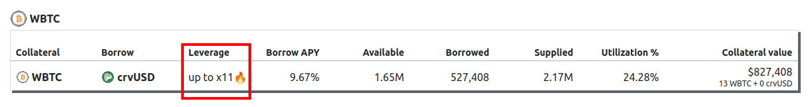

<h1>Leverage</h1>

This section explains how leverage works in crvUSD and Curve lending markets. For step-by-step instructions on taking out a leveraged loans, see the following guides:

- [crvUSD: How to Take Out a Leveraged Loan](../crvusd/loan-creation.md#leveraged-loans)
- [Curve Lending: How to Take Out a Leveraged Loan](../lending/how-to-borrow.md#how-to-take-out-a-leverage-loan)

# **How Leverage Works**

Leverage in Curve loans multiplies both potential gains and losses. For example, with 2x leverage on WETH collateral, profits and losses in crvUSD terms are doubled compared to holding WETH without leverage (excluding borrowing rates).

Example scenarios with different leverage levels:

| ETH starting price | ETH end price | Deposited Collateral | Borrowed Collateral | Total Collateral | Leverage | Profit | ETH Profit |
|---|---|---|---|---|---|---|---|
| 1000 crvUSD | 2000 crvUSD| 1 ETH | 0 ETH | 1 ETH | 1x | 1000 crvUSD | 0 |
| 1000 crvUSD| 2000 crvUSD| 1 ETH | 1 ETH | 2 ETH | 2x | 2000 crvUSD | 1 ETH |
| 1000 crvUSD| 2000 crvUSD| 1 ETH | 2 ETH | 3 ETH | 3x | 3000 crvUSD | 2 ETH |

!!!warning "Warning"
    Leverage multiplies both profits AND losses. A price decrease will result in proportionally larger losses based on your leverage amount.

---

# **Leverage Methods**

## **Manual Leverage Looping**

Users can create leverage in any crvUSD or lending market through manual looping:

{: .centered }
{: .centered }

Users, in this process:

1. Deposit WETH as collateral
2. Borrow crvUSD
3. Swap borrowed crvUSD back to WETH
4. Repeat the process

Each loop provides less additional leverage since loan LTV is always below 100%.  If a user uses 1 WETH worth 3,000 crvUSD, and borrows a total of 6,000 crvUSD, this is called 2x leverage.

---

## **Built-in Leverage**

All crvUSD minting markets and some Curve lending markets offer built-in leverage functionality, allowing users to achieve their desired leverage in a single transaction.   Below is a image of the lending UI showing the WBTC lending market, this market allows built-in leverage of up to 11x.

{: .centered }

How built-in leverage works:

{: .centered }

### **Depositing Combined Assets (Curve Lending Only)**

Users can deposit both crvUSD and collateral assets (e.g., WETH) together. In this case, during the single transaction:

1. WETH collateral is used to borrow crvUSD
2. Borrowed crvUSD is added to the deposited crvUSD
3. The total amount is converted to WETH through 1inch
4. All assets are deposited into the lending market

{: .centered }

*Note: With combined deposits, the leverage calculation remains the same. For example, with 1,500 crvUSD + 0.5 WETH (total value 3,000 crvUSD) at 5x leverage, the borrowed amount is still 12,000 crvUSD (4x deposited collateral). Repayment process and profit calculation remain unchanged from single-asset deposits, and after repayment the user will receive profit in their borrowed asset.*