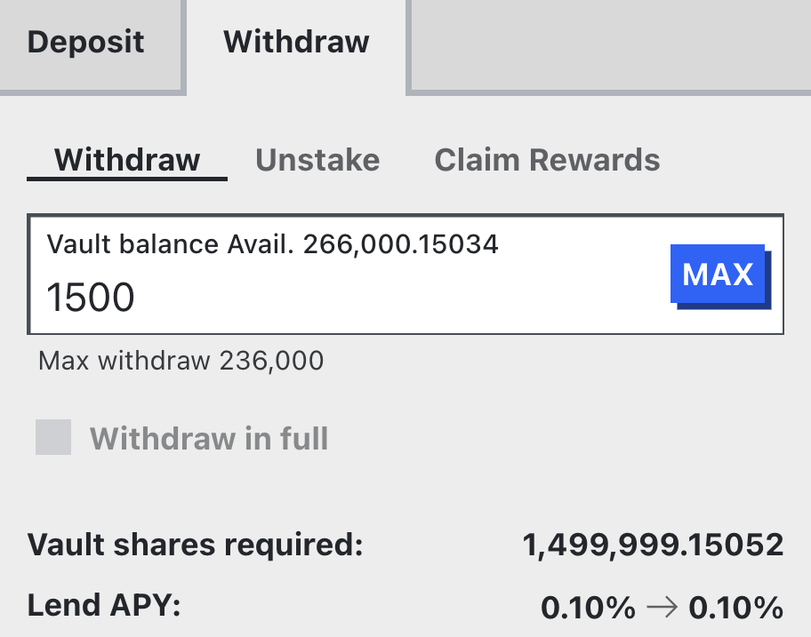
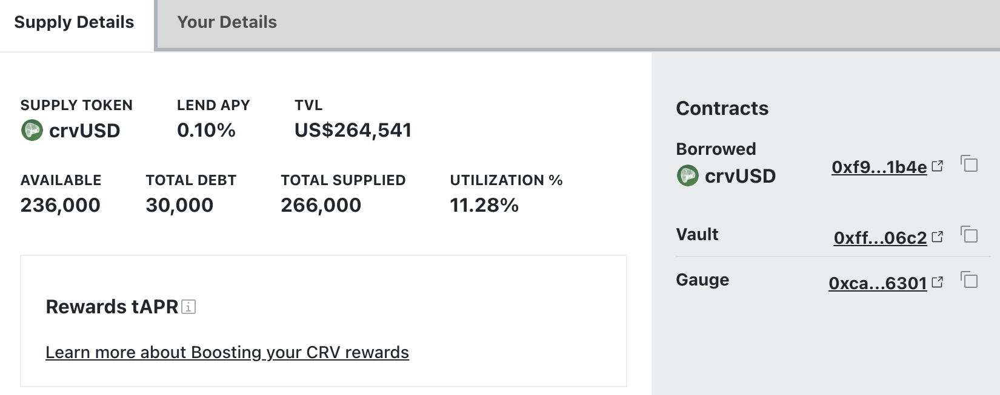
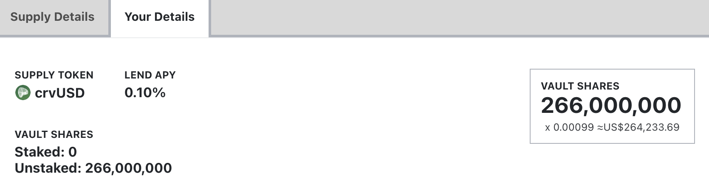

<h1>Supplying Assets</h1>

## **How do ERC-4626 Vaults work?**

Liquidity for borrowers is provided in ERC-4626 vaults. For detailed documentation on how they work, please check out the official [Ethereum documentation](https://ethereum.org/de/developers/docs/standards/tokens/erc-4626/) or visit the [technical docs of Curve](https://docs.curve.fi/lending/contracts/vault/).

---

## **Depositing and Withdrawing Assets**

<figure markdown="span">
  { width="350" }
  <figcaption></figcaption>
</figure>

In order to supply tokens to the vault, the user must specify the amount of underlying tokens to add. Underlying tokens are referred to as the asset in the vault, which is the asset that's borrowed. When depositing, the UI previews the amount of shares to receive and projects the lend APY after the deposit. For depositing, there is no cap. Users can deposit as much as they want. After depositing, if desired, users can stake their vault shares into the corresponding gauge (if there is one) under the "Stake" tab. Liquidity gauges of the vaults can be added to the GaugeController in order to be eligible to receive CRV emissions or external rewards can be added to the gauge by the deployer.

---

<figure markdown="span">
  { width="350" }
  <figcaption></figcaption>
</figure>

If a user has already deposited some shares, they can withdraw the desired amount under the withdraw tab. There is also a "Withdraw in full" option, which burns all the user's shares and converts them into the underlying asset[^1]. The UI previews the amount of shares to be burned in order to receive the underlying tokens.  
If a user has staked the vault shares in a gauge, they are required to unstake them before being able to withdraw.

[^1]: This method will only work if the vault has enough underlying assets to fully redeem all the shares. 

!!!tip "Lending Rates when Depositing or Withdrawing Assets"
    When depositing underlying assets into the vault, the lending rate may decrease depending on the amount of assets added. The reason for this is that when supplying additional assets, the market's utilization rate will decrease (as there are now more assets to borrow from), which simultaneously decreases the borrow rate. When the borrow rate decreases, the lending rate decreases as well.

    Vice versa: Withdrawing assets from the vault reduces the total amount of assets. This drives the utilization rate up, which increases the borrow rate and therefore also the lending rate.

---

*Having **`"Advanced Mode"`** enabled adds a full overview of the vault.*

<figure markdown="span">
  { width="600" }
  <figcaption></figcaption>
</figure>

*If a user has shares, the user can view their personal vault information on the `"Your Details"` tab.*

<figure markdown="span">
  { width="600" }
  <figcaption></figcaption>
</figure>
