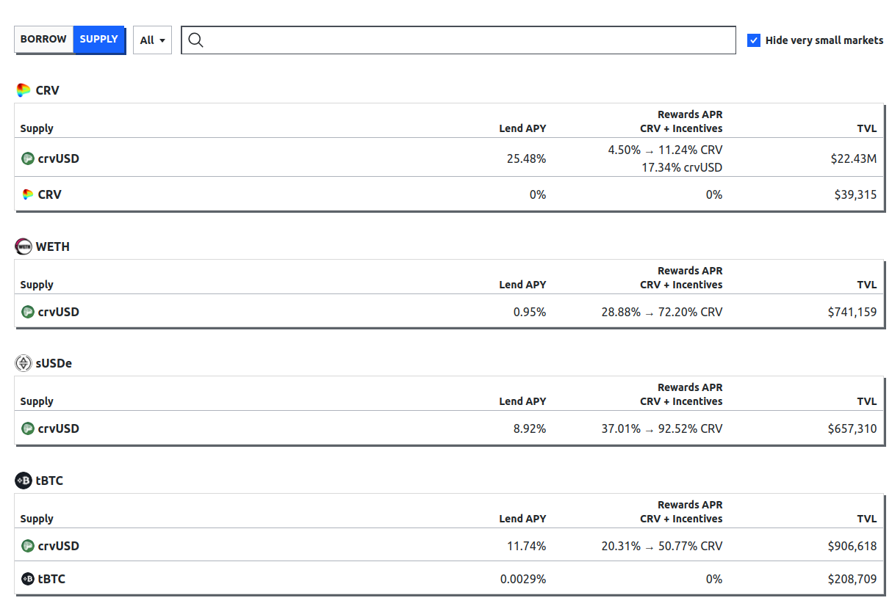

Curve lending system allows users to borrow crvUSD against any collateral token or to borrow any token against crvUSD, while benefiting from the **soft-liquidation mechanism** provided by [LLAMMA](#llamma-and-liquidations).

For the basic concepts of the system, see [here](#basic-concepts).

!!!danger "Curve Lending Risk Disclaimer"
    Add full risk disclaimer on using Curve Lending can be found [here](../resources/risks/crvusd.md).

---

# **Overview**

*Lending markets work very similarly to the markets for minting crvUSD. Here are the major differences:*

- Lending markets are permissionless; **any assets in combination with crvUSD can be used**. This means users can borrow against tokens like CRV, LRT's, etc. You name it. The only requirement is a **proper oracle[^1]**. Although, before creating a lending market, proper parameters should be simulated.
- The **interest rate of lending markets solely depends on the utilization of the supplied assets**, unlike for minting markets which depend on various factors such as crvUSD price, pegkeeper debt, and other parameters.

!!!warning "Collateral in Lending Markets *DO NOT* back crvUSD"
    Just because any kind of asset can be used in a lending market does not mean that crvUSD is backed by it. Minting crvUSD is still exclusively possible for high-quality crypto collateral approved by the DAO.

[^1]: New Curve pools such as stableswap-ng, twocrypto-ng, or tricrypto-ng provide a suitable oracle.

*Lending markets involve a synergy between two participants:*

-   :fontawesome-solid-money-bill-1: **Borrowers**

    ---

    Borrowers are the ones **borrowing assets**. To do so, they create a loan and put up some collateral. In exchange for borrowing, they pay a certain [borrow rate](#borrow-apr) which soley depends on the [utilization rate](#utilization-rate){ data-preview }.

    ---

    [:octicons-arrow-right-24: Borrowing Assets](./loan-creation.md)

-   :material-bank: **Lenders**

    ---

    Lenders are **lending out their assets** to borrowers by deposit their assets into a slightly modified [ERC-4626 vault](https://ethereum.org/en/developers/docs/standards/tokens/erc-4626/). In exchange for supplying their assets, they are awarded a [lending rate](#lend-apy).

    ---

    [:octicons-arrow-right-24: Supplying Assets](./supplying-assets.md)

---

# **Lending Markets**

The main site of the UI shows all available lending markets. The UI differentiates between **`BORROW`** and **`SUPPLY`** tabs, which can be chosen on the left of the search bar. The search bar can be used to look for token-specific lending markets by either inputting the name or token address.

<figure markdown="span">
  { width="700" }
  <figcaption></figcaption>
</figure>

!!!info "Long and Short Markets"
    When creating new markets, one of the parameters to input is a `name`, which will be used for display on the UI. As there was some confusion regarding certain names, here's a short explainer:

    - Long markets describe markets where a collateral token is used to borrow crvUSD against it. For example, in the `crv-long` market, CRV is used as the collateral token to borrow against it.
    - Short markets are the opposite. In these markets, crvUSD is provided as collateral to borrow against it. For example, in the `crv-short` market, crvUSD is used as collateral to borrow CRV tokens against it.

---

## **Borrowing**

When selecting the **`"BORROW"`** tab, all relevant market information and values for borrowers are displayed:

<figure markdown="span">
  { width="800" }
  <figcaption></figcaption>
</figure>

`Collateral` displays the collateral token of the market, while `Borrow` shows the tokens which can be borrowed. `Borrow APR` represents the current borrow rate.

The `Available` column shows the amount of assets left to borrow and `Total Debt` the current total amount borrowed.

The `Total supplied / Utilization (%)` shows the total amount of borrowable assets supplied (which equals to the sum of assets left to borrow and currently borrowed out assets) in the vault and its utilization rate.

---

## **Lending**

Chossing the **`"SUPPLY"`** tab, all relevant market information and values for lenders are displayed:

<figure markdown="span">
  { width="800" }
  <figcaption></figcaption>
</figure>

`Supply` shows the underlying token of the vault which can be supplied. `Lend APY` is the current annualized rate for doing so.

Additionally, vaults can have gauges, which are eligible to receive CRV emissions once they are added to the GaugeController. These rewards will show up in the `Rewards APR / CRV + Incentives` column if there are any.

`TVL` displays the total value locked into the vault.

---

# **Basic Concepts**

LLAMMA handles liquidation differently than most other lending protocols. In most other protocols, if the health factor of a borrower reaches a certain threshold due to their collateral value not properly covering their loan/debt value, the loan is up for liquidation. External users can repay the debt and, in exchange, receive the collateral of the user.

[LLAMMA](#llamma-and-liquidations) works differently. It does not have a single liquidation price, but has rather many "small liquidation ranges" which lead to the **continuous liquidation and de-liquidation of the collateral**. This mechanism may protect a user from a single full liquidation due to an unexpected and heavy price movement.

*The following section provides a short overview of the basic concepts of LLAMMA.*

## **LLAMMA and Liquidations**

LLAMMA (**Lending-Liquidating AMM Algorithm**) is a fully functional two-token AMM containing the collateral and borrowable token of the lending market, which is **responsible for the liquidation mechanism**. For more detailed documentation, please refer to the [technical docs](https://docs.curve.fi/crvUSD/amm/).

When creating a new loan, the put-up **collateral will be deposited into a specified number of bands across the AMM**. Unlike regular liquidation, which has a single liquidation price, LLAMMA has multiple liquidation ranges (represented by the bands) and **continuously liquidates the collateral if needed**.  
All bands have lower and upper price limits, each representing a "small liquidation range." The user's total liquidation range is represented by the upper price of the highest band to the lower price of the lowest band.

A loan only **enters soft-liquidation mode once the price of the collateral asset is within a band**. If the price is outside the bands, there is no need to partially liquidate and therefore not in soft-liquidation.

The AMM works in a way that the collateral price within the AMM and the "regular price" are treated a bit differently. If the price falls into a band, prices are adjusted in a way that external arbitrageurs are incentivized to sell the collateral token and buy the borrowable token in the band. So, **if the price is within a band, the user's collateral will be sold for the borrowable token**, meaning the user's collateral is now a combination of both tokens. This happens for each individual band the user has liquidity deposited into.

**This liquidation process does not only happen when prices fall but also when they rise again**. If the collateral in a band has been fully converted into the borrowable token and the collateral price rises again, the earlier sold-off collateral will be bought up again.

*In short: External traders will soft-liquidate a users collateral when the collateral token's price is falling and de-liquidate it again when prices rise again.*

!!!warning "Losses in Soft-Liquidation"
    Positions in soft-liquidation / de-liquidation are suffering losses due to the selling and buying of collateral. If the position is not in soft-liquidation, no losses occur[^2]. These losses decrease the health of the loan. Once a user's health is at 0%, the user's position may face a hard-liquidation, which closes the loan.

[^2]: The borrow rate the user is paying for borrowing assets is the only "loss" that decreases the loan's health.

---

## **Loan Health**

Based on a user's collateral and debt amount, the UI will display a health score and status. If the position is in self-liquidation mode, an additional warning will be displayed. Once a loan reaches **0% health**, the loan is **eligible to be hard-liquidated**. In a hard-liquidation, someone else can pay off a user's debt and, in exchange, receive their collateral. The loan will then be closed.

The **health of a loan decreases when the loan is in self-liquidation mode. These losses do not only occur when prices go down but also when the collateral price rises again, resulting in the de-liquidation of the user's loan.** This implies that the health of a loan can decrease even though the collateral value of the position increases. If a loan is not in self-liquidation mode, then no losses occur.

Losses are hard to quantify. There is no general rule on how big the losses are as they are dependent on various external factors such as how fast the collateral price falls or rises or how efficient the arbitrage is. But what can be said is that the **losses heavily depend on the number of bands** used; the more bands used, the fewer the losses.

<figure markdown>
  { width="600" }
  <figcaption></figcaption>
</figure>

---

## **Bands (N)**

When creating a loan, the added collateral is spread among the number of bands selected. Minimum amount is 4 bands, and the maximum amount is 50 bands.

**A band essentially is a price range, with an upper and lower price limit**. If the price of the collateral is within the limits of a band, that particular band is likely to be liquidated.

<figure markdown>
  { width="700" }
  <figcaption></figcaption>
</figure>

In the illustration above, there are multiple bands with different price ranges. The light grey areas represent the collateral token, which in this example is ETH. As depicted, the bands below the collateral token's price are entirely in ETH since there is no need for liquidation, given the higher price. The dark grey areas represent the borrowable token, which in this case is crvUSD. Because the price of ETH fell within the band on the far right, the deposited collateral (ETH) is converted into the borrowed token (crvUSD). In this instance, the band consists of both ETH and crvUSD. If the price continues to decline, all collateral in the band will be fully converted into crvUSD, and the band to the left will undergo soft-liquidation.

*Remember: When prices rise again, the opposite is happening. The ETH which was converted into crvUSD earlier will be converted back into ETH again.*

<figure markdown>
  { width="230" }
  <figcaption>A band which has fully been soft-liquidated. All collateral was converted into crvUSD because the price of the collateral is below the liquidation range.</figcaption>
</figure>

<figure markdown>
  { width="250" }
  <figcaption>A band which currently is in soft-liquidation. It contains both, the collateral and borrowable token.</figcaption>
</figure>

<figure markdown>
  { width="250" }
  <figcaption>A band which has not been liquidated yet (composition is 100% collateral token). The price of the collateral is above the liquidation range.</figcaption>
</figure>

---

## **Utilization Rate**
The utilization of assets is the driving factor for interest rates. It represents the percentage of how much of the provided asset is borrowed. The higher the utilization, the higher the interest rate.

$$\text{Utilization} = \frac{\text{Total assets borrowed}}{\text{Total assets supplied}}$$

!!!example "Utilization rate example"
    For example, if a total amount of 100 crvUSD is supplied into the vault and 80 crvUSD is borrowed from it, then the utilization rate is 80%.

---

## **Interest Rates**
Interest rates **solely depend on the utilization** of the markets, unlike on markets for minting crvUSD where the rate depends on multiple factors such as crvUSD price, pegkeeper debt, etc..

It is a simple intertwine of **supply and demand**: If the utilization is high, borrow rates are high. If the utilization is low, borrow rates are low.

!!!info "Difference between `APR` and `APY`"
    - **`APR`** represents the annual percentage rate and represents the rate on how much interest a user pays on his debt.
    - **`APY`** is the annual percentage yield and refers to how much a user earns by providing assets into the vault, taking compound interest into account.

    *To convert the APR into APY, we need to annualize it. Rate is per second.*

    $$\text{APY} = \left(1 + \frac{APR}{86400 \cdot 365}\right)^{86400 \cdot 365} - 1$$

### Borrow Rate
The borrow APR is the rate a **borrower pays for borrowing out assets**.

*The formula for the borrow rate is as follows:*

$$\text{borrowAPR} = \text{rate}_{\text{min}} \cdot \left(\frac{\text{rate}_{\text{max}}}{\text{rate}_{\text{min}}}\right)^{\text{utilization}}$$

$\text{rate}_{\text{min}}$ and $\text{rate}_{\text{max}}$ values are obtained from the monetary policy contract, calculations for utilization can be found [here](#utilization-rate).

### Lend Rate
Lend APY is the **annual yield a lender receives in exchange for lending out their assets**.

*Formula to calculate the Lend APR:*

$$\text{lendAPR} = \text{borrow rate} \cdot \left(\frac{\text{borrow rate} \cdot \text{utilization rate}}{\text{borrow rate}}\right)$$
