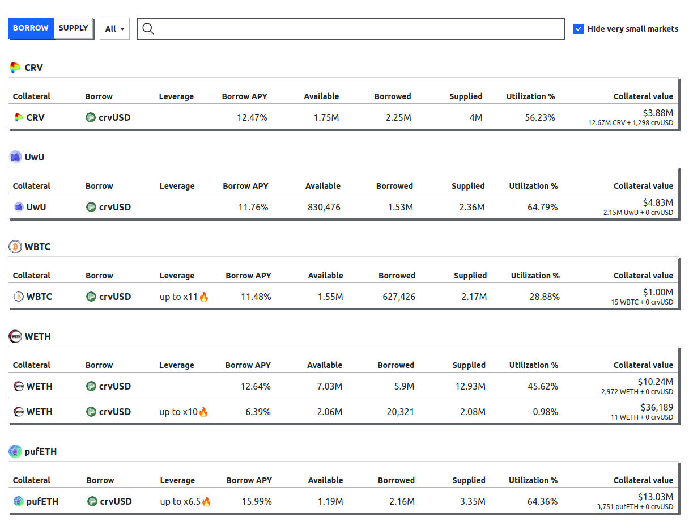

Curve lending allows borrowers to borrow crvUSD against any collateral token or to borrow any token against crvUSD as collateral, while benefiting from the soft-liquidation mechanism provided by LLAMMA.

For the basic concepts of the system, see [here](../crvusd/loan-details.md#crvusd-concepts).

## **Overview**

!!!danger "Risks"
    Add a risk disclaimer here.

*Lending markets work similarly to the markets for minting crvUSD. Here are the major differences:*

- The interest rate of lending markets solely depends on the utilization of the supplied assets, unlike for minting markets which depend on various factors such as crvUSD price, pegkeeper debt, and other parameters.
- Lending markets are permissionless; any assets in combination with crvUSD can be used. This means users can borrow against tokens like $CRV, $DOGE, etc. You name it. The only requirement is a proper oracle[^1].
- Sooner or later, lending activities will be available on L2's, profiting from low gas fees.

!!!warning "Collateral in Lending Markets *DO NOT* back crvUSD"
    Just because any kind of asset can be used in a lending market does not mean that crvUSD is backed by it. Minting crvUSD is still exclusively possible for high-quality crypto collateral which has been approved by the DAO.

[^1]: New Curve pools such as stableswap-ng, twocrypto-ng, or tricrypto-ng provide a suitable oracle.

---

*Lending markets involve a synergy between two participants:*

-   :fontawesome-solid-money-bill-1: **Borrowers**

    ---

    Borrowers are the ones borrowing assets. To do so, they pay a borrowing rate, which depends on the [utilization](#utilization-rate){ data-preview } of the market.

    [:octicons-arrow-right-24: Borrower](#borrowing)

-   :material-bank: **Lenders**

    ---

    Lenders are the ones who lend out their assets to the borrower. They deposit their assets into an ERC-4626 vault and, in exchange for supplying their assets, they receive an interest rate.

    [:octicons-arrow-right-24: Lender](#lending)

---

## **Lending Markets**

The main site of the UI shows all available lending markets. The UI differentiates between `BORROW` and `SUPPLY` modes, which can be chosen on the left of the search bar. The search bar can be used to search for token-specific lending markets by either inputting the name or token address.

!!!info "Long and Short Markets"
    - Long markets describe markets where a certain collateral token is used to borrow crvUSD against it. For example, in the `crv-long` market, CRV is used as the collateral token to borrow against it.
    - Short markets are the opposite. In these markets, crvUSD is provided as collateral to borrow tokens against it. For example, in the `crv-short` market, crvUSD is used as collateral to borrow CRV tokens against it.

Curve lending is permissionless; anyone can deploy a lending market, but lending markets require a suitable oracle.

[:octicons-arrow-right-24: Creating a lending market](./factory.md)

---

### Borrowing

When choosing **`BORROW`**, all relevant market information and values for borrowers are displayed:

<figure markdown="span">
  { width="800" }
  <figcaption></figcaption>
</figure>

`Collateral` displays the collateral token of the market. These tokens can be supplied and borrowed against.  
`Borrow`, on the other hand, displays the tokens which can be borrowed in this market and `Borrow APR` represents the rate which borrowers pay for borrowing assets.

The `Available` column shows the amount of borrowable asset left to borrow and `Total Debt` the total amount borrowed.

The `Total supplied / Utilization (%)` shows the total amount of borrowable assets supplied in the vault. This equals to the sum of the remaining assets to borrow and the borrowed assets. Additionally, the utilization rate is shown, which represents the ratio between assets borrowed and assets left to be borrowed.  
The utilization is the driving factor in how much borrowers pay. The higher the utilization, the higher the borrow rate.

---

### Lending
When choosing **`SUPPLY`**, all relevant market information and values for suppliers (also called lenders) are displayed:

<figure markdown="span">
  { width="800" }
  <figcaption></figcaption>
</figure>

`Supply` represents the token which can be supplied to the vault and `Lend APY` the annualized rate for doing so.

Additionally, vaults can have gauges, which are eligible to receive CRV emissions once they're added to the GaugeController or external rewards can be added. These rewards will display in the `Rewards APR / CRV + Incentives` column if there are any.

`TVL` displays the total value locked into the vault.

---

## **Utilization Rate**
The utilization of assets is the driving factor for interest rates. It represents the percentage of how much of the provided assets are borrowed.

$$\text{Utilization} = \frac{\text{Total assets borrowed}}{\text{Total assets supplied}}$$

!!!example "Some examples"
    - If a total amount of 100 crvUSD is supplied into the vault and 80 crvUSD is borrowed from it, then the utilization rate is 80%.
    - If a total amount of 266 crvUSD is supplied into the vault and 133 crvUSD is borrowed from it, then the utilization rate is 50%.

---

## **Interest Rates**
Interest rates solely depend on the utilization of the markets, unlike on markets for minting crvUSD where the rate depends on multiple factors such as crvUSD price, pegkeeper debt, etc..

*It is a simple intertwine of supply and demand: If the utilization is high, borrow rates are high. If the utilization is low, borrow rates are low.*

!!!info "Difference between `APR` and `APY`"
    - **`APR`** represents the annual percentage rate and represents the rate on how much interest a user pays on his debt.
    - **`APY`** is the annual percentage yield and refers to how much a user earns by providing assets into the vault, taking compound interest into account.

### **Borrow APR**
The borrow APR is the rate a borrower pays for borrowing out assets.

*The formula for the borrow rate is as follows:*

$$\text{rate} = \text{rate}_{\text{min}} \cdot \left(\frac{\text{rate}_{\text{max}}}{\text{rate}_{\text{min}}}\right)^{\text{utilization}}$$

### **Lend APY**
Lend APY is the annual yield a lender receives in exchange for lending out their assets.

When the utilization of a market is at 100%, borrow and lend rates will be the same.

*Formula to calculate the Lend APY:*

$$\text{lend APR} = \text{borrow rate} \cdot \left(\frac{\text{borrow rate} \cdot \text{utilization rate}}{\text{borrow rate}}\right)$$

*To convert the APR into APY, we need to annualize it. Rate is per second.*

$$\text{lend APY} = lendAPR