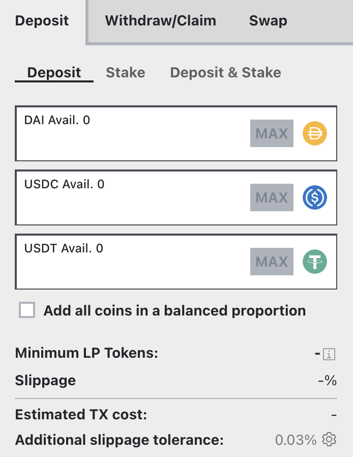

The Tri-Pool is a classic Curve pool and improved upon earlier offerings in many ways.

Here are some of the major improvements this pool:

*   A new rampable A parameter (like on BTC pools) which can adjust liquidity density without causing losses to the virtual price (and to LPs)
*   Gas optimised
*   Will be used as a base pool for meta pools (which would essentially allow some pools to seemingly trade against underlying “base” pools without diluting liquidity)
*   By only having the three most liquid stable coins in crypto, this pool should grow to become the most liquid and offer the best prices
    
This pool is expected to become the most liquid and the cheapest to interact with making it a good place to start for newcomers wanting to try Curve with small amounts of capital. Because this pool is likely to offer the best prices, it will also likely be one of the Curve pools getting the most volume.

*See how to deposit and stake into the 3Pool: https://www.youtube.com/watch?v=OsRrGij9Ou8*

<figure class="video_container">
  <video controls="true" allowfullscreen="true">
    <source src="https://storage.googleapis.com/curvedocs/staking-3pool.mp4" type="video/mp4">
  </video>
</figure>

## **Depositing into the pool**

Visit the deposit page ([https://curve.fi/#/ethereum/pools/3pool/deposit](https://curve.fi/#/ethereum/pools/3pool/deposit)). You will need one or multiple stable coins to deposit. The Tri-Pool takes DAI, USDC and USDT.

<figure markdown>
  { width="300" }
  <figcaption></figcaption>
</figure>

First, it's important to understand that you don't have to deposit all coins, you can deposit one or several of the coins in the pool and it won't affect your returns. Depositing the coin with the smallest share in the pool will result in a small deposit bonus.

Second, once you deposit one stable coin, **it gets split over the three different coins in the pool which means you now have exposure to all of them**. The first checkbox (Add all coins in a balanced proportion) allows you to deposit all three coins in the same proportion they currently are in the pool, resulting in no slippage occurrence.

## **Confirming and staking**

You will then be asked to approve the Curve Finance contract, follow by a deposit transaction which will wrap your stable coins and deposit them into the pool. This transaction can be expensive so you ideally want to wait for gas to be fairly cheap if this will impact the size of your deposit.

After depositing in the pool, you receive liquidity provider (LP) tokens. They represent your share of ownership in the pool and you will need them to stake for CRV.

After depositing, you will be prompted with a new transaction that will deposit your LP tokens in the DAO liquidity gauge. Confirming the transaction **will let you mine CRV.** This second transaction will only pop up if you deposited your tokens under the "Deposit and stake" tab. Otherwise it will just deposit the tokens in the pool.

If you already have LP tokens, you can also directly stake them into the gauge under the 'Stake' tab.

**Once that's done, you're providing liquidity and staking so all that's left to do is wait for your trading fees to accrue.**

*You can click the link below to learn how to boost your CRV rewards by locking CRV on the Curve DAO:*

- [Boosting your CRV Rewards](../../reward-gauges/boosting-your-crv-rewards.md)
- [Staking your $CRV](../../crv-token/staking-your-crv.md)

​
