<Pools Overview>

## INTRO

If you are new to Ethereum or DeFi, liquidity pools are a seemingly complicated concept to understand.  

Pools are two or more assets pooled so other users can swap between any of the assets, and the liquidity providers who deposit to the pools earn fees from trades.

It’s important to understand that when you provide liquidity to a pool, no matter what coin you deposit, you essentially **gain exposure to all the coins in the pool** which means you want to find a pool with coins you are comfortable holding.

!!!danger "Liquidity Pool Risks"
    Before using liquidity pools, it's advisable to review our [risk disclaimer](../risks-security/risks/pool.md) page for a comprehensive overview of potential risks.

## HOW POOLS GENERALLY WORK

Pools have 2 or more pools of tokens, and users can swap between the tokens in the pool by sending 1 token, and in return receiving the other.  Below you can find an example.  There's a pool with Token A and Token B.  Charlie sends Token A, which gets added to the pool, and in return he receives some Token B from the pool.

{.centered}

## STABLESWAP

Stableswap is the name given to pools which have assets pegged to each other.  For example USDC and USDT, their value should always be very close to 1:1 so these assets can be added to a Stableswap pool.

Because the value of the assets in the pool are the same, the amounts of each asset in the pool can change a lot.  It can be 80% USDT and 20% USDC and the price will still be very close to 1:1.

PICTURE ABOUT HOW STABLESWAP WORKS

## CRYPTOSWAP

Cryptoswap is the name given to pools which have assets which are not pegged to each other.  For example USDC and ETH, their value relative to each other is always changing, because of this a different type of pool is needed compared to Stableswap.

These pools are designed to always balance the value of the assets in the pool.  For example, if there is $1,000,000 worth of USDC, then there should be $1,000,000 worth of ETH as well.

PICTURE ABOUT HOW CRYPTOSWAP WORKS

## OUTDATED POOL TYPES

Basepools, metapools, etc.

## FEES

---

# **What are liquidity pools?**

Liquidity pools are **essentially tokens that sit in smart contracts and are used to facilitate trades between others**. If you were to create a pool of DAI and USDC where 1 DAI = 1 USDC. You would have the same amount of tokens, let’s say 1,000 tokens (1,000 DAI and 1,000 USDC) in the pool.

If trader 1 comes and exchange 100 DAI for 100 USDC, you would then have 1,100 DAI and 900 USDC in the pool so the price would tilt slightly lower for USDC to encourage another trader to exchange USDC for DAI and average the pool back.

***GRAPHIC ABOUT HOW THIS WOULD WORK***

You can see those details for each pool and it is something you can take advantage of when depositing.

<figure markdown="span">
  { width="500" }
  <figcaption></figcaption>
</figure>

On the screenshot above for the [**TriCrypto v2 Pool**](https://curve.fi/#/ethereum/pools/tricrypto2/deposit), the three volatilely priced tokens are held in proportions similar to their price. If the coins are out of proportion traders are incentivized to take advantage of the arbitrage, which will push the balances in the pool back towards proportion

<figure markdown="span">
  { width="350" }
  <figcaption></figcaption>
</figure>

---

# **Base vAPY**

To understand what the different pools do, it’s also important to understand how Curve makes money for liquidity providers. Curve **interests come from trading fees**. Every time someone makes a trade on Curve.fi, liquidity providers (people who have deposited funds onto Curve) get a [**small fee**](#what-are-curve-fees) split evenly between all providers, this is why you will see high vAPYs on days with high volume and high volatility. It’s important to note that because fees are dependent on volume, daily vAPYs can often be quite low just like they can be very high.

Some pools (Compound, PAX, Y, BUSD) also earn interest from lending protocols. Behind the scenes, those four pools also use lending protocols (like Compound or AAVE) to help generate more interest for liquidity providers. Whilst it means those pools can be better performers when lending rates are high, it’s also worth noting it also adds more layers of risks.

---

# **What are Curve fees?**

Swap fees are typically around 0.04% which is thought to be the most efficient when exchange stable coins on Ethereum.

Deposit and withdrawals have fees between 0% and 0.02% depending if depositing and withdrawing in imbalance or not. If fees were 0%, users could, for example, deposit in USDC and withdraw in USDT for free. **Balanced deposits or withdrawals are free**.
