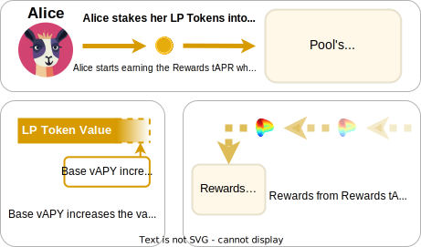

<h1>Pools Overview</h1>>

If you are new to Ethereum or DeFi, liquidity pools are a seemingly complicated concept to understand.  

Pools hold multiple assets, allowing users to swap between them. Liquidity providers who deposit assets earn fees from these swaps.

In Curve, pools can be 2 different types, these are:

* **Stableswap Pools** for coins that are pegged to each other, for example USDC and USDT, or stETH and ETH.  
* **Cryptoswap Pools** which are for assets which fluctuate in value against each other, for example USDT and ETH, or CRV and ETH.

It’s important to understand that when you provide liquidity to a pool, no matter what coin you deposit, you essentially **gain exposure to all the coins in the pool** which means you want to find a pool with coins you are comfortable holding.

!!!danger "Liquidity Pool Risks"
    Before using liquidity pools, it's advisable to review our [risk disclaimer](../risks-security/risks/pool.md) page for a comprehensive overview of potential risks.

---

## **Stableswap** (**Curve V1**)

Stableswap pools have assets pegged to each other.  For example USDC and USDT, as their value should always be very close to 1:1.

Because the value of the assets in the pool should always be around 1:1, the amounts of each asset in the pool can change a lot.  A stableswap pool can be 80% USDT and 20% USDC and the price will still be very close to 1:1.

Let's look at an example about how it works for a liquidity provider:

{: .centered }

---

## **Cryptoswap** (**Curve V2**)

Cryptoswap pools contain unpaired assets like USDC and ETH, whose relative values fluctuate. This necessitates a different pool design than Stableswap.

Cryptoswap pools maintain an equal value balance between their assets. For example, $1,000,000 in USDC would be matched by $1,000,000 worth of ETH.

Let's look at an example about how it works for a liquidity provider:

{: .centered }

---

## **Pool Fees**

Swap fees are typically around 0.04% which is thought to be the most efficient when exchange stable coins on Ethereum.  All new pools also have dynamic fees, so in times of high volatility, fees earned by the pools increase.

**50% of the pool fees go to the Liquidity Providers** increasing the value of LP tokens, and **50% to veCRV holders**.

Deposit and withdrawals have fees between 0% and 0.02% depending if depositing and withdrawing in imbalance or not. If fees were 0%, users could, for example, deposit in USDC and withdraw in USDT for free. **Balanced deposits or withdrawals are free**.

---

## **Rewards & Yield**

Liquidity providers are rewarded with 2 different types of yield:

* **Base vAPY**: This is how much the LP token value is increasing due to accruing pool fees.
* **Rewards tAPR**: These are CRV inflation rewards, other token incentives and points.  LP tokens must be staked to earn these rewards as they accrue through the pool's gauge.

{: .centered }

Some pools contain yield-bearing tokens, such as sUSDe and sDAI. These tokens generate additional yield within themselves, separate from the pool's operations.