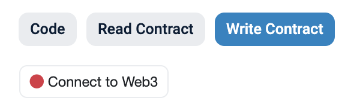
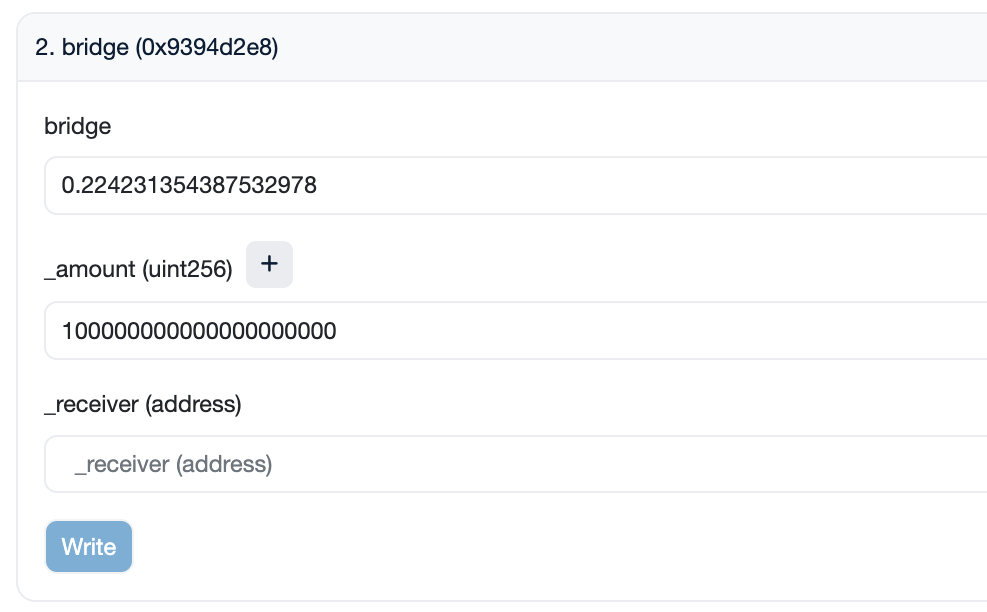

<h1>User Guide: Bridging crvUSD</h1>

## **Overview**
This guide explains how to **bridge crvUSD tokens from the Ethereum Mainnet to the Binance Smart Chain (BSC) or vice versa**, utilizing [LayerZero](https://layerzero.network/) infrastructure.

Requirements include having a wallet with crvUSD tokens and either ETH or BNB, depending on the bridging direction, to cover transaction fees.

!!!danger "Disclaimer"
    This guide is **only applicable for bridging crvUSD** to BSC or vice versa. Using the contracts below will only allow the bridging of crvUSD. **Attempting to use other tokens will cause the transaction to revert**.

!!!deploy "Contract Addresses"
    Both bridge contracts, on Ethereum and Binance Smart Chain, have the same contract addres.

    | Bridge             | Contract Address |
    | ------------------ | ---------------- |
    | :logos-ethereum: Ethereum | [0x0A92Fd5271dB1C41564BD01ef6b1a75fC1db4d4f](https://etherscan.io/address/0x0A92Fd5271dB1C41564BD01ef6b1a75fC1db4d4f) |
    | :logos-bsc: Binance Smart Chain | [0x0A92Fd5271dB1C41564BD01ef6b1a75fC1db4d4f](https://bscscan.com/address/0x0A92Fd5271dB1C41564BD01ef6b1a75fC1db4d4f) |

    The crvUSD contract address differs depending on the chain.

    | :logos-crvusd: crvUSD | Contract Address |
    | --------------------- | ---------------- |
    | :logos-ethereum: Ethereum | [0xf939E0A03FB07F59A73314E73794Be0E57ac1b4E](https://etherscan.io/token/0xf939E0A03FB07F59A73314E73794Be0E57ac1b4E) |
    | :logos-bsc: Binance Smart Chain | [0xe2fb3F127f5450DeE44afe054385d74C392BdeF4](https://bscscan.com/address/0xe2fb3F127f5450DeE44afe054385d74C392BdeF4) |

---

## **Bridging crvUSD from Ethereum to Binance Smart Chain**

### Step 1: Approve the Bridge Contract
1. Navigate to the crvUSD token contract on Etherscan: [0xf939E0A03FB07F59A73314E73794Be0E57ac1b4E](https://etherscan.io/address/0xf939E0A03FB07F59A73314E73794Be0E57ac1b4E#writeContract).
2. Connect your wallet by selecting **`Contract` > `Write Contract` > `Connect to Web3`**.
    <figure markdown="span">
    { width="300" }
    <figcaption></figcaption>
    </figure>
3. Locate the method **`3. approve`** and approve the bridge contract as a spender.
        <figure markdown="span">
            { width="350" }
            <figcaption></figcaption>
        </figure>
    - **`_spender`**: Enter `0x0A92Fd5271dB1C41564BD01ef6b1a75fC1db4d4f`, the bridge contract address.
    - **`_value`**: Specify the amount in 1e18 format (for example, for 100 crvUSD, enter `100000000000000000000`).
    Alternatively, to avoid manually entering the amount in 1e18 format, you can input the amount of crvUSD you wish to bridge and then append 18 zeros by using the **`+`** button.
    <figure markdown="span">
        { width="350" }
        <figcaption></figcaption>
    </figure>
4. Click **`Write`** and complete the transaction.

---

### Step 2: Read Contract and Quote ETH Amount
1. Visit the bridge contract on Etherscan: [0x0A92Fd5271dB1C41564BD01ef6b1a75fC1db4d4f#readContract](https://etherscan.io/address/0x0A92Fd5271dB1C41564BD01ef6b1a75fC1db4d4f#readContract).
2. Use function **`1. quote`** to determine the destination chain fees.
    <figure markdown="span">
    { width="350" }
    <figcaption></figcaption>
    </figure>
    The `quote` amount represents the cost (in ETH) of calling the bridge method in [Step 3](#step-3-bridge-crvusd-to-bsc). This does not include gas costs, which need to be paid additionally.

---

### Step 3: Bridge crvUSD to BSC
1. Access the bridge contract on Etherscan: [0x0A92Fd5271dB1C41564BD01ef6b1a75fC1db4d4f#writeContract](https://etherscan.io/address/0x0A92Fd5271dB1C41564BD01ef6b1a75fC1db4d4f#writeContract).
2. Connect your wallet by selecting **`Contract` > `Write Contract` > `Connect to Web3`**.
    <figure markdown="span">
    { width="300" }
    <figcaption></figcaption>
    </figure>
3. Navigate to method **`2. bridge`** and input your values:
        <figure markdown="span">
        { width="400" }
        <figcaption></figcaption>
        </figure>
    - **`bridge`**: Enter the ETH amount quoted in [Step 2](#step-2-read-contract-and-quote-eth-amount). Ensure you enter the **amount denominated in Ether** (quoted amount / 1e18).
    - **`_amount`**: Specify the amount of crvUSD in 1e18 format.
    Alternatively, to avoid manually entering the amount in 1e18 format, you can input the amount of crvUSD you wish to bridge and then append 18 zeros by using the **`+`** button.
        <figure markdown="span">
            { width="350" }
            <figcaption></figcaption>
        </figure>
    - **`_receiver`**: Enter your BSC wallet address.
4. Click **`Write`** and complete the transaction.

*After completing these steps, it may take a few minutes for your crvUSD tokens to be successfully bridged to the Binance Smart Chain.*

---

## **Bridging crvUSD from Binance Smart Chain to Ethereum**

### Step 1: Approve the Bridge Contract
1. Navigate to the crvUSD token contract on BSCScan: [0xe2fb3F127f5450DeE44afe054385d74C392BdeF4](https://bscscan.com/address/0xe2fb3F127f5450DeE44afe054385d74C392BdeF4).
2. Connect your wallet by selecting **`Contract` > `Write Contract` > `Connect to Web3`**.
    <figure markdown="span">
        { width="300" }
        <figcaption></figcaption>
    </figure>
3. Locate the method **`3. approve`** and approve the bridge contract as a spender.
        <figure markdown="span">
            { width="350" }
            <figcaption></figcaption>
        </figure>
    - **`_spender`**: Enter `0x0A92Fd5271dB1C41564BD01ef6b1a75fC1db4d4f`, the bridge contract address.
    - **`_value`**: Specify the amount in 1e18 format (for example, for 100 crvUSD, enter `100000000000000000000`).
    Alternatively, to avoid manually entering the amount in 1e18 format, you can input the amount of crvUSD you wish to bridge and then append 18 zeros by using the **`+`** button.
    <figure markdown="span">
        { width="350" }
        <figcaption></figcaption>
    </figure>
4. Click **`Write`** and complete the transaction.

---

### Step 2: Read Contract and Quote BNB Amount
1. Visit the bridge contract on BSCScan: [0x0A92Fd5271dB1C41564BD01ef6b1a75fC1db4d4f#readContract](https://bscscan.com/address/0x0A92Fd5271dB1C41564BD01ef6b1a75fC1db4d4f#readContract).
2. Use function **`1. quote`** to determine the destination chain fees.
    <figure markdown="span">
    { width="350" }
    <figcaption></figcaption>
    </figure>
    The `quote` amount represents the cost (in BNB) of calling the bridge method in [Step 3](#step-3-bridge-crvusd-to-ethereum). This does not include gas costs, which need to be paid additionally.

---

### Step 3: Bridge crvUSD to Ethereum
1. Access the bridge contract on BSCScan: [0x0A92Fd5271dB1C41564BD01ef6b1a75fC1db4d4f#writeContract](https://etherscan.io/address/0x0A92Fd5271dB1C41564BD01ef6b1a75fC1db4d4f#writeContract).
2. Connect your wallet by selecting **`Contract` > `Write Contract` > `Connect to Web3`**.
    <figure markdown="span">
    { width="300" }
    <figcaption></figcaption>
    </figure>
3. Navigate to method **`2. bridge`** and input your values:
        <figure markdown="span">
        { width="400" }
        <figcaption></figcaption>
        </figure>
    - **`bridge`**: Enter the ETH amount quoted in [Step 2](#step-2-read-contract-and-quote-bnb-amount). Ensure you enter the **amount denominated in Ether** (quoted amount / 1e18).
    - **`_amount`**: Specify the amount of crvUSD in 1e18 format.
    Alternatively, to avoid manually entering the amount in 1e18 format, you can input the amount of crvUSD you wish to bridge and then append 18 zeros by using the **`+`** button.
        <figure markdown="span">
            { width="350" }
            <figcaption></figcaption>
        </figure>
    - **`_receiver`**: Enter your Ethereum wallet address.
4. Click **`Write`** and complete the transaction.

*After completing these steps, it may take a few minutes for your crvUSD tokens to be successfully bridged to Ethereum.*