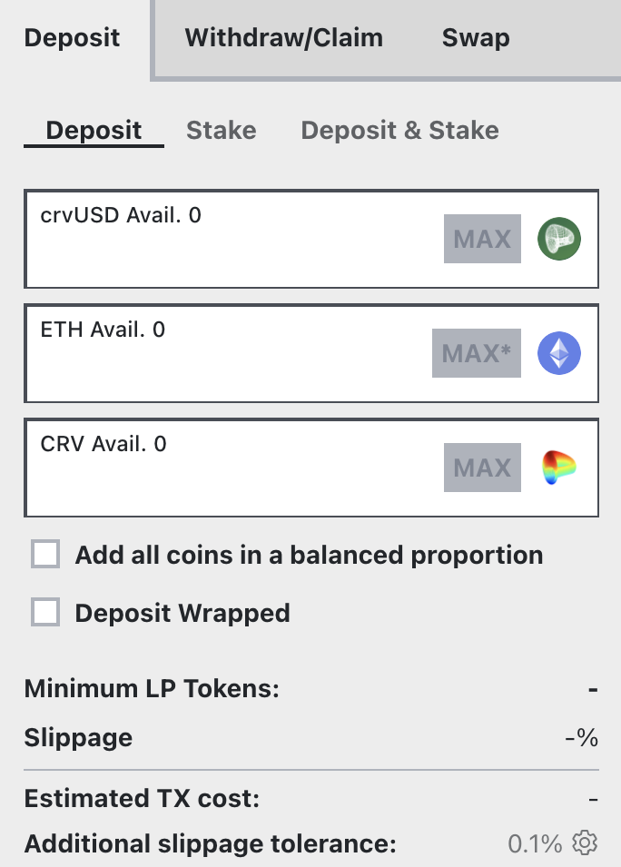

Tricrypto pools contain three volatile assets.

[Learn more about Cryptoswap pools](../../pools/overview.md)

*For instance, the [TriCRV pool](https://curve.fi/#/ethereum/pools/factory-tricrypto-4/deposit) is used in the examples below.*

## **Depositing into the pool**
Visit the deposit page ([https://curve.fi/#/ethereum/pools/factory-tricrypto-4/deposit](https://curve.fi/#/ethereum/pools/factory-tricrypto-4/deposit)). You will need at least one of the three tokens in the pool to deposit. The TriCRV pool consists of CRV, crvUSD, and ETH.

<figure markdown>
  { width="300" }
  <figcaption></figcaption>
</figure>

First, it's important to understand that you don't have to deposit all coins, you can deposit one or several of the coins in the pool and it won't affect your returns. Depositing the coin with the smallest share in the pool will result in a small positive price impact. Since crypto pools have a rebalancing mechanism, the balances of the pool should be relatively equal.

Second, once you deposit one coin, **it gets split over the three different coins in the pool which means you now have exposure to all of them**. The first checkbox (Add all coins in a balanced proportion) allows you to deposit all three coins in the same proportion they currently are in the pool, resulting in no price impact.

The second checkbox (Deposit Wrapped) allows users to deposit wrapped ETH instead of plain ETH.

## **Confirming and staking**

You will then be asked to approve the Curve Finance contract, follow by a deposit transaction which will deposit your into the pool. This transaction can be expensive so you ideally want to wait for gas to be fairly cheap if this will impact the size of your deposit.

After depositing in the pool, you receive liquidity provider (LP) tokens. They represent your share of ownership in the pool and you will need them to stake for CRV.

After depositing, you will be prompted with a new transaction that will deposit your LP tokens in the DAO liquidity gauge. Confirming the transaction **will let you mine CRV.** This second transaction will only pop up if you deposited your tokens under the "Deposit and stake" tab. Otherwise it will just deposit the tokens in the pool. 

If you already have LP tokens, you can also directly stake them into the gauge under the 'Stake' tab.

**Once that's done, you're providing liquidity and staking so all that's left to do is wait for your trading fees to accrue.**

*You can click the link below to learn how to boost your CRV rewards by locking CRV on the Curve DAO:*

- [Boosting your CRV Rewards](../../reward-gauges/boosting-your-crv-rewards.md)
- [Staking your $CRV](../../vecrv/locking-your-crv.md)