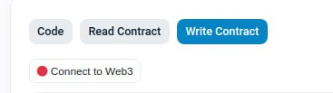
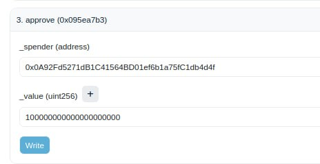
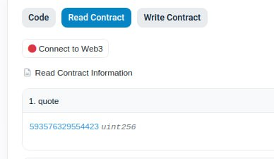

---
hide:
  - toc
---

<h1>User Guide: Bridging crvUSD from Ethereum to Binance Smart Chain</h1>

## **Overview**
This guide explains how to bridge crvUSD tokens from the Ethereum Mainnet to the Binance Smart Chain (BSC) using a Layer Zero bridge contract.

**Requirements**

- A Web3 wallet containing crvUSD on Ethereum.
- Some ETH to cover transaction fees.
- Your BSC wallet address.

---

## **Step 1: Approve the Bridge Contract**
1. Navigate to the crvUSD token contract on Etherscan: [0xf939E0A03FB07F59A73314E73794Be0E57ac1b4E](https://etherscan.io/address/0xf939E0A03FB07F59A73314E73794Be0E57ac1b4E#writeContract).
2. Connect your wallet by selecting `Contract` > `Write Contract` > `Connect to Web3`.
    <figure markdown="span">
    { width="400" }
    <figcaption></figcaption>
    </figure>
3. Locate method `3. approve`.
        <figure markdown="span">
            { width="350" }
            <figcaption></figcaption>
        </figure>
    - `_spender()`: Enter `0x0A92Fd5271dB1C41564BD01ef6b1a75fC1db4d4f` (the bridge contract address).
    - `_value()`: Specify the amount in 1e18 format (for example, for 100 crvUSD, enter `100000000000000000000`).
    Alternatively, to avoid manually entering the amount in 1e18 format, you can input the amount of crvUSD you wish to bridge and then append 18 zeros by using the `+` button.
    <figure markdown="span">
        { width="350" }
        <figcaption></figcaption>
    </figure>
4. Click `Write` and complete the transaction.

---

## **Step 2: Read Contract and Quote ETH Amount**
1. Visit the bridge contract on Etherscan: [0x0A92Fd5271dB1C41564BD01ef6b1a75fC1db4d4f#readContract](https://etherscan.io/address/0x0A92Fd5271dB1C41564BD01ef6b1a75fC1db4d4f#readContract).
2. Use function `1. quote` to determine the ETH required for bridging (excluding gas costs).
    <figure markdown="span">
    { width="400" }
    <figcaption></figcaption>
    </figure>

---

## **Step 3: Bridge crvUSD to BSC**
1. Access the bridge contract on Etherscan: [0x0A92Fd5271dB1C41564BD01ef6b1a75fC1db4d4f#writeContract](https://etherscan.io/address/0x0A92Fd5271dB1C41564BD01ef6b1a75fC1db4d4f#writeContract).
2. Connect your wallet by selecting `Contract` > `Write Contract` > `Connect to Web3`.
    <figure markdown="span">
    { width="350" }
    <figcaption></figcaption>
    </figure>
3. Navigate to method `2. bridge`.
        <figure markdown="span">
        { width="400" }
        <figcaption></figcaption>
        </figure>
    - `bridge (payableAmount (ether))`: Enter the ETH amount quoted in Step 2. Ensure you enter the amount denominated in Ether (quoted amount / 1e18).
    - `_amount()`: Specify the amount of crvUSD in 1e18 format.
    Alternatively, to avoid manually entering the amount in 1e18 format, you can input the amount of crvUSD you wish to bridge and then append 18 zeros by using the `+` button.
        <figure markdown="span">
            { width="350" }
            <figcaption></figcaption>
        </figure>
    - `_receiver()`: Enter your BSC wallet address.
4. Click `Write` and complete the transaction.

---
