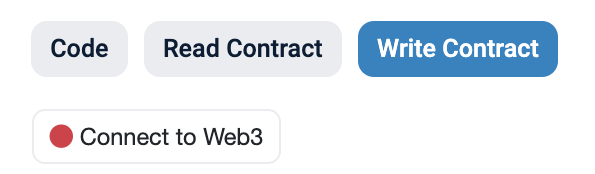
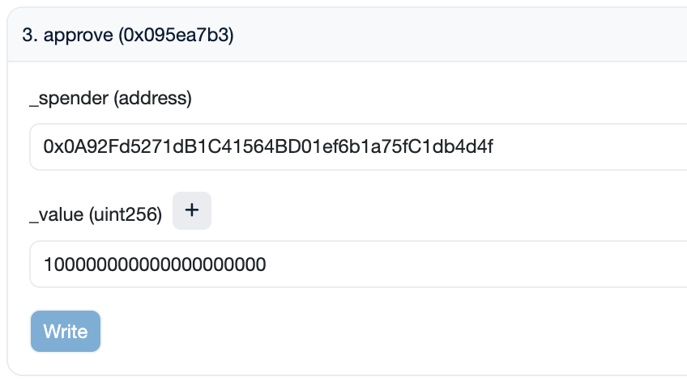
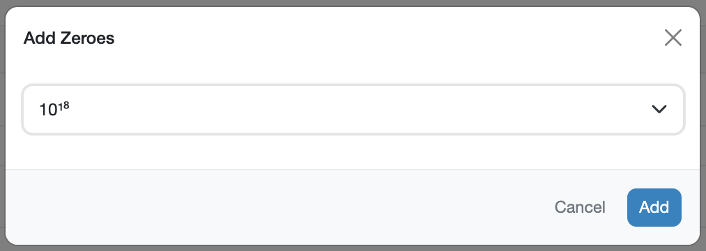
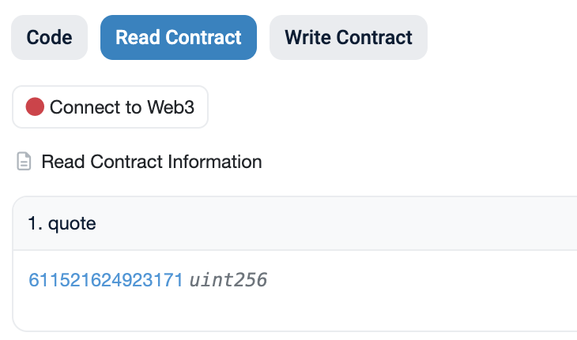
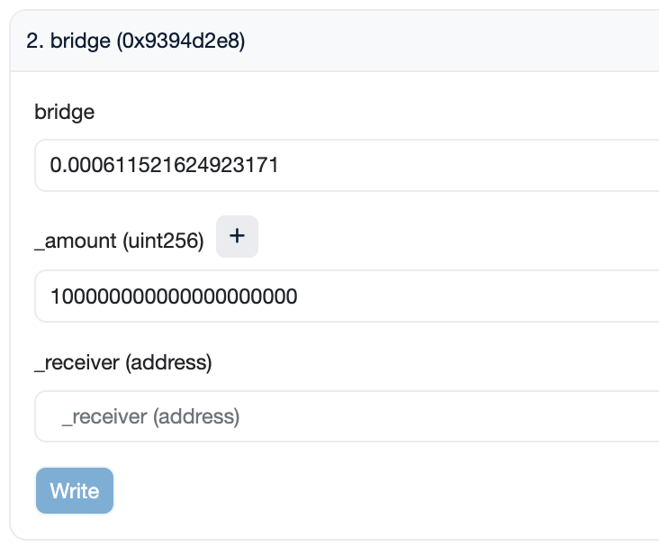
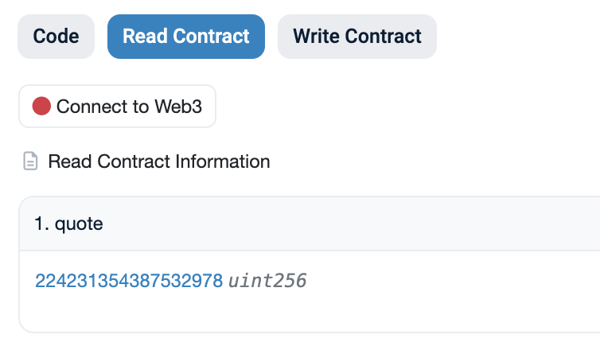

<h1>User Guide: Bridging</h1>

## **Overview**
This guide explains how to bridge crvUSD tokens from the Ethereum Mainnet to the Binance Smart Chain (BSC) or vice versa using a Layer Zero bridge contract.

Curve utilizes the [LayerZero](https://layerzero.network/) infrastructure for bridging contracts.

**Requirements**

- A Web3 wallet containing crvUSD on Ethereum or BSC.
- Some ETH or BNB to cover transaction fees.

!!!deploy "Contract Addresses"
    Both bridge contracts, on Ethereum and BinanceSmartChain have the same contract address!

    | Contract | Address |
    | -------- | ------- |
    | :logos-ethereum: Ethereum Bridge | [0x0A92Fd5271dB1C41564BD01ef6b1a75fC1db4d4f](https://etherscan.io/address/0x0A92Fd5271dB1C41564BD01ef6b1a75fC1db4d4f)|
    | :logos-bsc: Binance Bridge | [0x0A92Fd5271dB1C41564BD01ef6b1a75fC1db4d4f](https://bscscan.com/address/0x0A92Fd5271dB1C41564BD01ef6b1a75fC1db4d4f)|

---

# **Bridging crvUSD from Ethereum to Binance Smart Chain**

## **Step 1: Approve the Bridge Contract**
1. Navigate to the crvUSD token contract on Etherscan: [0xf939E0A03FB07F59A73314E73794Be0E57ac1b4E](https://etherscan.io/address/0xf939E0A03FB07F59A73314E73794Be0E57ac1b4E#writeContract).
2. Connect your wallet by selecting **`Contract` > `Write Contract` > `Connect to Web3`**.
    <figure markdown="span">
    { width="300" }
    <figcaption></figcaption>
    </figure>
3. Locate method **`3. approve`**.
        <figure markdown="span">
            { width="350" }
            <figcaption></figcaption>
        </figure>
    - **`_spender`**: Enter `0x0A92Fd5271dB1C41564BD01ef6b1a75fC1db4d4f` (the bridge contract address).
    - **`_value`**: Specify the amount in 1e18 format (for example, for 100 crvUSD, enter `100000000000000000000`).
    Alternatively, to avoid manually entering the amount in 1e18 format, you can input the amount of crvUSD you wish to bridge and then append 18 zeros by using the **`+`** button.
    <figure markdown="span">
        { width="350" }
        <figcaption></figcaption>
    </figure>
4. Click **`Write`** and complete the transaction.

---

## **Step 2: Read Contract and Quote ETH Amount**
1. Visit the bridge contract on Etherscan: [0x0A92Fd5271dB1C41564BD01ef6b1a75fC1db4d4f#readContract](https://etherscan.io/address/0x0A92Fd5271dB1C41564BD01ef6b1a75fC1db4d4f#readContract).
2. Use function **`1. quote`** to determine the amount of ETH required for bridging (excluding gas costs).
    <figure markdown="span">
    { width="350" }
    <figcaption></figcaption>
    </figure>
    The `quote` amount represents the cost (in ETH) of calling the bridge method in Step 3.

---

## **Step 3: Bridge crvUSD to BSC**
1. Access the bridge contract on Etherscan: [0x0A92Fd5271dB1C41564BD01ef6b1a75fC1db4d4f#writeContract](https://etherscan.io/address/0x0A92Fd5271dB1C41564BD01ef6b1a75fC1db4d4f#writeContract).
2. Connect your wallet by selecting **`Contract` > `Write Contract` > `Connect to Web3`**.
    <figure markdown="span">
    { width="300" }
    <figcaption></figcaption>
    </figure>
3. Navigate to method **`2. bridge`**.
        <figure markdown="span">
        { width="400" }
        <figcaption></figcaption>
        </figure>
    - **`bridge`**: Enter the ETH amount quoted in [Step 2](#step-2-read-contract-and-quote-eth-amount). Ensure you enter the **amount denominated in Ether** (quoted amount / 1e18).
    - **`_amount`**: Specify the amount of crvUSD in 1e18 format.
    Alternatively, to avoid manually entering the amount in 1e18 format, you can input the amount of crvUSD you wish to bridge and then append 18 zeros by using the **`+`** button.
        <figure markdown="span">
            { width="350" }
            <figcaption></figcaption>
        </figure>
    - **`_receiver`**: Enter your BSC wallet address.
4. Click **`Write`** and complete the transaction.

---

# **Bridging crvUSD from Binance Smart Chain to Ethereum**

## **Step 1: Approve the Bridge Contract**
1. Navigate to the crvUSD token contract on BSCScan: [0xf939E0A03FB07F59A73314E73794Be0E57ac1b4E](https://bscscan.com/address/0xe2fb3F127f5450DeE44afe054385d74C392BdeF4).
2. Connect your wallet by selecting **`Contract` > `Write Contract` > `Connect to Web3`**.
    <figure markdown="span">
        { width="300" }
        <figcaption></figcaption>
    </figure>
3. Locate method **`3. approve`**.
        <figure markdown="span">
            { width="350" }
            <figcaption></figcaption>
        </figure>
    - **`_spender`**: Enter `0x0A92Fd5271dB1C41564BD01ef6b1a75fC1db4d4f` (the bridge contract address).
    - **`_value`**: Specify the amount in 1e18 format (for example, for 100 crvUSD, enter `100000000000000000000`).
    Alternatively, to avoid manually entering the amount in 1e18 format, you can input the amount of crvUSD you wish to bridge and then append 18 zeros by using the **`+`** button.
    <figure markdown="span">
        { width="350" }
        <figcaption></figcaption>
    </figure>
4. Click **`Write`** and complete the transaction.

---

## **Step 2: Read Contract and Quote BNB Amount**
1. Visit the bridge contract on BSCScan: [0x0A92Fd5271dB1C41564BD01ef6b1a75fC1db4d4f#readContract](https://bscscan.com/address/0x0A92Fd5271dB1C41564BD01ef6b1a75fC1db4d4f#readContract).
2. Use function **`1. quote`** to determine the amount of BNB required for bridging (excluding gas costs).
    <figure markdown="span">
    { width="350" }
    <figcaption></figcaption>
    </figure>
    The `quote` amount represents the cost (in BNB) of calling the bridge method in Step 3.

---

## **Step 3: Bridge crvUSD to Ethereum**
1. Access the bridge contract on BSCScan: [0x0A92Fd5271dB1C41564BD01ef6b1a75fC1db4d4f#writeContract](https://etherscan.io/address/0x0A92Fd5271dB1C41564BD01ef6b1a75fC1db4d4f#writeContract).
2. Connect your wallet by selecting **`Contract` > `Write Contract` > `Connect to Web3`**.
    <figure markdown="span">
    { width="300" }
    <figcaption></figcaption>
    </figure>
3. Navigate to method **`2. bridge`**.
        <figure markdown="span">
        { width="400" }
        <figcaption></figcaption>
        </figure>
    - **`bridge`**: Enter the ETH amount quoted in [Step 2](#step-2-read-contract-and-quote-bnb-amount). Ensure you enter the **amount denominated in Ether** (quoted amount / 1e18).
    - **`_amount`**: Specify the amount of crvUSD in 1e18 format.
    Alternatively, to avoid manually entering the amount in 1e18 format, you can input the amount of crvUSD you wish to bridge and then append 18 zeros by using the **`+`** button.
        <figure markdown="span">
            { width="350" }
            <figcaption></figcaption>
        </figure>
    - **`_receiver`**: Enter your Ethereum wallet address.
4. Click **`Write`** and complete the transaction.