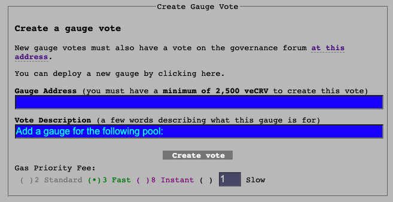

# **Deploy a Gauge**

You can deploy the gauge directly through the UI simply by posting the address: [https://classic.curve.fi/factory/create\_gauge](https://classic.curve.fi/factory/create_gauge)

# **Deploy a Gauge via Etherscan**

In addition to the UI, there is an option to deploy the gauge directly through Etherscan. 

!!!warning
    Calling **`deploy_gauge`** on Etherscan will only work if the function is called on the Factory contract that also deployed the pool.

To navigate to this page, first search for the corresponding Factory contract on Etherscan. Then, go to **`Contract -> Write Contract -> deploy_gauge`**.  
Then insert the pool address you want to add a gauge for, press on **`Write`** and sign the transaction.  

Before deploying the gauge, ensure you connect your wallet by clicking the **`Connect to Web3`** button.

<figure markdown>
  { width="800" }
  <figcaption></figcaption>
</figure>

# **Submit a DAO Vote**

In order for a gauge to become eligible to receive CRV emissions, it has to be added to the GaugeController. This needs to be approved by the DAO.

Once you've created your gauge, you can submit it to the DAO for a vote. [https://classic.curve.fi/factory/create\_vote](https://classic.curve.fi/factory/create_vote)​

The address that submits must have 2500 veCRV in order to create a vote.

Once the gauge has been submitted, politics take over. You may want to visit the governance forum and explain why your pool should be made eligible for rewards.

[Governance Forum](https://gov.curve.fi/)
