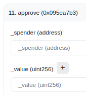

<h1> </h1>

# **Guide to Set Any Token Reward on a Gauge**

This guide explains the process of setting any token reward using Etherscan. It's assumed that you possess some familiarity with Etherscan or are competent in executing this transaction through an alternative tool. Note that Curve has employed various gauge versions over time. If your attempts are unsuccessful, it might be due to version differences. Should you encounter repeated failures, please seek our assistance.

## **Setting the Reward Token and Distributor Address**

Specify the *reward token* and the *distributor address*. The distributor address is the source from which the reward token will be sent to the gauge. 

!!!info
    Ensure you have the required `admin/manager` privileges for the gauge. The address that deployed the gauge is set as the `admin/manager`.
    If you are not admin/manager, this call will fail. 
    
To identify the manager, check the *manager/admin* in the "Read Contract" section on Etherscan. Some versions of this contract may also allow the factory owner to execute this call.

The deployer of the gauge is usually the manager of the gauge if the gauge was deployed via the Proxy of the Factory. If the gauge was deployed directly through the Factory contract itself, a quick migration needs to occur (see [here](https://docs.curve.fi/curve_dao/LiquidityGaugesAndMintingCRV/gauges/PermissionlessRewards/#migrate_gauge_manager)).

### Call **`add_reward()`** on Etherscan

This function should be called only once for a specific reward token. A repeated call to `add_reward` using a previously set reward token will fail. However, the distributor address for an already added reward token can be updated using the `set_reward_distributor` function. Over the lifetime of a gauge, a total of 8 different reward tokens can be set.

As `add_reward()` is an admin guarded function, you might need to call it from a ProxyContract. More information [here](https://docs.curve.fi/curve_dao/LiquidityGaugesAndMintingCRV/gauges/PermissionlessRewards/).

!!!info
    On sidechains, permissionless rewards are directly built into the gauges. Whoever deploys the gauge can call `add_rewards` on the gauge contract itself (no need to migrate or do it via proxy).

!!! description "`add_reward(_reward_token: address, _distributor: address):`"

    Function to add a reward token and distributor on Etherscan.

    { align=left, width="150" }

    | Parameter | Type | Description |
    | --------- | ---- | ----------- |
    | **`_reward_token`** | `address` | Reward Token Address |
    | **`_distributor`** | `address` | Distributor Address, who can add the Reward Token |

## **Approving the Reward Token for Deposit**

Visit the reward token contract address on Etherscan and switch to the "Write Contract" tab. Use the *approve()* function, setting the spender as the gauge contract address and specifying the desired amount.

### Call **`approve()`** on Etherscan on the reward token contract

!!! description "`approve(_spender : address, _value : uint256) -> bool:`"

    Function to approve `_spender` to transfer `_value` tokens.
    
    { align=left, width="150" }

    | Parameter | Type | Description |
    | --------- | ---- | ----------- |
    | **`_spender`** | `address` | Gauge Contract Address |
    | **`_value`** | `uint256` | Amount to approve |

## **Depositing the Reward Token**

Deposit the reward token to the contract. This action initiates the first reward epoch, lasting a week (defined as 604,800 seconds or 7 * 24 * 3600). If no additional reward token is deposited using the same function, this reward epoch ends after the week.

Should you add new tokens during an ongoing epoch, both the new tokens and any remaining ones are combined, triggering a fresh week-long epoch.

For consistent reward distributions, it's advisable to deposit near the end of an epoch. If replenishing mid-epoch, ensure you compute the appropriate amount for a steady distribution rate.

For tokens with 18 decimals: 1 full token = 1 * 10^18 = 1000000000000000000. *This function must be called using the distributor address.* A previous distributor address or an admin can update the distributor address using *set_reward_distributor()* if necessary.

### Call **`deposit_reward_token()`** on Etherscan on the gauge

!!! description "`deposit_reward_token(_reward_token: address, _amount: uint256):`"

    Function to deposit _amount of _reward_token into the gauge.

    { align=left, width="150" }

    | Parameter | Type | Description |
    | --------- | ---- | ----------- |
    | **`_reward_token`** | `address` | Reward Token Address |
    | **`_amount`** | `uint256` | Amount to be distributed over the week |
