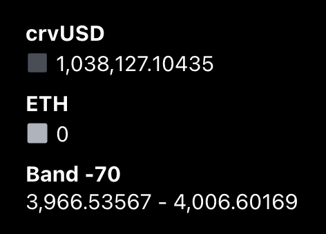
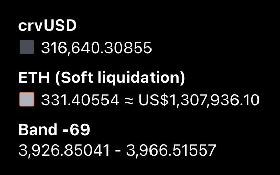
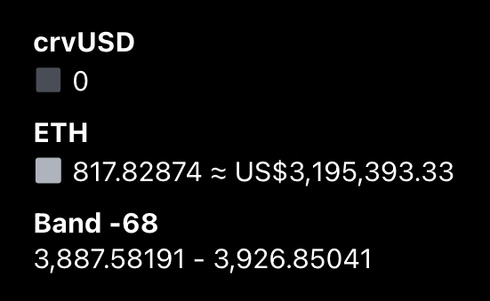

<h1>Концепции Займа: Подробный Обзор</h1>

## **Параметры Рынка** {#market-parameters}

Каждый рынок crvUSD имеет следующие параметры, которые влияют на все займы и автоматически изменяются под воздействием рыночных сил:

- **Базовая Цена (Base Price):** Базовая цена — это верхний предел цены полосы номер 0. Ставка заимствования увеличивает базовую цену со временем.
- **Цена оракула (Oracle Price):** Цена оракула — это текущая цена залога, определённая оракулом. Цена оракула используется для расчёта стоимости залога и [здоровья займа](#loan-health).
- **Ставка заимствования (Borrow Rate):** Ставка заимствования — это годовая процентная ставка, начисляемая на займ. Эта ставка переменная и может изменяться в зависимости от рыночных условий. Ставка заимствования выражается в процентах. Например, ставка заимствования 7,62% означает, что пользователю будет начисляться 7,62% годовых процентов на непогашенный займ. Смотрите [здесь](#borrow-rate) для расчёта.

Каждый рынок также имеет следующие параметры, которые изменяются только если CurveDAO проголосует за их изменение:

- **A (Амплификационный параметр):** Параметр амплификации A используется для расчёта плотности ликвидности и ширины [полос](#bands-n), а также [максимального LTV](#loan-discount) рынка.
- **Дисконт займа (Loan Discount):** Дисконт займа определяет, насколько залог дисконтируется при взятии займа, он напрямую связан с максимальным LTV каждого рынка crvUSD. Смотрите [здесь](#loan-discount) для дополнительной информации.
- **Дисконт ликвидации (Liquidation Discount):** Дисконт ликвидации используется для дисконтирования залога при расчёте здоровья займа. Смотрите раздел [здоровья займа](#loan-health) для дополнительной информации.
- **Сигма (Sigma):** Сигма изменяет скорость увеличения и уменьшения ставок при девальвации crvUSD. При более высокой сигме процентные ставки будут увеличиваться медленнее, когда crvUSD теряет привязку (depeg). Смотрите [здесь](#borrow-rate) для дополнительной информации.

## **LLAMMA и Ликвидации** {#llamma-and-liquidations}

LLAMMA (**Lending-Liquidating AMM Algorithm**) — это полностью функциональный двухтокеновый AMM, содержащий токен залога и crvUSD, который **отвечает за механизм ликвидации**. Для более подробной документации, пожалуйста, обратитесь к [технической документации](https://docs.curve.fi/crvUSD/amm/).

При создании нового займа, предоставленный **залог будет депонирован в определённое количество полос (bands) по AMM**. В отличие от обычной ликвидации, которая имеет единую цену ликвидации, LLAMMA имеет несколько диапазонов ликвидации (представленных полосами) и **непрерывно ликвидирует залог при необходимости**. Все полосы имеют нижние и верхние пределы цен, каждая из которых представляет собой "небольшой диапазон ликвидации". Общий диапазон ликвидации пользователя представлен верхней ценой самой высокой полосы до нижней цены самой низкой полосы.

Займ входит в режим мягкой ликвидации только тогда, когда цена залогового актива находится внутри полосы. Если цена вне полос, то нет необходимости в частичной ликвидации, и займ не находится в мягкой ликвидации.

AMM работает таким образом, что цена залога внутри AMM и "обычная цена" обрабатываются немного иначе. Если цена попадает в полосу, цены корректируются таким образом, чтобы внешние арбитражеры были стимулированы продавать токен залога и покупать crvUSD в полосе. Таким образом, **если цена находится внутри полосы, залог пользователя будет продан за crvUSD**, что означает, что залог пользователя теперь представляет собой комбинацию обоих токенов. Это условие верно для каждой из полос, в которые пользователь внёс ликвидность.

**Этот процесс мягкой ликвидации происходит не только при падении цен, но и при их росте.** Если залог в полосе был полностью конвертирован в crvUSD и цена залога снова выросла, ранее проданный залог будет снова выкуплен.

*Короче говоря: Внешние трейдеры будут мягко ликвидировать залог пользователя, когда цена токена залога падает, и вновь де-ликвидировать его, когда цена о растёт.*

!!!warning "Потери при Мягкой Ликвидации"
    Позиции в мягкой ликвидации / де-ликвидации терпят убытки из-за продажи и покупки залога. Если позиция не находится в мягкой ликвидации, убытки не происходят. Эти убытки уменьшают здоровье займа. Как только здоровье пользователя достигает 0%, позиция пользователя может столкнуться с жёсткой ликвидацией, которая закрывает займ.

### **Жёсткие Ликвидации (Hard Liquidations)** {#hard-liquidations}

Жёсткие ликвидации происходят, когда [здоровье](#loan-health) займа падает ниже 0%, позволяя ликвидатору ликвидировать займ. Любой может выступать в роли ликвидатора и ликвидировать подходящие займы, но обычно это делают специальные боты ликвидаторы (searchers).

Когда ликвидатор инициирует процесс, в рамках одной транзакции происходит следующее, используем рынок с залогом WETH и долгом в crvUSD в качестве примера:

1. Любой залог, который был обменен на crvUSD в мягкой ликвидации, передаётся Curve и удаляется из позиции пользователя.
2. Оставшийся долг в crvUSD погашается ликвидатором в пользу Curve.
3. Ликвидатор получает оставшийся залог в WETH в качестве награды, которая обычно превышает сумму погашенного долга.

Этот процесс иллюстрирован на изображении ниже:

{: .centered }
{: .centered }

### **Безнадежный Долг (Bad Debt)** {#bad-debt}

**Безнадежный долг возникает, когда займ невыгодно ликвидировать.** Это может произойти по многим причинам, включая высокие цены на газ, которые превышают прибыль от ликвидации, отключение секвенсера на L2, или просто отсутствие заинтересованных ликвидаторов на новом рынке. Это выглядит следующим образом:

{: .centered }
{: .centered }

В этом примере никакой рациональный ликвидатор не начнёт процесс ликвидации, потому что он потеряет деньги, делая это.

crvUSD выпускается только на Ethereum и использует высококачественные активы с глубокой ликвидностью для снижения риска безнадежного долга. Благодаря этим мерам предосторожности, **безнадежный долг не ожидается в системе выпуска crvUSD**. Однако безнадежный долг может и возникать на отдельных рынках Curve Lending, так как они не требуют разрешения для создания, но они не влияют на целостность стейблкоина crvUSD.

---

## **Полосы (N)** {#bands-n}

При создании займа добавленный залог распределяется между выбранным количеством полос. Минимальное количество полос — 4, максимальное — 50 полос.

**Полоса (Band) — это, по сути, диапазон цен с верхним и нижним пределами.** Если цена залога находится в пределах диапазона полосы, эта конкретная полоса, скорее всего, будет мягко ликвидирована.

***Обратите внимание, что диапазоны цен полос со временем поднимаются вверх, так как базовая цена увеличивается за счёт ставки заимствования***

<figure markdown>
  { width="700" }
  <figcaption></figcaption>
</figure>

На приведённой выше иллюстрации показано несколько полос с разными диапазонами цен. Светло-серые области содержат токен залога, в данном примере — ETH. Как видно, эти полосы ниже цены токена залога полностью в ETH, поскольку нет необходимости в ликвидации из-за высокой цены. Тёмно-серые области содержат crvUSD. Поскольку цена ETH упала в крайнюю правую полосу, внесённый залог (ETH) был конвертирован в crvUSD. В этом случае полоса состоит из обоих токенов — ETH и crvUSD. Если цена продолжит падать, весь залог в полосе будет полностью конвертирован в crvUSD, и уже новая полоса слева будет проходить мягкую ликвидацию.

*Помните: Когда цены растут после снижения, происходит обратное. ETH, который ранее был конвертирован в crvUSD, будет обратно конвертирован в ETH.*

<figure markdown>
  { width="230" }
  <figcaption>Полоса, которая полностью была мягко ликвидирована. Весь залог был конвертирован в crvUSD, потому что цена залога ниже диапазона ликвидации.</figcaption>
</figure>

<figure markdown>
  { width="250" }
  <figcaption>Полоса, которая в настоящее время находится в мягкой ликвидации. Она содержит как токен залога, так и crvUSD.</figcaption>
</figure>

<figure markdown>
  { width="250" }
  <figcaption>Полоса, которая ещё не была ликвидирована (состав 100% токен залога). Цена залога выше диапазона ликвидации.</figcaption>
</figure>

### Формулы для полос {#band-formulae}

`A` контролирует плотность ликвидности. Это напрямую связано с шириной полос. Ширина полосы при любой цене может быть оценена как:

$$\text{ширина полосы} \approx \frac{\text{цена}}{\text{A}}$$

Для нахождения точных **верхнего и нижнего пределов цен** полос можно использовать следующие формулы:

$$\begin{aligned} 
\text{верхний предел} &= \text{basePrice} \times \left( \frac{A-1}{A} \right)^{n} \\
\text{нижний предел} &= \text{basePrice} \times \left( \frac{A-1}{A} \right)^{n+1}
\end{aligned}$$

Где:

- $\text{basePrice}$: Текущая базовая цена желаемого рынка
- $A$: Амплификационный фактор желаемого рынка (по умолчанию 100)
- $n$: Номер полосы, например, $-67$.

### **Калькулятор Полос** {#band-calculator}

Используйте калькулятор ниже, чтобы смоделировать, как формируются полосы и как плотность ликвидности изменяется с разными параметрами. По определению, плотность ликвидности будет 100% на полосе 1. Плотность ликвидности увеличивается по мере уменьшения ширины полосы, потому что та же сумма залога будет распределена по меньшему диапазону цен.

  <canvas id="ampChart"></canvas>
  <h4>Входные данные:</h4>
  

    

      <label for="ampInput" style="margin-right: 2%;">A : </label>
      <input type="number" id="ampInput" min="1" max="10000" step="1" value="30" style="font-size: 16px; width: 15%;">
      <label for="numBandsInput" style="margin-left: 3%; margin-right: 2%;">N : </label>
      <input type="number" id="numBandsInput" min="1" max="50" step="1" value="10" style="font-size: 16px; width: 15%;">
      <label for="basePriceInput" style="margin-left: 3%; margin-right: 2%;">Базовая Цена($):</label>
      <input type="number" id="basePriceInput" min="0.01" max="1000000" step="0.01" value="2000" style="font-size: 16px; width: 20%;">
    

  

---

## **Здоровье Займа (Health)** {#loan-health}

На основе суммы залога и долга пользователя, интерфейс пользователя будет отображать показатель здоровья (health) и статус займа. Если позиция находится в режиме мягкой ликвидации, будет отображаться дополнительное предупреждение. Как только займ достигает **здоровья 0%**, займ **становится доступным для жёсткой ликвидации**. В жёсткой ликвидации кто-то другой может погасить долг пользователя и, взамен, получить его залог. Займ затем будет закрыт.

**Здоровье займа уменьшается, когда займ находится в режиме мягкой ликвидации. Эти убытки происходят не только при падении цен, но и когда цена залога снова растёт, что приводит к де-ликвидации займа пользователя.** Это означает, что здоровье займа может уменьшаться, даже если стоимость залога позиции увеличивается. Если займ не находится в режиме мягкой ликвидации, то такие убытки не происходят.

Убытки сложно количественно оценить. Нет общего правила о том, насколько велики убытки, так как они зависят от различных внешних факторов, таких как скорость падения или роста цены залога или эффективность арбитража. Однако можно сказать, что **убытки сильно зависят от количества полос**; чем больше полос используется, тем меньше убытки. Ежедневные убытки на основе текущих данных показаны [здесь](./loan-strategies.md#soft-liquidation-losses).

Формула для **здоровья (health)** показана ниже, это также визуализировано в апплете калькулятора здоровья.

$$\begin{aligned} \text{health} &= \frac{s \times (1-\text{liqDiscount}) + p}{\text{debt}} - 1 \\ 
p &= \text{collateral} \times \text{priceAboveBands} \end{aligned}$$

Где:

- $\text{collateralValue}$ : стоимость всех залогов по текущим ценам LLAMMA
- $\text{liqDiscount}$ : дисконт ликвидации для рынка (насколько дисконтируется стоимость залога для безопасности при жёсткой ликвидации).
- $\text{debt}$ : долг пользователя
- $s$ : оценка того, сколько crvUSD у пользователя будет после конвертации всех залогов через его полосы в мягкой ликвидации. Это можно очень грубо оценить как: $\text{collateral} \times \left( \frac{\text{softLiqUpperLimit} - \text{softLiqLowerLimit}}{2} \right)$
- $p$ : стоимость выше полос мягкой ликвидации. Найдено путём умножения количества залога на то, насколько цена выше мягкой ликвидации. Если пользователь находится в или ниже мягкой ликвидации, это значение равно 0.
- $\text{collateral}$ - количество залога, которое у пользователя есть, например, если у пользователя 5 wBTC, это значение равно 5.
- $\text{priceAboveBands}$ - разница в цене между ценой оракула и верхней границей диапазона мягкой ликвидации пользователя (верхняя граница верхней полосы). Это значение равно 0, если пользователь находится в мягкой ликвидации. Смотрите апплет ниже для визуального представления.
- $\text{collateralPrice}$ - цена одного токена залога, например, если залоговый актив — wBTC, это значение равно цене 1 wBTC.

### **Калькулятор Здоровья** {#health-calculator}

*Используйте апплет ниже, чтобы смоделировать, как работает здоровье, убытки от мягкой ликвидации представлены числами в списке, разделённом запятыми, первое число — это начальная полоса и далее. Светло-голубые затенённые области в полосах представляют значение без использования дисконта на мягкую ликвидацию, тогда как тёмно-голубые области — значения после дисконтирования.*

  <h4>Входные Данные:</h4>
  

    

      

        

          <label for="ampInputLiq" style="margin-right: 10px;">A:</label>
          <input type="number" id="ampInputLiq" min="0" max="1000" step="1" value="10" style="font-size: 16px; width: 80px;">
        

        

          <label for="startingBandInputLiq" style="margin-right: 10px;">Начальная Полоса:</label>
          <input type="number" id="startingBandInputLiq" min="-1000" max="1000" step="1" value="2" style="font-size: 16px; width: 80px;">
        

        

          <label for="oraclePriceLiq" style="margin-right: 10px;">Цена Оракула ($):</label>
          <input type="number" id="oraclePriceLiq" min="0" max="100000" step="0.01" value="1100" style="font-size: 16px; width: 80px;">
        

        

          <label for="collateralLiq" style="margin-right: 10px;">Сумма Залога:</label>
          <input type="number" id="collateralLiq" min="0" max="1000000" step="0.01" value="10" style="font-size: 16px; width: 80px;">
        

        

          <label for="debtLiq" style="margin-right: 10px;">Долг ($):</label>
          <input type="number" id="debtLiq" min="0" max="1000000" step="0.01" value="5000" style="font-size: 16px; width: 80px;">
        

      

      

        

          <label for="basePriceInputLiq" style="margin-right: 10px;">Базовая Цена($):</label>
          <input type="number" id="basePriceInputLiq" min="0" max="100000" step="0.01" value="1000" style="font-size: 16px; width: 80px;">
        

        

          <label for="finishBandInputLiq" style="margin-right: 10px;">Финишная Полоса:</label>
          <input type="number" id="finishBandInputLiq" min="-1000" max="1000" step="1" value="5" style="font-size: 16px; width: 80px;">
        

        

          <label for="liqDiscountLiq" style="margin-right: 10px;">Скидка на Ликвидацию %:</label>
          <input type="number" id="liqDiscountLiq" min="0" max="100" step="0.01" value="10" style="font-size: 16px; width: 80px;">
        

        

          <label for="slLossesLiq" style="margin-right: 10px;">Убытки от Мягкой Ликвидации (%):</label>
          <input type="text" id="slLossesLiq" value="0,0,0,0" style="font-size: 16px; width: 80px;">
        

      

    

  

   
  <canvas id="liqChart"></canvas>
   
  <canvas id="healthChart"></canvas>
  

    

      
<strong>Здоровье</strong> (включая стоимость выше полос):

      
<strong>Здоровье</strong> (без учета стоимости выше полос):

    

    

      

        
      

      

        
      

    

  

*Интерфейс Curve будет отображать здоровье, добавляя стоимость выше полос или без этой стоимости, в зависимости от того, насколько близко пользователь находится к ликвидации. Если активная полоса (полоса цены оракула) находится на расстоянии 3х или менее полос от полос мягкой ликвидации пользователя, интерфейс будет отображать здоровье без учёта стоимости полос выше диапазона мягкой ликвидации. В противном случае будет отображаться здоровье с учётом стоимости полос выше.*

*Значения здоровья в интерфейсе Curve и в смарт-контрактах всегда будут немного ниже значений в этом калькуляторе. Здоровье рассчитывается путём оценки количества crvUSD/долговых токенов, на которые залог обменян в каждой полосе. Это учитывает, сколько ликвидности находится в каждой полосе, чем больше ликвидности в полосе, тем меньше проскальзывание (slippage), которое оценивает Curve. Эта оценка проскальзывания слегка уменьшает здоровье пользователя.*

---

## **Дисконт займа** {#loan-discount}

`loan_discount` используется для определения максимального LTV, которое пользователь может иметь на рынке. На момент написания в рынках crvUSD это значение является постоянным 9%, в рынках Curve Lending это значение варьируется от 7% для WETH до 33% для волатильных активов, таких как UwU. Используйте калькулятор ниже, чтобы увидеть максимальные LTV, которые пользователь может иметь на основе `loan_discount`, амплификационного фактора `A` и количества полос `N`. Формула:

$$\text{maxLTV} = 1 - \text{loan_discount} - \frac{N}{2 \times A}$$

  <h3 style="margin-top: 0;">Калькулятор Максимального LTV</h3>
  <h4>Входные данные:</h4>
  

    

      <label for="ampInput2" style="margin-right: 10px;">A:</label>
      <input type="number" id="ampInput2" min="1" max="10000" step="1" value="30" style="font-size: 16px; width: 80px;">
      <label for="numBandsInput2" style="margin-left: 20px; margin-right: 10px;">N:</label>
      <input type="number" id="numBandsInput2" min="4" max="50" step="1" value="10" style="font-size: 16px; width: 80px;">
      <label for="loanDiscountInput" style="margin-left: 20px; margin-right: 10px;">Дисконт займа %:</label>
      <input type="number" id="loanDiscountInput" min="0" max="100" step="1" value="10" style="font-size: 16px; width: 80px;">
    

  

  <h4>Результат</h4>
  

    
Максимальный LTV: 

  

---

## **Ставка Заимствования** {#borrow-rate}

Основная идея состоит в том, что **ставка заимствования увеличивается, когда crvUSD теряет в стоимости, и уменьшается, когда crvUSD растёт в стоимости**. Также контракты, называемые [PegKeepers](https://docs.curve.fi/crvUSD/pegkeepers/overview/), могут влиять на процентную ставку и привязку crvUSD путем создания и продажи crvUSD или покупки и сжигания crvUSD.

*Формула для ставки заимствования следующая:*

$$\begin{aligned} 
r &= \text{rate0} \times e^{\text{power}} \\
\text{power} &= \frac{\text{price}_\text{peg} - \text{price}_\text{crvUSD}}{\text{sigma}} - \frac{\text{DebtFraction}}{\text{TargetFraction}} \\
\text{DebtFraction} &= \frac{\text{PegKeeperDebt}}{\text{TotalDebt}} 
\end{aligned}$$

*где:*

- $r$: Процентная ставка.
- $\text{rate0}$: Ставка, когда PegKeepers не имеют долга и цена crvUSD точно равна 1.00.
- $\text{price}_\text{peg}$: Желаемая цена crvUSD: 1.00
- $\text{price}_\text{crvUSD}$: Текущая цена crvUSD.
- $\text{sigma}$: переменная, которую может настроить DAO, более низкое значение заставляет процентные ставки увеличиваться и уменьшаться быстрее, когда crvUSD теряет привязку (depeg).
- $\text{DebtFraction}$: Соотношение долга PegKeepers к общему непогашенному долгу.
- $\text{TargetFraction}$: Целевая доля.
- $\text{PegKeeperDebt}$: Сумма долгов всех PegKeepers.
- $\text{TotalDebt}$: Общий долг crvUSD на всех рынках.

*Инструмент для экспериментов с моделью процентных ставок доступен [здесь](https://crvusd-rate.0xreviews.xyz/).*

---

## **PegKeeper** {#pegkeeper}

PegKeeper — это контракт, который помогает стабилизировать цену crvUSD. PegKeepers развёртываются для специальных пулов Curve, список которых можно найти [здесь](https://docs.curve.fi/references/deployed-contracts/#curve-stablecoin).

PegKeepers выполняют определённые действия на основе цены crvUSD в пулах. Все эти действия не требуют стороннего разрешения и могут быть вызваны любым пользователем.

Когда цена crvUSD в пуле превышает 1.00, PegKeepers разрешается брать в долг путем чеканки (mint) необеспеченных crvUSD и депонирования их в определенных пулах Curve. Это увеличивает баланс crvUSD в пуле, что, как следствие, снижает его цену.

Если PegKeeper взял на себя долг, депонируя crvUSD в пул, он может снова выводить этот депонированный crvUSD из пула. Это можно сделать, когда цена опускается ниже 1.00. Вывод crvUSD уменьшает баланс токенов и увеличивает цену в пуле.

[:octicons-arrow-right-24: Подробнее о PegKeepers здесь](https://docs.curve.fi/crvUSD/pegkeepers/overview/)

