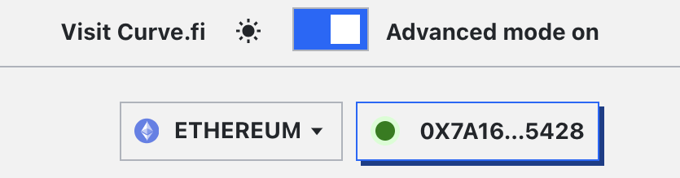
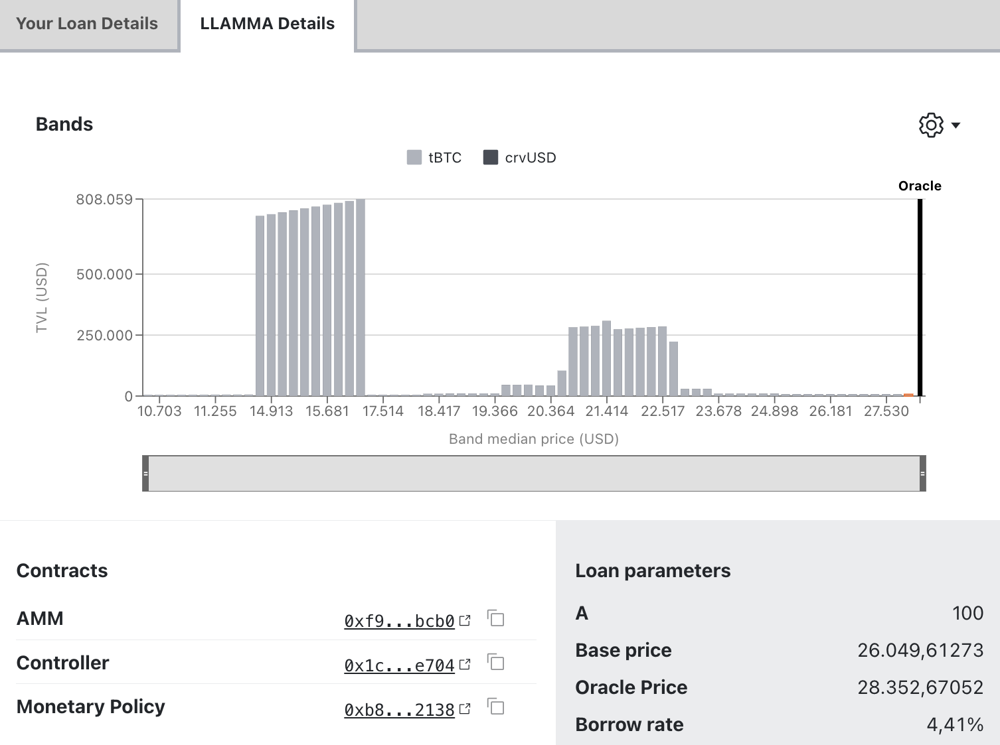
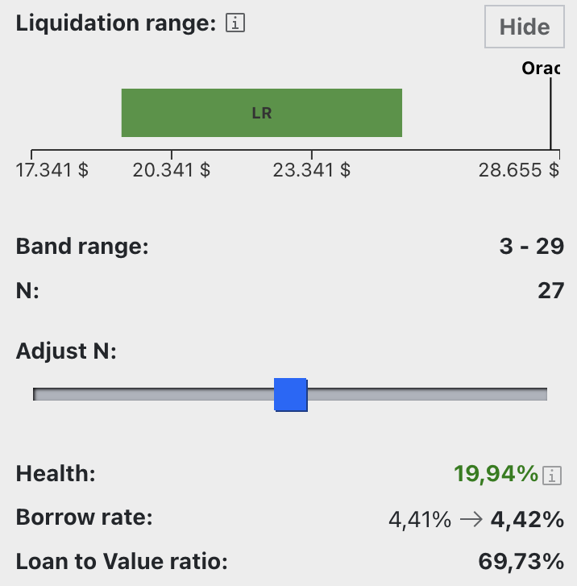
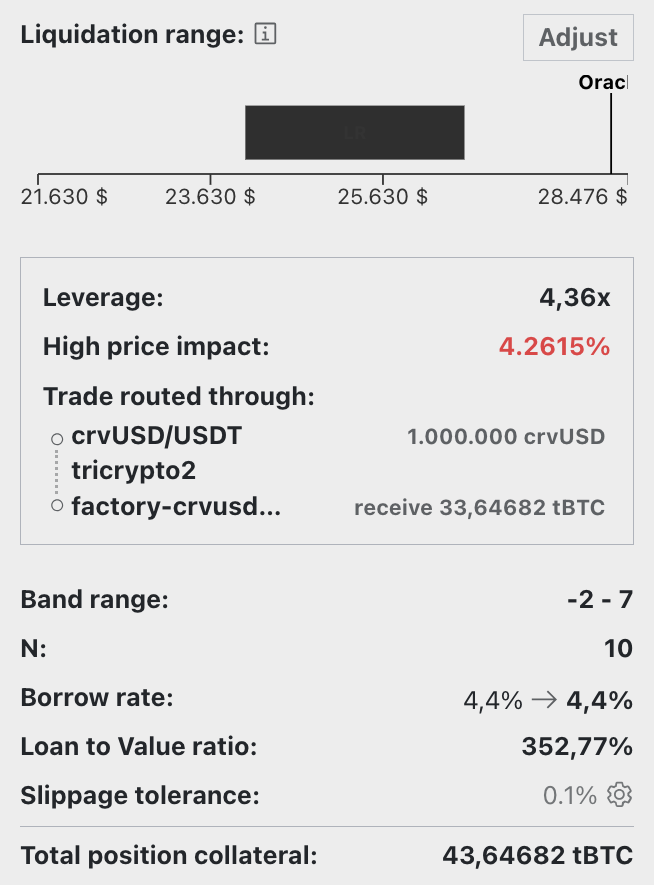
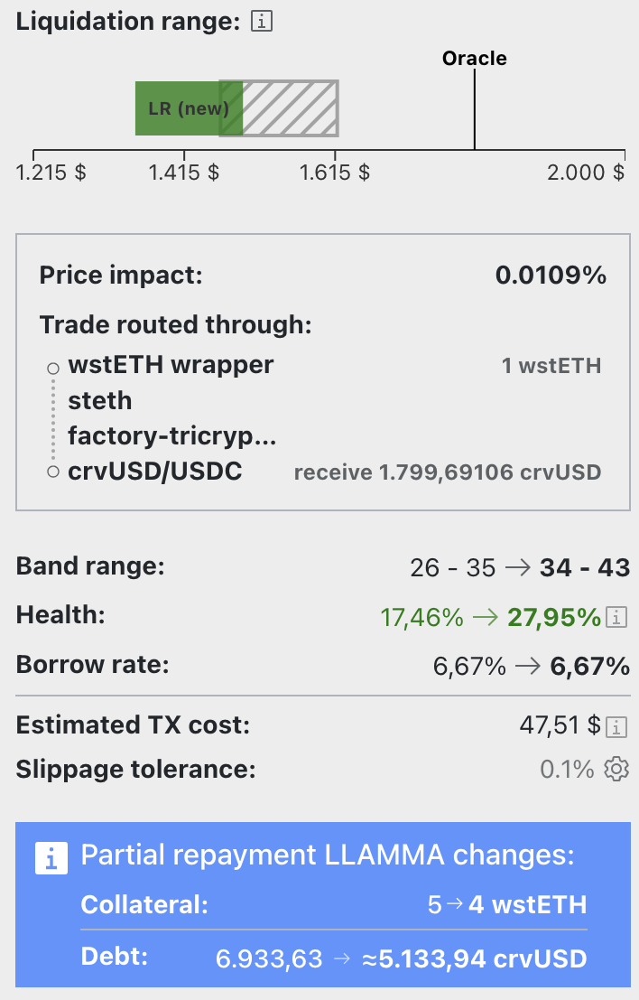

<h1>Создание и управление займами</h1>

# **Создание займа** {#loan-creation}

В стандартном режиме создание займа с crvUSD включает указание определённого количества залогового актива и определение количества crvUSD для заимствования. После установки суммы залога интерфейс отображает максимальное количество crvUSD, которое можно заимствовать, а также влияние на здоровье займа и [**процентную ставку за займ**](./loan-concepts.md#borrow-rate).

<figure markdown>
  { width="300" }
  <figcaption></figcaption>
</figure>

Интерфейс пользователя (UI) включает выпадающее меню для просмотра дополнительных параметров займа, таких как текущая цена оракула и [**процентная ставка за займ**](./loan-concepts.md#borrow-rate).

<figure markdown>
  { width="300" }
  <figcaption></figcaption>
</figure>

---

# **Управление займом** {#loan-management}

В этом интерфейсе доступно всё необходимое для управления займом. Функции включают:

<figure markdown>
  { width="300" }
  <figcaption></figcaption>
</figure>

**`Loan`** (Займ)  
Эта вкладка предоставляет опции для **`Borrow more`** (Занять больше) crvUSD, **`Repay`** (Погасить) долг или **`Self-liquidate`** (Самоликвидировать) займ.

**`Collateral`** (Залог)  
Здесь доступны опции для **`add`** (Добавить) или **`remove`** (Удалить) залог из займа.

**`Deleverage`** (Снижение кредитного плеча)  
Эта вкладка облегчает деливереджинг займа. Подробнее см. [здесь](#deleveraging-loans).

---

# **Детали займа** {#loan-details}

Вкладка `Your Loan Details` (Детали вашего займа) отображает всю информацию о вашем личном займе:

<figure markdown>
  { width="600" }
  <figcaption></figcaption>
</figure>

Когда пользователь создаёт займ, его **залог распределяется по ряду диапазонов мягкой ликвидации — полосам [Bands](./loan-concepts.md#bands-n) (полосам ликвидации)**. Если цена актива опустится в эту полосу, займ перейдёт в режим [мягкой ликвидации](./liquidations.md#soft-liquidation). В этом состоянии пользователю запрещено добавлять дополнительный залог. Единственный выход — либо погасить crvUSD частично или полностью, либо самоликвидировать займ.

Если позиция находилась или находится в режиме мягкой ликвидации, возникают потери. Интерфейс пользователя отображает эти потери тремя способами:

- `LOSS AMOUNT` (СУММА ПОТЕРИ) — сколько вы потеряли в мягкой ликвидации в формате залога, например, 0.001 ETH.
- `% LOST` (% ПОТЕРЯНО) — процент залога, потерянный в мягкой ликвидации.
- `COLLATERAL CURRENT BALANCE (EST.) / DEPOSITED` (ТЕКУЩИЙ БАЛАНС ЗАЛОГА (ОЦЕНКА) / ВНЕСЁННЫЙ ЗАЛОГ) — ваш текущий залог за вычетом любых потерь по сравнению с внесённой суммой.

Раздел `LLAMMA BALANCES` показывает распределение вашего текущего залога. Например, на приведённой выше картинке показано 0.01 ETH и 0 crvUSD. Если пользователь находится в режиме мягкой ликвидации, часть залога будет обменена на crvUSD для защиты от дальнейшего снижения цены, что уменьшит текущий баланс ETH и увеличит баланс crvUSD.

!!!info "Режим мягкой ликвидации"
    **Во время [мягкой ликвидации](./liquidations.md#soft-liquidation) пользователи не могут добавлять или выводить залог.** Они могут выбрать **либо частично или полностью погасить (repay)** свой долг в crvUSD для улучшения своего [**здоровья займа (health)**](./loan-concepts.md#loan-health) **либо** решить [**самоликвидировать (self-liquidate)**](../lending/how-to-borrow.md#self-liquidate) свой займ, если их структура залога содержит достаточное количество crvUSD для покрытия непогашенного долга. Если они выбирают самоликвидизацию, долг пользователя полностью погашается, и займ закрывается. Любые остаточные суммы возвращаются пользователю.

Если здоровье займа (health) падает до 0, займ [**жестко ликвидируется (hard-liquidated)**](./liquidations.md#hard-liquidation), и пользователь теряет свой залог, но сохраняет занятые средства.

---

# **Расширенное создание и управление займами** {#advanced-loan-creation-management}

В правом верхнем углу экрана находится переключатель для включения расширенного режима.

<figure markdown>
  {width="400"}
  <figcaption></figcaption>
</figure>

В расширенном режиме интерфейс пользователя показывает больше информации о [**Диапазонах залога (Collateral Bands - полос обеспечения)**](./loan-concepts.md#bands-n) для вашего личного займа:

<figure markdown>
  { width="600" }
  <figcaption></figcaption>
</figure>

Расширенный режим также добавляет вкладку с информацией о [**Диапазонах LLAMMA**](./loan-concepts.md#bands-n) для всех займов пользователей на рынке вместе:

<figure markdown>
  { width="600" }
  <figcaption></figcaption>
</figure>

Он также расширяет интерфейс создания займа, отображая **диапазон ликвидации и диапазон (LR)**, **количество полос (band range)**, **процентную ставку по займу (borrow rate)** и **коэффициент займа к стоимости залога (Loan to Value ratio - LTV)**. Кроме того, пользователи могут вручную выбрать количество полос для займа, нажав кнопку **`adjust`** (регулировать) и используя ползунок для увеличения или уменьшения количества полос.

<figure markdown>
  { width="300" }
  <figcaption></figcaption>
</figure>

!!!tip "Совет"
    **Большее количество полос (bands) обычно приводит к меньшим потерям при нахождении займа в режиме мягкой ликвидации**, см. [здесь](./loan-concepts.md#loan-health). Максимальное количество полос — 50, а минимальное — 4.

---

## **Использование кредитного плеча** {#leveraged-loans}

Интерфейс пользователя предлагает функцию использования кредитного плеча для займов, доступную через вкладку **`Leverage`** (Использование кредитного плеча).

Подробнее о том, как деливереджить займ, см. [здесь](#deleveraging-loans).

!!!info "Использование кредитного плеча"
    Залог может быть использован с кредитным плечом **до 9x кредитного плеча**, в зависимости от выбранного количества полос. Если пользователь хочет использовать максимальное кредитное плечо (9x), его займ будет иметь минимальное количество полос (4). Использование наибольшего количества полос (50) позволяет использовать кредитное плечо только до 3x. **Подробнее о последствиях использования разного количества полос см. [здесь](./loan-concepts.md#loan-health).**

Процесс использования кредитного плеча фактически включает **повторяющуюся продажу crvUSD за токены залога и последующие депонирование их для максимизации залоговой позиции**. По сути, весь заимствованный crvUSD используется для приобретения большего количества залога (Looping).

!!!warning "Предупреждение"
    **Будьте осторожны, так как падение цены залога потребует погашения всей суммы для возврата исходной позиции.**

:fontawesome-solid-book: [Хорошее объяснение использования кредитного плеча](https://curve.substack.com/p/august-15-2023-all-or-nothing)

<figure markdown>
{ width="400" }
<figcaption></figcaption>
</figure>

Переключение в расширенный режим раскрывает дополнительную информацию о займе, включая влияние на цену, маршрут сделки и фактическое кредитное плечо.

<figure markdown>
{ width="300" }
<figcaption></figcaption>
</figure>

---

## **Деливереджинг займов** {#deleveraging-loans}

Деливереджинг займа (Снижение кредитного плеча займа) — независимо от того, было ли [использовано кредитное плечо](../crvusd/loan-creation.md#leveraged-loans) — доступен через пользовательский интерфейс. Пользователи могут перейти на вкладку `Deleverage` (Снижение кредитного плеча) и ввести сумму залога, которую они намерены выделить для деливереджинга. Этот залог затем конвертируется в crvUSD, который используется для погашения долга.

<figure markdown>
  { width="300" }
  <figcaption></figcaption>
</figure>

!!!info "Информация"
    **Когда займ пользователя находится в режиме мягкой ликвидации, деливереджинг возможен только в случае полного погашения.** Помимо этого, займ обычно может быть самоликвидирован. Если позиция не находится в режиме мягкой ликвидации, пользователь может сознательно деливереджить на любую выбранную сумму.

Интерфейс предоставит пользователю обновленные детали займа, такие как диапазон ликвидации (LR) и полос (Band range), процентная ставка по займу (Borrow rate), уровень здоровья (Health), а также изменения LLAMMA залога (Collateral) и долга (Debt).

<figure markdown>
{ width="300" }
  <figcaption></figcaption>
</figure>

